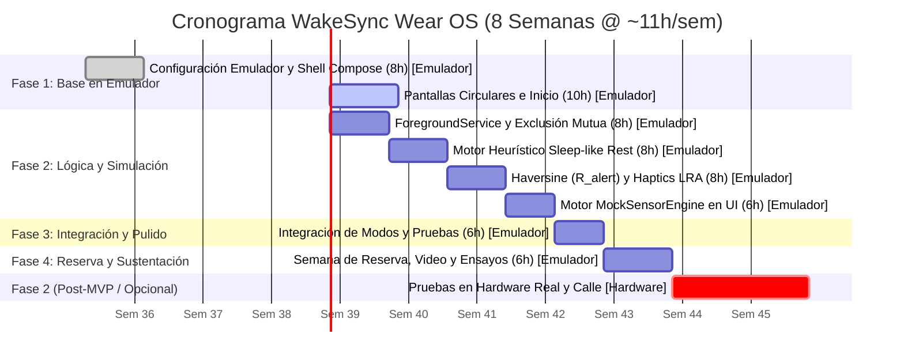

# WakeSync: Especificación Maestra del Sistema para Smartwatch Wear OS

> **Aplicación Wearable Autónoma para Estimación de Reposo y Proximidad en Tránsito**  
> *Entorno de Ejecución:* **Smartwatch Autónomo Wear OS (Android Wear OS 3+ / 4, API 30+)**  
> *Entorno de Desarrollo y Evaluación del MVP:* **Emulador Wear OS en Android Studio (100% Funcional sin Reloj Físico)**  
> *Dispositivo Complementario (Fase 2 / Opcional):* Notificador Espejo para Smartphone Android (Wearable Data Layer API)  
> *Curso / Institución:* Diseño de Sistemas / Ingeniería de Software — Universidad Cooperativa de Colombia (UCC)  
> *Equipo de Ingeniería:* Proyecto WakeSync  
> *Estándar:* IEEE 830-1998 (SRS) / Guías de Calidad para Wear OS de Google / ISO/IEC 25010  
> *Idioma:* Español (Documentación técnica; identificadores, clases y contratos de código en inglés estándar)  

---

## Tabla de Contenidos
1. [Resumen Ejecutivo y Paradigma Wearable](#1-resumen-ejecutivo-y-paradigma-wearable)
2. [Visión del Producto y Definición del Alcance del MVP](#2-visión-del-producto-y-definición-del-alcance-del-mvp)
3. [Experiencia de Usuario y Diseño de Interfaz (UI/UX)](#3-experiencia-de-usuario-y-diseño-de-interfaz-uiux)
4. [Arquitectura de IA Heurística: Sleep-like Rest Estimator](#4-arquitectura-de-ia-heurística-sleep-like-rest-estimator)
5. [Arquitectura del Sistema y Stack Tecnológico para Wear OS](#5-arquitectura-del-sistema-y-stack-tecnológico-para-wear-os)
6. [Estrategia de Simulación y Pruebas en Emulador](#6-estrategia-de-simulación-y-pruebas-en-emulador)
7. [Parámetros Normativos del MVP](#7-parámetros-normativos-del-mvp)
8. [Desglose Modular y Requisitos del Sistema (SRS)](#8-desglose-modular-y-requisitos-del-sistema-srs)
   - [8.1 Módulo 1: Infraestructura Base y Servicio Central (`com.wakesync.core`)](#81-módulo-1-infraestructura-base-y-servicio-central-comwakesynccore)
   - [8.2 Módulo 2: Adquisición de Sensores y Simulación (`com.wakesync.sensors`)](#82-módulo-2-adquisición-de-sensores-y-simulación-comwakesyncsensors)
   - [8.3 Módulo 3: Motor de IA Heurística de Reposo (`com.wakesync.ai`)](#83-módulo-3-motor-de-ia-heurística-de-reposo-comwakesyncai)
   - [8.4 Módulo 4: Modo Siesta / MicroNap (`com.wakesync.sleep`)](#84-módulo-4-modo-siesta--micronap-comwakesyncsleep)
   - [8.5 Módulo 5: Modo Transporte / TransitNudge (`com.wakesync.transit`)](#85-módulo-5-modo-transporte--transitnudge-comwakesynctransit)
   - [8.6 Módulo 6: Actuador Háptico Progresivo (`com.wakesync.alerts`)](#86-módulo-6-actuador-háptico-progresivo-comwakesyncalerts)
   - [8.7 Módulo 7: UI Circular en Compose (`com.wakesync.ui`)](#87-módulo-7-ui-circular-en-compose-comwakesyncui)
   - [8.8 Módulo 8: Motor de Simulación Determinista (`com.wakesync.sim`)](#88-módulo-8-motor-de-simulación-determinista-comwakesyncsim)
   - [8.9 Módulo 9: Motor de Insights por IA (`com.wakesync.insights`)](#89-módulo-9-motor-de-insights-por-ia-comwakesyncinsights)
   - [8.10 Matriz de Trazabilidad de Requisitos (SRS Traceability Matrix)](#810-matriz-de-trazabilidad-de-requisitos-srs-traceability-matrix)
9. [Criterios de Aceptación Verificables](#9-criterios-de-aceptación-verificables)
10. [Cronograma de Desarrollo](#10-cronograma-de-desarrollo)
11. [Registro de Riesgos y Mitigaciones](#11-registro-de-riesgos-y-mitigaciones)
12. [Alineación con la Rúbrica de Evaluación Académica (UCC)](#12-alineación-con-la-rúbrica-de-evaluación-académica-ucc)
---
- [Apéndice A: Formulaciones Matemáticas](#apéndice-a-formulaciones-matemáticas)
- [Apéndice B: Implementación Kotlin del Estimador de Reposo](#apéndice-b-implementación-kotlin-del-estimador-de-reposo)
- [Apéndice C: Lista Completa de Dependencias (`build.gradle.kts`)](#apéndice-c-lista-completa-de-dependencias-buildgradlekts)
- [Apéndice D: Scripts de Automatización ADB](#apéndice-d-scripts-de-automatización-adb)
- [Apéndice E: Especificaciones de Formas de Onda Háptica (LRA)](#apéndice-e-especificaciones-de-formas-de-onda-háptica-lra)

---

## 1. Resumen Ejecutivo y Paradigma Wearable

### 1.1 Naturaleza Unificada de WakeSync
**WakeSync es una única aplicación nativa y autónoma para smartwatches Wear OS.** No está compuesta por aplicaciones separadas ni por subsistemas independientes aislados; es una solución de software cohesiva instalada en el reloj que ofrece **dos modos de operación mutuamente excluyentes**, compartiendo la misma infraestructura técnica de servicios en primer plano, sensores, motor heurístico de IA y actuadores hápticos:

* **Regla de Exclusión Mutua:** **Solo puede existir una sesión activa a la vez.** El usuario opera en el **Modo Siesta** o en el **Modo Transporte**, garantizando un uso predecible de recursos y eliminando conflictos de concurrencia en la interfaz y en los actuadores hápticos.

1. **Modo Siesta (MicroNap):** Resuelve el problema del descanso diurno no reparador. Un temporizador fijo convencional (p. ej. de 20 minutos) suena antes de tiempo si el usuario tarda 15 minutos en relajarse, o suena tarde tras caer en sueño profundo, causando letargo e inercia del sueño. WakeSync muestrea la frecuencia cardíaca (PPG) y la quietud motora (acelerómetro), calculando un score mediante el **`Sleep-like Rest Estimator`**. Cuando el usuario alcanza un estado de reposo profundo continuo, se inicia una cuenta regresiva estricta de 15 minutos para despertarlo con vibraciones suaves y progresivas.
   - *Variante con Destino:* El Modo Siesta permite opcionalmente fijar un destino geográfico (GPS). Si el usuario viaja mientras descansa, **la proximidad al destino ($d \le R_{\text{alert}}$ dinámico, con piso de $250\text{ m}$) tiene prioridad absoluta sobre el temporizador de 15 minutos**, despertando al usuario para que no pase de largo su parada.
2. **Modo Transporte (TransitNudge):** Previene que el pasajero pase de largo su destino en transporte público mientras lee, trabaja o escucha música con auriculares. Monitorea la distancia en línea recta al destino mediante coordenadas satelitales (GPS) y la fórmula esférica de Haversine.
   - *Comportamiento sin Temporizador:* Este modo no utiliza temporizador de siesta; monitorea continuamente la posición y dispara alertas hápticas al ingresar al radio de alerta dinámico **$R_{\text{alert}} = \max(250\text{ m},\, v \cdot T_{\text{reaccion}} + \frac{v^2}{2 \cdot |a_{\text{frenado}}|})$** (con piso de $250\text{ m}$ y modulación por reposo). Opcionalmente, si el estimador de reposo detecta que el usuario está en `DEEP_REST`, modula la intensidad a `URGENT` y amplía el radio de alerta con $T_{\text{reaccion}} = 90\text{ s}$ para un despertar gradual y seguro.

```
+─────────────────────────────────────────────────────────────────────────────+
|                     WAKESYNC: UNA SOLA APLICACIÓN WEAR OS                   |
+─────────────────────────────────────────────────────────────────────────────+
                                       │
     [REGLA DE EXCLUSIÓN MUTUA: EXACTAMENTE 1 SESIÓN ACTIVA A LA VEZ]
                                       │
           +───────────────────────────┴───────────────────────────+
           │                                                       │
           ▼                                                       ▼
  [MODO SIESTA (MicroNap)]                                [MODO TRANSPORTE (TransitNudge)]
  • Estimación de Reposo Profundo                         • Proximidad Geográfica (GPS Haversine)
  • Temporizador de Siesta (15 min)                       • Geocerca Dinámica R_alert (Piso: 250 m)
  • Calibración Basal de 20 s                             • Sin Temporizador de Siesta
  • Opción: Con o Sin Destino GPS                         • Modulación según Reposo (AWAKE vs DEEP_REST)
  • Prioridad: Alerta GPS interrumpe Siesta               • Cancelación manual inmediata
           │                                                       │
           +───────────────────────────┬───────────────────────────+
                                       │
                                       ▼
             [INFRAESTRUCTURA COMPARTIDA DE LA APP WAKESYNC]
             • Servicio en Primer Plano: `WakeSyncForegroundService`
             • Capa de Sensores: Health Services PPG + Acelerómetro + Fused Location GPS
             • Motor de Demostración: `MockSensorEngine` (100% funcional en Emulador)
             • Motor de IA Heurística: `Sleep-like Rest Estimator`
             • Actuador Háptico: Formas de onda `VibrationEffect` (3 niveles)
             • UI Circular en Compose: Jetpack Compose for Wear OS + Horologist
```

> **Aviso de Dispositivo de Bienestar (No Médico):** WakeSync es una herramienta de bienestar personal y productividad para movilidad urbana; no es un dispositivo médico. No diagnostica trastornos del sueño ni realiza estadificación clínica del sueño. Los estados de reposo son estimaciones heurísticas calculadas exclusivamente para gestionar alertas y temporizadores.

### 1.2 Viabilidad del MVP sin Hardware Físico
Para asegurar la terminación exitosa del proyecto en menos de 3 meses mientras se gestionan 4 proyectos en simultáneo, el MVP asume formalmente:
1. **Desarrollo y Verificación 100% en Emulador:** Toda la lógica, interfaz, flujos y alertas se verifican mediante el **Emulador Wear OS en Android Studio**.
2. **Simulación Determinista como Vía Primaria:** El motor `MockSensorEngine` integrado en la app es la vía oficial y principal para evaluar y calificar el sistema en el aula de clases, eliminando cualquier riesgo por falta de hardware.
3. **Postergación a Fase 2:** La adquisición de PPG continuo en la calle, el GPS en vehículos en movimiento real, la vibración háptica física medible en la piel y las pruebas de consumo de batería real se documentan como características de **Fase 2 / Opcional**.

---

## 2. Visión del Producto y Definición del Alcance del MVP

### 2.1 Alcance del MVP Académico (Semanas 1–6)

**Función de Siesta (Modo MicroNap):**
- Inicio de sesión con 1 toque desde la pantalla principal.
- Calibración basal de reposo fija durante **$20\text{ segundos}$** con barra circular de progreso.
- Inferencia periódica cada **$10\text{ segundos}$** sobre ventana de análisis de **$20\text{ segundos}$**.
- Transición a `DEEP_REST` tras **2 evaluaciones consecutivas** con score $\ge 0.60$.
- Inicio automático de la cuenta regresiva fija de **$15\text{ minutos}$**.
- Soporte opcional de destino GPS: si se configura y la distancia es $\le R_{\text{alert}}$ dinámico, se dispara la alerta de llegada interrumpiendo la siesta.
- Tiempo límite de seguridad de **$25\text{ minutos}$**: finaliza la sesión si no se detecta reposo.
- Alerta háptica progresiva al completar la siesta o por proximidad.
- Registro local de la sesión (duración, hora de inicio, latencia de reposo, estado final).

**Función de Transporte (Modo TransitNudge):**
- Selección de destino entre 3 ubicaciones predefinidas ("Campus UCC", "Estación Metro", "Casa").
- Cálculo continuo de distancia geodésica en línea recta mediante la fórmula de Haversine.
- Disparo de alerta de llegada al ingresar al radio dinámico normativo **$R_{\text{alert}} = \max(250\text{ m},\, v \cdot T_{\text{reaccion}} + \frac{v^2}{2 \cdot |a_{\text{frenado}}|})$** (con piso de $250\text{ m}$ y modulación según velocidad y reposo).
- Despliegue en pantalla de distancia restante en metros y velocidad estimada (suavizada por EMA, $\alpha = 0.3$).
- Modulación por reposo: si el estimador reporta `DEEP_REST`, la alerta escala a `URGENT` y el tiempo de reacción se amplía a $T_{\text{reaccion}} = 90\text{ s}$ para un despertar seguro.
- Botón de cancelación inmediata `[Detener]` visible en todo momento.

**Infraestructura e Integración:**
- Lógica de exclusión mutua: impedir iniciar un modo si el otro está activo.
- Motor heurístico `Sleep-like Rest Estimator` ejecutado en corrutina secundaria (`Dispatchers.Default`) en $< 10\text{ ms}$.
- `WakeSyncForegroundService` persistente con notificación en curso para mantener la ejecución en segundo plano con pantalla apagada en el emulador.
- `MockSensorEngine` integrado con botones en pantalla: `[Simular Siesta]` y `[Simular Ruta]`.

**Interfaz de Usuario y Ergonomía Circular:**
- Desarrollada en **Jetpack Compose for Wear OS** (Material 3 circular).
- 3 pantallas principales: Inicio (selector de modos), Pantalla de Siesta, Pantalla de Transporte.
- Desplazamiento por corona física rotatoria (*Rotary Input*) mediante librería **Horologist**.
- Áreas táctiles circulares $\ge 48\text{dp} \times 48\text{dp}$.

### 2.2 Fase 2 (Características Opcionales / Post-MVP)
*(Nota de alcance: La geocerca dinámica cinemática $R_{\text{alert}}$ con modulación por reposo fue promovida de Fase 2 a requisito mandatorio del MVP en Fase 3, encontrándose 100% implementada y verificada).*
- Monitoreo PPG continuo con sensores ópticos reales en sujetos en movimiento en la calle.
- Pruebas de geolocalización GPS real en vehículos de transporte público en movimiento.
- Mediciones empíricas de consumo de batería (mAh) en hardware físico de reloj.
- Notificador espejo para smartphone mediante Wearable Data Layer API (canal de retransmisión para que el módulo opcional de Insights por IA opere en producción sobre smartwatches que carezcan de radio WiFi/LTE propio; para el MVP académico esta infraestructura no es requerida ni bloqueante, ya que el emulador Wear OS dispone de salida directa a internet a través de la máquina anfitriona).
- Modo Ambiente (*Always-On Display*) optimizado a bajo nivel.
- Selector de coordenadas personalizadas mediante mapa interactivo en smartphone.

### 2.3 Fuera del Alcance (Out of Scope)
- Diagnóstico médico o polisomnografía clínica.
- Servidores web remotos, microservicios o sincronización en la nube.
- Autenticación de usuarios, inicios de sesión o redes sociales.
- Integración con APIs de operadores de tránsito en tiempo real (GTFS-RT cerrado).
- Soporte multilingüe (documentación e interfaz en español/inglés técnico unificado).

---

## 3. Experiencia de Usuario y Diseño de Interfaz (UI/UX)

### 3.1 Pantallas y Estados Visuales
WakeSync adapta toda su interfaz a pantallas circulares de $454 \times 454\text{ px}$, garantizando legibilidad en menos de 3 segundos (*glanceability*):

| Pantalla / Estado | Acento de Color | Elementos Visuales Principales | Retroalimentación Háptica |
| :--- | :--- | :--- | :--- |
| **Inicio (Idle)** | Blanco / Carbón | 2 tarjetas grandes: `[ Siesta ]` y `[ Transporte ]` | Ninguna |
| **Calibrando Basal** | Cian (`#00E5FF`) | Anillo de progreso rotatorio (20 s), valor FC base | Pulsación corta al finalizar |
| **Siesta: Monitoreando** | Ámbar (`#FFD600`) | Score de reposo, estado actual, FC en vivo | Ninguna (silencio para dormir) |
| **Siesta: Reposo Confirmado**| Índigo (`#7C4DFF`) | Cuenta regresiva circular (15 min), pantalla tenue | Doble pulso corto de confirmación |
| **Transporte: En Ruta** | Verde (`#00E676`) | Distancia restante al destino (m), velocidad | Micro-vibración cada 500 m recorridos |
| **Alerta Activa (Llegada/Fin)**| Coral (`#FF1744`) | Pantalla parpadeante, botón masivo de descarte | Patrón LRA de 3 niveles en crescendo |
| **Sensor No Disponible** | Naranja (`#FF9100`)| Ícono de advertencia, estado no bloqueante | Ninguna |

### 3.2 Reglas Ergonómicas para Wear OS
* **Inicio Rápido:** Inicio de cualquier sesión en $\le 2\text{ toques}$ desde el encendido.
* **Control de Corona (Rotary Input):** Permite desplazarse verticalmente y ajustar opciones sin cubrir la pequeña pantalla con los dedos.
* **Áreas de Contacto:** Todo botón interactivo respeta el estándar $\ge 48\text{dp} \times 48\text{dp}$.
* **Descarte de Alarma:** Botón central grande para silenciar la vibración con un solo toque ciego sobre la muñeca.

---

## 4. Arquitectura de IA Heurística: Sleep-like Rest Estimator

### 4.1 Naturaleza del Modelo
El **`Sleep-like Rest Estimator`** es un **modelo heurístico determinista basado en reglas fisiológicas**, diseñado específicamente para ejecutarse en dispositivos de muy bajo consumo. **No es una red neuronal pesada ni un modelo de caja negra entrenado**, lo que garantiza ejecución instantánea ($< 10\text{ ms}$), cero consumo apreciable de batería y total interpretabilidad para la defensa académica.

```
┌─────────────────────────────────────────────────────────────────────────────┐
│                 MOTOR HEURÍSTICO: SLEEP-LIKE REST ESTIMATOR                 │
├─────────────────────────────────────────────────────────────────────────────┤
│                                                                             │
│  [PPG Sensor / HealthServices] ──► HR_actual                                │
│  [Acelerómetro Triaxial (IMU)] ──► Motion_actual (SVM en m/s^2)             │
│                                           │                                 │
│                                           ▼                                 │
│                   [Ventana de Análisis Fija: 20 segundos]                   │
│                                           │                                 │
│                   ┌───────────────────────┴───────────────────────┐         │
│                   ▼                                               ▼         │
│        [¿Datos válidos de HR y Movimiento?]                     [NO]        │
│                   │                                               │         │
│                  [SÍ]                                             ▼         │
│                   │                                   [SENSOR_NO_DISPONIBLE]│
│                   ▼                                                         │
│   Delta_HR = max(0, (HR_base - HR_actual) / HR_base)                        │
│   Quietud  = 1.0 - min(1.0, Motion_actual / MotionMaxRef)                   │
│   (con MotionMaxRef = 2.5 m/s^2 fijo)                                       │
│                   │                                                         │
│                   ▼                                                         │
│      score_reposo = (0.5 * Delta_HR) + (0.5 * Quietud)                      │
│                   │                                                         │
│        +──────────┴──────────+──────────+                                   │
│        ▼                     ▼          ▼                                   │
│  score >= 0.60         0.30 <= score   score < 0.30                         │
│  (2 evaluaciones       < 0.60           │                                   │
│   consecutivas)              │          ▼                                   │
│        │                     ▼     [AWAKE]                                  │
│        ▼             [LIGHT_REST]                                           │
│  [DEEP_REST]                                                                │
│  (Inicia 15 min siesta                                                      │
│   o alerta GPS de llegada)                                                  │
└─────────────────────────────────────────────────────────────────────────────┘
```

### 4.2 Formulación Matemática del Score de Reposo

Cada **$10\text{ segundos}$**, el estimador calcula la media sobre la ventana deslizante reciente de **$20\text{ segundos}$**:

1. **Deceleración Cardíaca Relativa ($\Delta HR_{\text{rel}}$):**
   $$\Delta HR_{\text{rel}} = \max\left(0.0, \; \frac{HR_{\text{base}} - HR_{\text{actual}}}{HR_{\text{base}}}\right)$$
   *Si $HR_{\text{actual}} \ge HR_{\text{base}}$, el término toma el valor $0.0$.*

2. **Quietud Motora Normalizada ($\text{Quietud}$):**
   A partir de la aceleración dinámica media $\text{Motion}_{\text{actual}}$ (calculada como la magnitud del vector de señal $\text{SVM}$ restando $1.0g$ de gravedad) y la constante normativa fija $\text{MotionMaxRef} = 2.5\text{ m/s}^2$:
   $$\text{Quietud} = 1.0 - \min\left(1.0, \; \frac{\text{Motion}_{\text{actual}}}{\text{MotionMaxRef}}\right)$$
   *Nótese que la línea base de movimiento se elimina de la fórmula para evitar inestabilidad si el usuario se movió durante la calibración.*

3. **Score Ponderado de Reposo:**
   $$\text{score\_reposo} = (0.5 \cdot \Delta HR_{\text{rel}}) + (0.5 \cdot \text{Quietud})$$
   El score resultante es un valor acotado en el intervalo $[0.0, \; 1.0]$.

### 4.3 Estados de Reposo y Reglas de Transición
* **`DEEP_REST`:** $\text{score\_reposo} \ge 0.60$ durante **2 evaluaciones consecutivas** (requiere al menos 20 segundos sostenidos de relajación y quietud). Representa una pauta fisiológica de descanso efectivo.
* **`LIGHT_REST`:** $0.30 \le \text{score\_reposo} < 0.60$. Usuario inmóvil con pulso cercano al basal; estado de relajación previa.
* **`AWAKE`:** $\text{score\_reposo} < 0.30$. Presencia de movimiento activo o ausencia de deceleración cardíaca.
* **`SENSOR_NO_DISPONIBLE`:** Se emite si faltan lecturas de frecuencia cardíaca durante más de 15 segundos o si el sensor reporta fuera de contacto con el cuerpo.

---

## 5. Arquitectura del Sistema y Stack Tecnológico para Wear OS

```
┌─────────────────────────────────────────────────────────────────────────────┐
│                 CAPA DE PRESENTACIÓN (UI CIRCULAR WEAR OS)                  │
│  • Jetpack Compose for Wear OS (Material 3 circular)                        │
│  • Navegación entre Inicio, Modo Siesta y Modo Transporte                   │
│  • Horologist Library (Rotary Input para corona giratoria)                  │
└──────────────────────────────────────┬──────────────────────────────────────┘
                                       │
                                       ▼
┌─────────────────────────────────────────────────────────────────────────────┐
│                 CAPA DE DOMINIO Y GESTIÓN EN SEGUNDO PLANO                  │
│  • WakeSyncForegroundService (Servicio Sticky con notificación en curso)    │
│  • SessionManager (Garante de Exclusión Mutua: 1 sesión activa a la vez)    │
│  • RestEstimatorEngine (Cálculo heurístico en hilo de fondo a 0.1 Hz)       │
│  • GeofenceTracker (Haversine y geocerca dinámica R_alert >= 250 m)         │
│  • HapticVibrationController (Patrones VibrationEffect en 3 niveles)        │
└──────────────────────────────────────┬──────────────────────────────────────┘
                                       │
                                       ▼
┌─────────────────────────────────────────────────────────────────────────────┐
│                 CAPA DE SENSORES Y SIMULACIÓN DETERMINISTA                  │
│  • Health Services API (MeasureClient para PPG de frecuencia cardíaca)      │
│  • SensorManager Android (Acelerómetro TYPE_ACCELEROMETER para SVM)         │
│  • Google FusedLocationProviderClient (GPS con intervalos adaptativos)      │
│  • MockSensorEngine (Generador sintético determinista para evaluación)      │
│  • Almacenamiento Local (DataStore / Room para historial de sesiones)       │
└─────────────────────────────────────────────────────────────────────────────┘
```

### 5.1 Gestión de Sesión y Exclusión Mutua
El componente `SessionManager` asegura que solo exista un modo activo en ejecución. Si el usuario intenta iniciar el Modo Transporte mientras el Modo Siesta está corriendo, la interfaz muestra un cuadro de diálogo solicitando confirmar si desea finalizar la sesión de siesta en curso.

### 5.2 Ciclo de Vida y Resiliencia
* `WakeSyncForegroundService` se ejecuta con bandera `START_STICKY`, publicando una notificación persistente no descartable que garantiza que el emulador o el reloj no cierren la aplicación al atenuar la pantalla.
* Para proteger la batería, el `PARTIAL_WAKE_LOCK` cuenta con una liberación de seguridad automática a los **$40\text{ minutos}$** (tope absoluto de sesión por `absoluteCapJob` en `NapManager`).

### 5.3 Módulo Auxiliar de Insights y Frontera de Conectividad
* **Frontera Estricta de Módulo:** El módulo `com.wakesync.insights` es un componente desacoplado y periférico. Importa exclusivamente de `com.wakesync.core` (específicamente los modelos agregados y el repositorio de lectura de `SessionRecord` en DataStore). No posee dependencias ni importa clases de `com.wakesync.sleep`, `com.wakesync.transit`, `com.wakesync.sensors`, `com.wakesync.ai` ni `com.wakesync.alerts`. Opera exclusivamente sobre el historial ya persistido tras la finalización de una sesión, sin interceptar flujos activos en segundo plano.
* **Independencia de Conectividad vs. GPS Satelital:** La conectividad de red de datos (solicitudes HTTPS REST) requerida por el módulo de Insights es totalmente independiente del subsistema de posicionamiento geográfico (`com.wakesync.sensors` / `com.wakesync.transit`, RF-SENS-03 / RF-TRAN-02). El receptor GPS opera por radiofrecuencia satelital pasiva autónoma y no requiere datos móviles, WiFi ni conexión a internet para calcular distancias o disparar alertas de proximidad.

---

## 6. Estrategia de Simulación y Pruebas en Emulador

Para asegurar que el proyecto sea evaluable sin un reloj físico, WakeSync adopta una arquitectura de pruebas basada en el emulador de Android Studio:

```
┌─────────────────────────────────────────────────────────────────────────────┐
│                     CONFIGURACIÓN DEL EMULADOR WEAR OS                      │
│  • Imagen de Sistema: Google Wear OS 4 (v33 o v34) Round (454x454 px)       │
│  • Panel Extended Controls (Sensores Virtuales):                            │
│    - Heart Rate Slider: Variar pulso manualmente (p. ej. 75 -> 55 BPM)      │
│    - Accelerometer 3D: Rotar la muñeca para probar quietud vs movimiento    │
│    - Location Tab: Inyectar coordenadas estáticas o reproducir track GPX    │
└──────────────────────────────────────┬──────────────────────────────────────┘
                                       │
                                       ▼
┌─────────────────────────────────────────────────────────────────────────────┐
│                 MOCKS APPLICATION ENGINE (VÍA PRIMARIA EN AULA)             │
│  • Pantalla Modo Siesta: Botón [Simular Siesta]                             │
│    Inyecta FC decreciente (75 -> 56 BPM) y SVM quieto (0.05 m/s^2). En 20 s │
│    confirma DEEP_REST y arranca la cuenta de 15 minutos en vivo.            │
│  • Pantalla Modo Transporte: Botón [Simular Ruta]                           │
│    Interpola coordenadas hacia el Campus UCC (1200m -> 0m en 120 s a 10m/s). │
│    Al ingresar al radio R_alert (>= 250 m), dispara la vibración de llegada.│
│  • Demostración completa realizable en menos de 3 minutos de reloj.         │
└──────────────────────────────────────┬──────────────────────────────────────┘
                                       │
                                       ▼
┌─────────────────────────────────────────────────────────────────────────────┐
│                       AUTOMATIZACIÓN POR COMANDOS ADB                       │
│  • Inyección por terminal para pruebas unitarias de regresión (Apéndice D)  │
└─────────────────────────────────────────────────────────────────────────────┘
```

---

## 7. Parámetros Normativos del MVP

Para eliminar contradicciones y asegurar la terminación en tiempo, todos los módulos de WakeSync deben utilizar estrictamente los valores de esta **Tabla Normativa Única**:

| Parámetro del Sistema | Identificador en Código | Valor Normativo del MVP | Justificación Técnica |
| :--- | :--- | :---: | :--- |
| **Tiempo de Calibración Basal** | `CALIBRATION_DURATION_SEC` | **$20\text{ s}$** | Permite registrar $HR_{\text{base}}$ sin hacer esperar al usuario ni al evaluador. |
| **Ventana de Análisis de Reposo**| `ANALYSIS_WINDOW_SEC` | **$20\text{ s}$** | Intervalo suficiente para filtrar fluctuaciones cardíacas transitorias. |
| **Intervalo entre Evaluaciones** | `EVALUATION_INTERVAL_SEC` | **$10\text{ s}$** | Balance óptimo entre reactividad y ahorro de cómputo en segundo plano. |
| **Umbral de Reposo Profundo** | `REST_DEEP_THRESHOLD` | **$0.60$** | Exige relajación cardíaca y quietud muscular simultáneas. |
| **Evaluaciones Consecutivas** | `REQUIRED_CONSECUTIVE_EVALS`| **$2$** | Previene falsos positivos por una lectura aislada ($20\text{ s}$ sostenidos). |
| **Rango de Reposo Ligero** | `REST_LIGHT_MIN_THRESHOLD` | **$0.30\text{ a }0.59$** | Usuario quieto pero aún no en pauta de siesta profunda. |
| **Referencia Máxima de Movimiento**| `MOTION_MAX_REF` | **$2.5\text{ m/s}^2$** | Aceleración media típica en vigilia por encima de $1.0g$. |
| **Duración de Siesta Estándar** | `NAP_DURATION_MIN` | **$15\text{ min}$** | Tiempo de descanso ideal para evitar inercia del sueño. |
| **Radio de Alerta Dinámico** | `DYNAMIC_ALERT_RADIUS` | **$R_{\text{alert}} = \max(250\text{ m},\, v \cdot T_{\text{reaccion}} + \frac{v^2}{2 \cdot |a_{\text{frenado}}|})$** | Fórmula cuadrática con $T_{\text{reaccion}} = 60\text{ s}$ ($90\text{ s}$ ante `DEEP_REST`), $a_{\text{frenado}} = 1.1\text{ m/s}^2$ y piso de $250\text{ m}$. |
| **Piso Mínimo de Radio de Alerta** | `GEOFENCE_MIN_RADIUS_M` | **$250\text{ m}$** | Distancia mínima de seguridad para avisar al usuario incluso a baja velocidad o detenido (reemplaza umbral fijo preliminar de 500 m). |
| **Tiempo de Reacción (Vigilia)** | `REACTION_TIME_AWAKE_SEC` | **$60\text{ s}$** | Ventana para alertar al usuario antes de la parada en vigilia/reposo ligero (`AWAKE`/`LIGHT_REST`). |
| **Tiempo de Reacción (Reposo Profundo)** | `REACTION_TIME_DEEP_REST_SEC` | **$90\text{ s}$** | Margen adicional de anticipación para compensar inercia del sueño ante `DEEP_REST`. |
| **Desaceleración de Frenado** | `BRAKING_DECELERATION_MPS2` | **$1.1\text{ m/s}^2$** | Tasa estándar de frenado de servicio en transporte público para modelar parada segura. |
| **Límite Superior de Velocidad** | `MAX_SPEED_CLAMP_MPS` | **$35.0\text{ m/s}$** | Límite cinemático (~126 km/h) para acotar ruido o saltos de señal GPS. |
| **Factor de Suavizado de Velocidad** | `SPEED_EMA_ALPHA` | **$0.3$** | Factor de filtro exponencial EMA para atenuar jitter GPS en cálculo de velocidad. |
| **Duración de Ruta Simulada** | `SIMULATED_ROUTE_SEC` | **$120\text{ s}$** | Tiempo total para la aproximación demostrativa en el aula (1200 m $\rightarrow$ 0 m a 10 m/s). |
| **Frecuencia de Acelerómetro** | `ACCEL_SAMPLE_RATE_HZ` | **$20\text{ Hz}$** | Suficiente para medir quietud sin saturar el procesador. |
| **Latencia Máxima de Despacho Háptico** | `TARGET_DISPATCH_LATENCY_MS` | **$< 20\text{ ms}$** | Meta estricta de `haptic-waveform-spec` para respuesta somatosensorial inmediata con pre-cacheo ansioso. |
| **Tiempo Límite de Red para Insights** | `AI_INSIGHT_TIMEOUT_SEC` | **$5\text{ s}$** | Evita bloqueo de UI ante conexión lenta o inexistente. |
| **Longitud Máxima de Texto Insight** | `AI_INSIGHT_MAX_CHARS` | **$140\text{ caracteres}$** | Ergonomía de lectura en pantalla circular Wear OS. |

---

## 8. Desglose Modular y Requisitos del Sistema (SRS)

### 8.1 Módulo 1: Infraestructura Base y Servicio Central (`com.wakesync.core`)
* **RF-CORE-01 (Servicio en Primer Plano):** La app ejecutará un `ForegroundService` persistente de Android con los tipos `health` y `location`, con una notificación permanente que muestre el estado de la sesión activa.
* **RF-CORE-02 (Exclusión Mutua de Sesión):** El sistema mantendrá como máximo **una sola sesión activa a la vez**. Si se solicita iniciar un modo mientras otro está corriendo, la app exigirá confirmación explícita para detener la sesión previa.
* **RF-CORE-03 (Gestión Segura de WakeLock):** La app adquirirá un `PARTIAL_WAKE_LOCK` al iniciar una sesión y lo liberará inmediatamente al finalizar o al alcanzar el tiempo límite de $40\text{ minutos}$ (tope absoluto de sesión por `absoluteCapJob` en `NapManager` para prevenir drenaje innecesario de batería).
* **RF-CORE-04 (Permisos en Tiempo de Ejecución):** La app verificará y solicitará los permisos de Wear OS: `BODY_SENSORS`, `ACCESS_FINE_LOCATION`, `POST_NOTIFICATIONS` y `WAKE_LOCK`.
* **RF-CORE-05 (Flujo Reactivo de Estado):** La capa de servicio expondrá un `StateFlow<WakeSyncState>` inmutable hacia la interfaz de usuario.
* **RNF-CORE-01 (No Bloqueo de UI):** Ninguna operación del servicio, cálculo de IA o acceso a sensores bloqueará el hilo principal de la interfaz de usuario.
* **RNF-CORE-02 (Resiliencia ante Cierre):** El servicio configurará `START_STICKY` para recuperarse automáticamente si el sistema operativo reclama memoria.

### 8.2 Módulo 2: Adquisición de Sensores y Simulación (`com.wakesync.sensors`)
* **RF-SENS-01 (Muestreo de Frecuencia Cardíaca):** La app consultará el sensor PPG a través de Health Services a una frecuencia de $\ge 0.5\text{ Hz}$.
* **RF-SENS-02 (Muestreo de Acelerómetro):** La app muestreará el acelerómetro triaxial a $20\text{ Hz}$ y calculará la magnitud del vector de señal dinámica ($\text{SVM}$).
* **RF-SENS-03 (Intervalos Adaptativos de GPS):** La app consultará la posición satelital mediante `FusedLocationProviderClient` ajustando el intervalo de actualización según la distancia en línea recta al destino:
  - Distancia $> 2\text{ km}$: intervalo de **$10\text{ segundos}$**.
  - $1\text{ km} < \text{Distancia} \le 2\text{ km}$: intervalo de **$5\text{ segundos}$**.
  - Distancia $\le 1\text{ km}$: intervalo de **$3\text{ segundos}$**.
* **RF-SENS-04 (Manejo de Sensores Ausentes):** Si el sensor de pulso no arroja lecturas válidas o el reloj pierde contacto con la muñeca por más de 15 segundos, la app no se cerrará; transicionará el estimador a `SENSOR_NO_DISPONIBLE` y notificará en pantalla.
* **RF-SENS-05 (Manejo de Baja Precisión GPS):** Si la precisión reportada por el proveedor de ubicación es $> 100\text{ metros}$, la app marcará la ubicación como aproximada y mantendrá el último cálculo válido.
* **RF-SENS-06 (Conmutador de Simulación):** La app permitirá alternar entre los sensores del sistema y el componente `MockSensorEngine` sin reiniciar la aplicación.

### 8.3 Módulo 3: Motor de IA Heurística de Reposo (`com.wakesync.ai`)
* **RF-AI-01 (Ciclo de Inferencia):** El motor evaluará el score de reposo cada **$10\text{ segundos}$** sobre los últimos **$20\text{ segundos}$** de datos.
* **RF-AI-02 (Cálculo del Score):** El score de reposo se calculará mediante:
  $$\text{score\_reposo} = 0.5 \cdot \max\left(0, \frac{HR_{\text{base}} - HR_{\text{actual}}}{HR_{\text{base}}}\right) + 0.5 \cdot \left(1.0 - \min\left(1.0, \frac{\text{Motion}_{\text{actual}}}{2.5}\right)\right)$$
* **RF-AI-03 (Clasificación de Estados):** El estimador emitirá exactamente uno de los cuatro estados técnicos normalizados: `AWAKE`, `LIGHT_REST`, `DEEP_REST` o `SENSOR_NO_DISPONIBLE`.
* **RF-AI-04 (Confirmación por Persistencia):** La transición a `DEEP_REST` requerirá **2 evaluaciones consecutivas con score $\ge 0.60$**.
* **RNF-AI-01 (Tiempo de Cómputo):** El cálculo del score de reposo completará su ciclo en menos de **$10\text{ ms}$** por evaluación en el emulador.

### 8.4 Módulo 4: Modo Siesta / MicroNap (`com.wakesync.sleep`)
* **RF-NAP-01 (Calibración Inicial):** Al iniciar el Modo Siesta, la app ejecutará una calibración de **$20\text{ segundos}$** para fijar el $HR_{\text{base}}$ (con fallback defensivo a 70 BPM en ausencia de lecturas).
* **RF-NAP-02 (Disparo del Temporizador y Pre-alerta):** La cuenta regresiva de **$15\text{ minutos}$** comenzará de forma automática inmediatamente después de confirmarse el estado `DEEP_REST`, disparando una pre-alerta `AlertLevel.SOFT`.
* **RF-NAP-03 (Opción de Destino GPS):** El usuario podrá opcionalmente activar un destino geográfico durante la siesta.
* **RF-NAP-04 (Prioridad de Proximidad sobre Siesta):** Si el Modo Siesta tiene un destino activo y la distancia en línea recta al destino se reduce a $\le R_{\text{alert}}$ dinámico (con piso de $250\text{ m}$ y $T_{\text{reaccion}} = 90\text{ s}$ ante `DEEP_REST`), **la alerta de llegada se disparará inmediatamente interrumpiendo el temporizador de 15 minutos** con resultado `INTERRUPTED_BY_ARRIVAL`.
* **RF-NAP-05 (Tiempo Límite de Sesión):** Si transcurren **$25\text{ minutos}$** de monitoreo activo sin alcanzar `DEEP_REST`, la app finalizará la sesión con una alerta suave `AlertLevel.SOFT` y resultado `TIMED_OUT`.
* **RF-NAP-06 (Alerta por Expiración):** Al completarse los 15 minutos de siesta, la app activará la alerta `AlertLevel.URGENT` hasta que el usuario la descarte explícitamente.

### 8.5 Módulo 5: Modo Transporte / TransitNudge (`com.wakesync.transit`)
* **RF-TRAN-01 (Selección de Destino):** La app permitirá seleccionar un destino a partir de 3 ubicaciones preconfiguradas ("Campus UCC", "Estación Metro", "Casa").
* **RF-TRAN-02 (Distancia en Línea Recta Haversine):** La app calculará en cada actualización GPS la distancia geodésica esférica en línea recta hacia el destino seleccionado (aclarando en la interfaz que no corresponde a distancia vial por calles).
* **RF-TRAN-03 (Disparo de Alerta a $R_{\text{alert}}$ dinámico):** La app activará la alerta háptica de llegada en cuanto la distancia calculada sea $\le R_{\text{alert}} = \max(250\text{ m},\, v \cdot T_{\text{reaccion}} + \frac{v^2}{2 \cdot |a_{\text{frenado}}|})$ con piso de $250\text{ m}$ y modulación por reposo ($T_{\text{reaccion}} = 90\text{ s}$ ante `DEEP_REST`).
* **RF-TRAN-04 (Ausencia de Temporizador de Siesta):** El Modo Transporte no ejecutará ninguna cuenta regresiva de siesta; su ciclo de vida finaliza al llegar al destino o al ser cancelado por el usuario.
* **RF-TRAN-05 (Modulación por Reposo):** Si el estimador reporta `DEEP_REST` durante el viaje, el radio de alerta se amplía ($T_{\text{reaccion}} = 90\text{ s}$) y la alerta escala a `AlertLevel.URGENT` con espera de descarte real del usuario.
* **RF-TRAN-06 (Cancelación Manual):** El usuario podrá detener el seguimiento en cualquier instante mediante el botón `[Detener]`.

### 8.6 Módulo 6: Actuador Háptico Progresivo (`com.wakesync.alerts`)
* **RF-ALRT-01 (Patrones Hápticos en Tres Niveles y Fallback para Emulador):** La clase `HapticVibrationController` implementará la interfaz `AlertControllerContract` para sintetizar alertas hápticas progresivas según las especificaciones normativas de `haptic-waveform-spec` mediante `VibrationEffect.createWaveform()` con soporte para actuadores LRA (*Linear Resonant Actuator*):
  - **Nivel 1 (`AlertLevel.SOFT`):** Pre-aviso o confirmación de reposo (`DEEP_REST`), patrón tipo latido cardíaco (`timings = [0, 150, 600, 150, 600]`, `amplitudes = [0, 60, 0, 90, 0]`, `repeat = -1`, ejecución única no repetitiva).
  - **Nivel 2 (`AlertLevel.MODERATE`):** Llegada al umbral de geocerca en modo transporte, patrón rítmico ascendente (`timings = [0, 300, 300, 300, 300, 400]`, `amplitudes = [0, 140, 0, 180, 0, 220]`, `repeat = -1`, ejecución única no repetitiva).
  - **Nivel 3 (`AlertLevel.URGENT`):** Conclusión de siesta de $15\text{ min}$ o alerta crítica de proximidad, doble pulso repetitivo de máxima intensidad (`timings = [0, 200, 100, 200, 500]`, `amplitudes = [0, 255, 0, 255, 0]`, `repeat = 0`, bucle continuo hasta descarte manual explícito).
  - **Resolución Dual de API y Fallback de Emulador:** El controlador resolverá el servicio del sistema soportando arquitectura dual: API 31+ (`VibratorManager`) y API 30 (`Vibrator`). En caso de que el entorno no soporte control de amplitud (`vibrator.hasAmplitudeControl() == false`, condición habitual en emuladores Wear OS), el controlador conmuta a un fallback funcional a nivel binario mediante `VibrationEffect.createWaveform(timings, repeat)` preservando la cadencia rítmica y comportamiento de repetición, debidamente anotado con `// PHASE2_HARDWARE_REQUIRED: Physical LRA motor amplitude control`.
  - **Permisos y Ensamblado de Aplicación:** Requiere el permiso normal `android.permission.VIBRATE` en `AndroidManifest.xml` y su inicialización/registro global durante el ciclo de vida en `WakeSyncApplication.onCreate()`, vinculando la instancia en `AlertControllerProvider` y `SessionManager`.
* **RF-ALRT-02 (Descarte y Control Reactivo de Alerta):** El controlador expondrá el estado de alerta activa mediante `activeAlertLevel: StateFlow<AlertLevel>` y la operación de cancelación inmediata `cancelAlert()`, implementando el contrato desacoplado `AlertControllerContract` y reflejándose en el modelo de estado central `WakeSyncState`:
  - La invocación de `cancelAlert()` (o `triggerAlert(AlertLevel.NONE)`) detendrá de inmediato cualquier tren de pulsos activo mediante `vibrator.cancel()` y transicionará el flujo de estado a `AlertLevel.NONE`.
  - La pantalla de alerta activa de la interfaz Wear OS presentará un botón circular de descarte con área táctil interactiva $\ge 48\text{dp} \times 48\text{dp}$ para silenciar la vibración con un solo toque (componente UI construido por `wear-ui-architect` en Fase 4 dentro de `com.wakesync.ui`).
* **RNF-ALRT-01 (Latencia de Despacho Háptico Sub-20ms):** El comando de vibración se enviará al subsistema de hardware del sistema operativo en menos de **$20\text{ ms}$** tras cumplirse la condición de disparo (meta estricta de `haptic-waveform-spec`, ajustada respecto al umbral preliminar de $100\text{ ms}$). Para garantizar despacho sub-milisegundo sin pausas por recolección de basura (*zero-allocation dispatch*), el controlador pre-cachea ansiosamente todas las formas de onda `VibrationEffect` durante su inicialización (`init`), logrando tiempos de despacho medidos inferiores a $1\text{ ms}$.

### 8.7 Módulo 7: UI Circular en Compose (`com.wakesync.ui`)
* **RF-UI-01 (Interfaz Circular):** La UI estará construida con componentes circulares de Jetpack Compose for Wear OS sin recortes de texto.
* **RF-UI-02 (Navegación por Corona):** La app integrará la librería Horologist para permitir desplazamiento de listas y pantallas con la corona rotatoria.
* **RF-UI-03 (Visibilidad de Estado):** La interfaz mostrará en tiempo real el modo activo, el estado del reposo y la distancia restante.
* **RNF-UI-01 (Glanceability):** Toda información crítica podrá interpretarse en menos de 3 segundos de lectura visual.

### 8.8 Módulo 8: Motor de Simulación Determinista (`com.wakesync.sim`)
* **RF-SIM-01 (Simulación de Siesta):** El botón `[Simular Siesta]` inyectará una traza fisiológica sintética que llevará al estimador a `DEEP_REST` en 20 segundos, disparando el temporizador de 15 minutos.
* **RF-SIM-02 (Simulación de Ruta):** El botón `[Simular Ruta]` interpolará la posición GPS desde $1200\text{ m}$ hasta $0\text{ m}$ hacia el destino a lo largo de **$120\text{ segundos}$** (a una velocidad vehicular constante de $10\text{ m/s}$), ingresando de forma continua al radio de alerta dinámico $R_{\text{alert}} \ge 250\text{ m}$ para activar la alerta.
* **RF-SIM-03 (Independencia de Sensores):** El motor de simulación funcionará al 100% en el emulador de Android Studio sin necesidad de hardware real.

### 8.9 Módulo 9: Motor de Insights por IA (`com.wakesync.insights`)

Este módulo opcional satisface el requerimiento de integración con modelos de Inteligencia Artificial externa, proporcionando retroalimentación cualitativa y contextual al usuario tras completar sus descansos o trayectos.

* **RF-INS-01 (Generación de Insight Post-Sesión):** Al finalizar cualquier sesión (`NAP` o `TRANSIT`), la app permitirá al usuario solicitar un análisis en lenguaje natural mediante una API de IA externa (vía cliente HTTPS REST asíncrono), consumiendo exclusivamente los atributos agregados persistidos en `local-storage-spec` (`sessionType`, `durationSeconds`, `restLatencySeconds`, `outcome`), y desplegando en pantalla una tarjeta con texto breve (máximo 140 caracteres, `INSIGHTS_MAX_CHARS`) adaptado a la ergonomía de lectura de Wear OS.
* **RF-INS-02 (Degradación sin Conectividad):** Si el dispositivo no dispone de conexión a internet o la solicitud excede un tiempo de espera (*timeout*) de $5\text{ segundos}$ (`INSIGHTS_API_TIMEOUT_SEC`), la función degradará de forma silenciosa y segura, presentando en pantalla el mensaje informativo *"Resumen no disponible sin conexión"*, sin bloquear el hilo principal (UI), sin reintentos en bucle y sin condicionar el almacenamiento del historial ni el flujo operativo de los modos de la app.
* **RF-INS-03 (Opcionalidad Explícita por Demanda):** La generación de insights será estrictamente **bajo demanda manual del usuario**, activándose únicamente al presionar el botón interactivo `[Generar Insight]` en la pantalla de resumen post-sesión o en el detalle del historial.  
  *Justificación de diseño:* En un dispositivo wearable con estrictas restricciones de batería (Wear OS), la invocación automática tras cada sesión generaría consumo innecesario de energía y datos en segundo plano sin consentimiento activo; la invocación explícita garantiza autonomía y control total del usuario.
* **RNF-INS-01 (Privacidad Estricta del Payload):** El cuerpo (*payload*) enviado a la API de IA externa nunca incluirá series temporales biomédicas crudas (registros de frecuencia cardíaca PPG o acelerometría triaxial SVM), identificadores de hardware, nombres de usuario ni coordenadas geográficas GPS exactas; se limitará de forma estricta a los 4 campos agregados definidos en la especificación de almacenamiento local.
* **RNF-INS-02 (Gestión Segura de Credenciales):** La clave de autenticación (*API Key*) del servicio de IA externo nunca se codificará en texto plano (*hardcoded*) en el código fuente ni se incluirá en el repositorio de control de versiones; se inyectará dinámicamente en tiempo de compilación a través del archivo `local.properties` hacia la clase `BuildConfig` (`BuildConfig.AI_INSIGHTS_API_KEY`).

### 8.10 Matriz de Trazabilidad de Requisitos (SRS Traceability Matrix)

Esta matriz vincula cada requisito funcional y no funcional con su módulo responsable, fase del proyecto y estado real de implementación según el estándar IEEE 830:

| ID Requisito | Nombre / Descripción Resumida | Módulo | Fase | Estado Actual | Notas Técnicas / Evidencia |
| :--- | :--- | :---: | :---: | :---: | :--- |
| **RF-CORE-01** | Servicio en Primer Plano (`health` / `location`) | `com.wakesync.core` | Fase 1 | **Verificado en emulador** | `WakeSyncForegroundService` persistente con notificación en curso. |
| **RF-CORE-02** | Exclusión Mutua de Sesión (1 activa a la vez) | `com.wakesync.core` | Fase 1 | **Verificado en emulador** | `SessionManager` gestiona conflictos y diálogo de confirmación. |
| **RF-CORE-03** | Gestión Segura de WakeLock (timeout 40 min) | `com.wakesync.core` | Fase 1 | **Verificado en emulador** | `WakeLockManager` con liberación automática defensiva (tope de 40 min alineado con `absoluteCapJob`). |
| **RF-CORE-04** | Permisos en Tiempo de Ejecución Wear OS | `com.wakesync.core` | Fase 1 | **Verificado en emulador** | `PermissionManager` para `BODY_SENSORS`, ubicación y notificaciones. |
| **RF-CORE-05** | Flujo Reactivo de Estado Inmutable | `com.wakesync.core` | Fase 1 | **Verificado en emulador** | `StateFlow<WakeSyncState>` como única fuente de verdad. |
| **RNF-CORE-01**| Operación No Bloqueante en Hilo Principal | `com.wakesync.core` | Fase 1 | **Verificado en emulador** | Corrutinas Kotlin en `Dispatchers.Default` e `IO`. |
| **RNF-CORE-02**| Resiliencia ante Muerte del Proceso | `com.wakesync.core` | Fase 1 | **Verificado en emulador** | Servicio iniciado con bandera `START_STICKY`. |
| **RF-SENS-01** | Muestreo de Frecuencia Cardíaca ($\ge 0.5\text{ Hz}$) | `com.wakesync.sensors` | Fase 2a | **Implementado** | Health Services API vía `RealSensorSource`. |
| **RF-SENS-02** | Muestreo de IMU Triaxial a $20\text{ Hz}$ (SVM) | `com.wakesync.sensors` | Fase 2a | **Implementado** | Magnitud del vector dinámico menos gravedad. |
| **RF-SENS-03** | Intervalos Adaptativos de Ubicación GPS | `com.wakesync.sensors` | Fase 2a | **Implementado** | Muestreo adaptativo (10s >2km, 5s 1–2km, 3s $\le$1km). |
| **RF-SENS-04** | Detección de Desconexión / Sensor Ausente | `com.wakesync.sensors` | Fase 2a | **Implementado** | Transición a `SENSOR_NO_DISPONIBLE` tras 15s de timeout. |
| **RF-SENS-05** | Filtrado de Baja Precisión GPS ($>100\text{ m}$) | `com.wakesync.sensors` | Fase 2a | **Implementado** | Mantiene última lectura válida con bandera de advertencia. |
| **RF-SENS-06** | Conmutador Caliente Real vs Simulado | `com.wakesync.sensors` | Fase 2a | **Verificado en emulador** | `SensorRepository` alterna entre `MockSensorEngine` y hardware sin reinicio. |
| **RF-AI-01**   | Ciclo de Inferencia Periódico (10 s / 20 s) | `com.wakesync.ai` | Fase 2a | **Verificado en emulador** | Evaluación cada 10 s sobre ventana móvil de 20 s. |
| **RF-AI-02**   | Ponderación Bimodal del Score de Reposo | `com.wakesync.ai` | Fase 2a | **Verificado en emulador** | Fórmula 50% deceleración cardíaca + 50% quietud motora. |
| **RF-AI-03**   | Clasificación de 4 Estados de Reposo | `com.wakesync.ai` | Fase 2a | **Verificado en emulador** | Emisión exacta de `AWAKE`, `LIGHT_REST`, `DEEP_REST`, `SENSOR_NO_DISPONIBLE`. |
| **RF-AI-04**   | Confirmación por Persistencia (2x $\ge 0.60$) | `com.wakesync.ai` | Fase 2a | **Verificado en emulador** | Requiere 2 ciclos continuos para validar descanso efectivo. |
| **RNF-AI-01**  | Inferencia Ultra-Rápida ($< 10\text{ ms}$) | `com.wakesync.ai` | Fase 2a | **Verificado en emulador** | Algoritmo determinista sin red neuronal ($< 1\text{ ms}$ en tests unitarios). |
| **RF-NAP-01**  | Calibración Basal Fija ($20\text{ s}$) | `com.wakesync.sleep` | Fase 3 | **Implementado y Verificado en Tests Unitarios** | Calibración de 20s con fallback a 70 BPM (19/19 tests pasando). |
| **RF-NAP-02**  | Disparo Automático del Temporizador (15 min) | `com.wakesync.sleep` | Fase 3 | **Implementado y Verificado en Tests Unitarios** | Arranca al confirmarse `DEEP_REST` y emite pre-alerta `SOFT` (19/19 tests pasando). |
| **RF-NAP-03**  | Soporte Opcional de Destino Satelital | `com.wakesync.sleep` | Fase 3 | **Implementado y Verificado en Tests Unitarios** | Monitoreo GPS simultáneo en siesta (19/19 tests pasando). |
| **RF-NAP-04**  | Prioridad Absoluta de Geocerca sobre Siesta | `com.wakesync.sleep` | Fase 3 | **Implementado y Verificado en Tests Unitarios** | Ingreso a $R_{\text{alert}}$ cancela siesta e interrumpe con `URGENT` (19/19 tests pasando). |
| **RF-NAP-05**  | Timeout de Inactividad sin Reposo ($25\text{ min}$) | `com.wakesync.sleep` | Fase 3 | **Implementado y Verificado en Tests Unitarios** | 25 min netos de monitoreo; concluye con `SOFT` y `TIMED_OUT` (19/19 tests pasando). |
| **RF-NAP-06**  | Alerta Progresiva por Expiración de Siesta | `com.wakesync.sleep` | Fase 3 | **Implementado y Verificado en Tests Unitarios** | Dispara `AlertLevel.URGENT` al finalizar los 15 minutos (19/19 tests pasando). |
| **RF-TRAN-01** | Selección entre 3 Destinos Preconfigurados | `com.wakesync.transit` | Fase 3 | **Implementado y Verificado en Tests Unitarios** | "Campus UCC", "Estación Metro", "Casa" (`TransitDestinations`, 19/19 tests pasando). |
| **RF-TRAN-02** | Geodesia Esférica Haversine en Línea Recta | `com.wakesync.transit` | Fase 3 | **Implementado y Verificado en Tests Unitarios** | Radio terrestre 6,371,000 m (`GeofenceCalculator`, 19/19 tests pasando). |
| **RF-TRAN-03** | Radio de Alerta Dinámico $R_{\text{alert}}$ | `com.wakesync.transit` | Fase 3 | **Implementado y Verificado en Tests Unitarios** | Fórmula dinámica cinemática con piso de 250 m y EMA ($\alpha = 0.3$, 19/19 tests pasando). |
| **RF-TRAN-04** | Ausencia de Cuenta Regresiva de Siesta | `com.wakesync.transit` | Fase 3 | **Implementado y Verificado en Tests Unitarios** | Modo exclusivamente de proximidad geográfica (19/19 tests pasando). |
| **RF-TRAN-05** | Modulación de Alerta Reforzada por Reposo | `com.wakesync.transit` | Fase 3 | **Implementado y Verificado en Tests Unitarios** | `MODERATE` en reposo normal vs `URGENT` y $T=90\text{ s}$ en `DEEP_REST` (19/19 tests pasando). |
| **RF-TRAN-06** | Cancelación Inmediata con Botón `[Detener]` | `com.wakesync.transit` | Fase 3 | **Implementado y Verificado en Tests Unitarios** | `stopSession()` detiene monitoreo y cancela alertas activas (19/19 tests pasando). |
| **RF-ALRT-01** | Patrones Hápticos LRA en 3 Niveles y Fallback | `com.wakesync.alerts` | Fase 2b | **Verificado en emulador** | `HapticVibrationController` implementa `SOFT`, `MODERATE`, `URGENT`, dual API 30/31+, y fallback de amplitud `// PHASE2_HARDWARE_REQUIRED`. |
| **RF-ALRT-02** | Descarte Reactivo y Cancelación de Alerta | `com.wakesync.alerts` / `com.wakesync.ui` | Fase 2b / Fase 4 | **Implementado (Core/Alerts) / Pendiente (UI)** | `cancelAlert()` y `activeAlertLevel: StateFlow` listos en `AlertControllerContract`; botón interactivo circular $\ge 48\text{dp}$ asignado a Fase 4. |
| **RNF-ALRT-01**| Latencia de Despacho Háptico Sub-20ms | `com.wakesync.alerts` | Fase 2b | **Verificado en emulador** | Meta de latencia $< 20\text{ ms}$ (`haptic-waveform-spec`) lograda mediante pre-cacheo ansioso de formas de onda en inicialización. |
| **RF-UI-01**   | Interfaz Circular Adaptada a Wear OS | `com.wakesync.ui` | Fase 4 | **Pendiente** | Componentes Jetpack Compose for Wear OS Material 3. |
| **RF-UI-02**   | Soporte para Corona Rotatoria (Rotary Input) | `com.wakesync.ui` | Fase 4 | **Pendiente** | Integración de librería Horologist. |
| **RF-UI-03**   | Glanceability y Visibilidad de Estado ($< 3\text{ s}$) | `com.wakesync.ui` | Fase 4 | **Pendiente** | Jerarquía visual clara para smartwatches. |
| **RNF-UI-01**  | Legibilidad Ergonómica en Pantalla 454x454 | `com.wakesync.ui` | Fase 4 | **Pendiente** | Targets táctiles $\ge 48\text{dp}$ sin recortes de texto. |
| **RF-SIM-01**  | Simulación Sintética de Reposo para Siesta | `com.wakesync.sim` | Fase 2a | **Verificado en emulador** | `MockSensorEngine.startNapSimulation()` induce `DEEP_REST` en 20 s. |
| **RF-SIM-02**  | Simulación Sintética de Ruta GPS (120 s @ 10 m/s) | `com.wakesync.sim` | Fase 2a | **Re-parametrizado y verificado en tests** | `MockSensorEngine.startTransitSimulation()` interpola 1200m a 0m en 120s (10 m/s) e ingresa a $R_{\text{alert}}$ dinámico. |
| **RF-SIM-03**  | Independencia Absoluta de Hardware Físico | `com.wakesync.sim` | Fase 2a | **Verificado en emulador** | Evaluación 100% autónoma en emulador de Android Studio. |
| **RF-INS-01**  | Generación de Insight Post-Sesión por IA | `com.wakesync.insights` | Fase 2 | **Propuesto / No implementado** | Llamada HTTPS REST con agregados de `local-storage-spec`. |
| **RF-INS-02**  | Degradación Grácil sin Conectividad (Timeout 5s) | `com.wakesync.insights` | Fase 2 | **Propuesto / No implementado** | Fallback visual seguro sin bloqueo de UI ni excepciones no controladas. |
| **RF-INS-03**  | Disparo Opcional por Demanda `[Generar Insight]` | `com.wakesync.insights` | Fase 2 | **Propuesto / No implementado** | Activación exclusiva por botón táctil en pantalla de resumen/historial. |
| **RNF-INS-01** | Privacidad de Payload (Cero Series Crudas / GPS) | `com.wakesync.insights` | Fase 2 | **Propuesto / No implementado** | Payload limitado estrictamente a los 4 campos agregados. |
| **RNF-INS-02** | Inyección de Credenciales vía `BuildConfig` | `com.wakesync.insights` | Fase 2 | **Propuesto / No implementado** | API key excluida del repositorio y leída desde `local.properties`. |

---

## 9. Criterios de Aceptación Verificables (Evaluación en Emulador)

Todos los criterios siguientes son **100% verificables en el Emulador de Wear OS en Android Studio**:

### 9.1 Modo Siesta (MicroNap)
- [ ] Iniciar sesión de siesta con un solo toque desde la pantalla principal.
- [ ] La calibración basal dura exactamente 20 segundos y muestra barra de progreso circular.
- [ ] Tras presionar `[Simular Siesta]`, el estado transiciona a `DEEP_REST` tras 2 evaluaciones consecutivas (en $\le 30\text{ s}$).
- [ ] Al confirmarse `DEEP_REST`, el temporizador de 15 minutos comienza su cuenta regresiva automáticamente.
- [x] Si se configura un destino y se inyectan coordenadas a $\le R_{\text{alert}}$ dinámico (calculado según velocidad estimada con piso de $250\text{ m}$ y $T_{\text{reaccion}} = 90\text{ s}$ ante `DEEP_REST`), la alerta de llegada se dispara de inmediato interrumpiendo el temporizador (verificado en pruebas unitarias).
- [ ] La alerta se puede silenciar con un solo toque en el botón central de descarte.
- [x] Si pasan 25 minutos sin reposo, la app termina la sesión automáticamente con una notificación (verificado en pruebas unitarias).

### 9.2 Modo Transporte (TransitNudge)
- [ ] Solo se puede iniciar si no hay una siesta activa (o se confirma cancelar la siesta previa).
- [ ] La app permite elegir uno de los 3 destinos predeterminados ("Campus UCC", "Estación Metro", "Casa").
- [ ] La distancia restante hacia el destino se muestra en metros en tiempo real.
- [ ] Al presionar `[Simular Ruta]`, la distancia decrece continuamente durante 120 segundos (1200 m $\rightarrow$ 0 m a 10 m/s).
- [x] Al ingresar al radio dinámico $R_{\text{alert}} = \max(250\text{ m},\, v \cdot T_{\text{reaccion}} + \frac{v^2}{2 \cdot |a_{\text{frenado}}|})$ evaluado según la velocidad estimada suavizada por EMA ($v$) con piso de $250\text{ m}$, la alerta háptica y visual se activa instantáneamente (verificado en pruebas unitarias).
- [x] Presionar `[Detener]` cancela la sesión y regresa a la pantalla de inicio de inmediato (verificado en pruebas unitarias).

### 9.3 Motor de IA Heurística
- [x] El score de reposo se recalcula cada 10 segundos en un hilo secundario sin congelar la UI.
- [x] El cálculo matemático se completa en menos de 10 ms por ciclo.
- [ ] Es posible verificar los cuatro estados en la interfaz (`AWAKE`, `LIGHT_REST`, `DEEP_REST`, `SENSOR_NO_DISPONIBLE`).
- [ ] Si faltan datos de pulso, el estado pasa a `SENSOR_NO_DISPONIBLE` sin generar cierres forzados (crashes).

### 9.4 Resiliencia y Privacidad
- [ ] La app no se detiene si se desactiva el sensor de frecuencia cardíaca en el panel de sensores virtuales.
- [ ] Todos los datos de sesión se almacenan exclusivamente en almacenamiento interno local, sin depender de internet para su registro ni recuperación. La función opcional de Insights por IA (com.wakesync.insights) es la única excepción de conectividad del sistema, degrada con gracia sin conexión, y nunca condiciona el funcionamiento de los Modos Siesta o Transporte.
- [ ] La app ofrece un botón en configuración para limpiar el historial de sesiones registradas.
- [ ] No se imprimen datos biomédicos personales en los registros generales de Logcat.

### 9.5 Verificación de la Demostración en Aula
- [ ] La demostración completa de ambos modos puede realizarse de principio a fin en **menos de 3 minutos**.

### 9.6 Actuador Háptico y Gestión de Alertas (`com.wakesync.alerts`)
- [x] El controlador `HapticVibrationController` sintetiza 3 niveles progresivos diferenciados (`SOFT`, `MODERATE`, `URGENT`) con timings, amplitudes y patrones de repetición exactos según `haptic-waveform-spec` (RF-ALRT-01).
- [x] El controlador conmuta a fallback funcional binario (`VibrationEffect.createWaveform(timings, repeat)`) cuando se ejecuta en emuladores o dispositivos sin control de amplitud LRA (`// PHASE2_HARDWARE_REQUIRED`) (RF-ALRT-01).
- [x] La latencia de despacho del comando háptico es menor a $20\text{ ms}$ (con despacho medido en $< 1\text{ ms}$) gracias al pre-cacheo ansioso de formas de onda en inicialización (RNF-ALRT-01).
- [x] La invocación de `cancelAlert()` o `triggerAlert(AlertLevel.NONE)` cancela inmediatamente cualquier vibración activa en el motor (`vibrator.cancel()`) y actualiza el flujo a `AlertLevel.NONE` (RF-ALRT-02).
- [x] El estado del actuador se expone reactivamente mediante `activeAlertLevel: StateFlow<AlertLevel>` vía `AlertControllerContract` y se propaga en `WakeSyncState` (RF-ALRT-02).
- [ ] La interfaz de usuario Wear OS despliega un botón circular de descarte con área interactiva $\ge 48\text{dp} \times 48\text{dp}$ que silencia la alerta con un solo toque (RF-ALRT-02, asignado a `wear-ui-architect` para Fase 4 en `com.wakesync.ui`).

### 9.7 Motor de Insights por IA (`com.wakesync.insights`)
- [ ] El botón `[Generar Insight]` en la pantalla de resumen post-sesión o historial envía únicamente los 4 campos agregados (`sessionType`, `durationSeconds`, `restLatencySeconds`, `outcome`) hacia la API externa.
- [ ] Al deshabilitar el acceso a internet en la máquina anfitriona/emulador, la solicitud muestra el mensaje *"Resumen no disponible sin conexión"* en $\le 5\text{ s}$ sin congelar la UI ni producir cierres inesperados.
- [ ] La inspección del tráfico de red saliente confirma la ausencia total de series de tiempo de PPG, acelerometría o coordenadas satelitales exactas.
- [ ] La clave de autenticación del servicio de IA no está presente en el código fuente de Git y se resuelve a través de `BuildConfig.AI_INSIGHTS_API_KEY`.

---

## 10. Cronograma de Desarrollo

**Duración Total:** 8 semanas  
**Dedicación Estimada:** ~10–11 horas por semana (~50–55 horas totales)  
**Entorno de Trabajo:** 100% Emulador Android Studio  



### Clasificación Explícita de Tareas por Entorno:
* **Tareas del MVP (Semanas 1 a 8 - Completables 100% en Emulador):**
  - Configuración del proyecto Wear OS 4 (API 33/34) en Android Studio.
  - Vistas circulares en Compose y navegación con Horologist.
  - Implementación del `ForegroundService` y la exclusión mutua de modos.
  - Implementación del estimador heurístico `RestEstimatorEngine` y fórmula Haversine.
  - Creación del `MockSensorEngine` y botones de simulación.
  - Ensayos de presentación y grabación de video de respaldo en alta resolución.
* **Tareas Pospuestas a Fase 2 (Requieren Hardware Real):**
  - Pruebas de adquisición de pulso óptico con reloj físico en la piel.
  - Validación de geocercas en autobús o metro real en movimiento.
  - Medición física del consumo energético de la batería del reloj.
  - Integración del enlace Bluetooth con la app complementaria del smartphone.

---

## 11. Registro de Riesgos y Mitigaciones

| Riesgo | Severidad | Probabilidad | Impacto | Mitigación |
| :--- | :---: | :---: | :--- | :--- |
| **Inestabilidad de sensores virtuales en el emulador** | **ALTA** | Media | Fallo al inyectar valores manuales durante la sustentación. | **Mitigación Principal:** Utilizar el botón integrado `[Simular Siesta]`, que inyecta los datos internamente en memoria sin depender de la ventana del emulador. |
| **El jurado pregunta por la ausencia de un reloj físico** | **MEDIA** | Alta | Dudas sobre la validez del proyecto como solución wearable. | **Mitigación:** Explicar que el desarrollo sigue el estándar oficial de Google de desarrollo sobre *Virtual Wearable Devices*, demostrando que la APK resultante es directamente instalable en un reloj comercial. |
| **Lentitud o congelamiento de Android Studio durante la demo** | **ALTA** | Media | Interrupción de la presentación académica. | **Mitigación:** Grabar un video en alta definición (Full HD) de 2 minutos demostrando el recorrido completo 24 horas antes de la entrega. |
| **Sobrecarga por los otros 3 proyectos académicos** | **CRÍTICA** | Alta | Retrasos en la entrega o código incompleto. | **Mitigación:** Congelar el alcance estrictamente en los parámetros normativos de la Sección 7. Dejar la Semana 8 libre de nuevas características. |
| **Pérdida de señal GPS simulada** | **BAJA** | Baja | Bloqueo de la pantalla de transporte. | **Mitigación:** El botón `[Simular Ruta]` interpola las coordenadas matemáticamente de forma determinista, inmune a cortes de conexión. |

---

## 12. Alineación con la Rúbrica de Evaluación Académica (UCC)

```
+─────────────────────────────────────────────────────────────────────────────+
|                    BALANCE DE EVALUACIÓN: DISEÑO Y RIGOR                    |
+──────────────────────────────────────┬──────────────────────────────────────+
                                       │
           +───────────────────────────┴───────────────────────────+
           │                                                       │
           ▼                                                       ▼
    [50% DISEÑO Y ERGONOMÍA]                                [50% RIGOR TÉCNICO]
• Estándar Google Wear OS Material 3                   • Estimador heurístico determinista
• Control por Corona Física (Horologist)               • Servicio en primer plano y WakeLock
• Comprensión visual inmediata (<= 3 s)                • Exclusión mutua de sesiones
• Targets táctiles circulares >= 48dp                  • Geocerca dinámica R_alert (>= 250 m)
• Paleta de contraste para descanso                    • 100% reproducible en emulador
```

### Guion de Sustentación ante el Evaluador (3 Minutos Exactos)
1. **Minuto 0–1 (Introducción y Concepto Unificado):**
   - Proyectar el emulador de Wear OS.
   - Explicar: *"WakeSync es una sola aplicación para smartwatch Wear OS con dos modos de operación: Modo Siesta y Modo Transporte, que comparten una misma infraestructura de servicio y estimación de reposo con exclusión mutua de sesión."*
2. **Minuto 1–2 (Demostración de la Función de Siesta):**
   - Tocar `[ Siesta ]`. Mostrar la calibración de 20 segundos.
   - Presionar `[ Simular Siesta ]`. Mostrar cómo el score de reposo supera $0.60$, transiciona a `DEEP_REST` y arranca automáticamente la cuenta de 15 minutos en pantalla.
3. **Minuto 2–3 (Demostración de la Función de Transporte):**
   - Salir al inicio y seleccionar `[ Transporte ]` (mostrando el cambio de modo).
   - Elegir "Campus UCC". Tocar `[ Simular Ruta ]`. Observar el progreso continuo y cómo, al ingresar al radio dinámico $R_{\text{alert}}$ (con piso de $250\text{ metros}$), la pantalla y el emulador disparan la alerta de llegada. Finalizar la demostración descartando la alerta con un toque.

---

# Apéndices Técnicos

---

## Apéndice A: Formulaciones Matemáticas

### A.1 Magnitud del Vector de Señal de Aceleración (SVM)
Aísla el movimiento dinámico del brazo del componente de aceleración gravitacional estática ($1.0g = 9.81\text{ m/s}^2$):

$$\text{SVM}_k = \sqrt{a_{x,k}^2 + a_{y,k}^2 + a_{z,k}^2} - 1.0g$$

Sobre una ventana de análisis fija de $N = 400$ muestras ($20\text{ segundos}$ a $20\text{ Hz}$):

$$\text{Motion}_{\text{actual}} = \frac{1}{N} \sum_{i=1}^{N} |\text{SVM}_i|$$

### A.2 Deceleración Cardíaca Relativa
$$\Delta HR_{\text{rel}} = \max\left(0.0, \; \frac{HR_{\text{base}} - HR_{\text{actual}}}{HR_{\text{base}}}\right)$$

### A.3 Quietud Motora Normalizada
Utilizando la constante normativa fija $\text{MotionMaxRef} = 2.5\text{ m/s}^2$:
$$\text{Quietud} = 1.0 - \min\left(1.0, \; \frac{\text{Motion}_{\text{actual}}}{2.5}\right)$$

### A.4 Puntuación del Estimador de Reposo
$$\text{score\_reposo} = (0.5 \cdot \Delta HR_{\text{rel}}) + (0.5 \cdot \text{Quietud})$$

### A.5 Distancia Geodésica en Línea Recta por Fórmula de Haversine
Calcula la distancia esférica en línea recta sobre el geoide terrestre entre la posición actual $(\phi_1, \lambda_1)$ y el destino $(\phi_2, \lambda_2)$ en radianes (no calcula distancia vial):

$$\Delta\phi = \phi_2 - \phi_1, \quad \Delta\lambda = \lambda_2 - \lambda_1$$
$$a = \sin^2\left(\frac{\Delta\phi}{2}\right) + \cos(\phi_1)\cos(\phi_2)\sin^2\left(\frac{\Delta\lambda}{2}\right)$$
$$c = 2 \cdot \arctan2\left(\sqrt{a}, \sqrt{1-a}\right)$$
$$d = R_{\text{tierra}} \cdot c \quad (R_{\text{tierra}} \approx 6,371,000\text{ metros})$$

### A.6 Radio de Alerta Dinámico y Modelo de Frenado Cinemático
Para anticipar la alerta según la velocidad real del vehículo y el estado fisiológico del usuario:

$$R_{\text{alert}} = \max\left(250\text{ m},\, v \cdot T_{\text{reaccion}} + \frac{v^2}{2 \cdot |a_{\text{frenado}}|}\right)$$

Donde:
- $v$: Velocidad estimada del vehículo mediante filtro exponencial (EMA, $\alpha = 0.3$) acotada en $[0.0, 35.0]\text{ m/s}$.
- $T_{\text{reaccion}}$: Tiempo de reacción del usuario ($60\text{ s}$ en vigilia/reposo ligero `AWAKE`/`LIGHT_REST`, o $90\text{ s}$ ante reposo profundo `DEEP_REST`).
- $a_{\text{frenado}}$: Desaceleración estándar de frenado vehicular ($1.1\text{ m/s}^2$).
- Piso mínimo de seguridad: $250\text{ metros}$.

Condición normativa de llegada:
$$\text{Disparo de Alerta} \iff d \le R_{\text{alert}}$$

---

## Apéndice B: Implementación Kotlin del Estimador de Reposo

```kotlin
package com.wakesync.ai

/**
 * Estados técnicos del estimador de reposo.
 * Representan pautas fisiológicas de descanso, no diagnóstico clínico de sueño.
 * Migración completada a identificadores estándar en inglés.
 */
enum class RestState {
    AWAKE,
    LIGHT_REST,
    DEEP_REST,
    SENSOR_NO_DISPONIBLE
}

data class RestEvaluationResult(
    val score: Float,
    val state: RestState,
    val consecutiveDeepRestCount: Int,
    val isDataValid: Boolean
)

/**
 * Motor heurístico determinista para estimar reposo compatible con siesta.
 * Parámetros normativos fijos:
 * - Ventana de análisis: 20 s
 * - Umbral reposo profundo: 0.60
 * - Evaluaciones consecutivas requeridas: 2
 * - MotionMaxRef fijo: 2.5 m/s^2 (no depende de línea base de movimiento)
 */
class RestEstimatorEngine(
    private val weightHeartRate: Float = 0.5f,
    private val weightMotion: Float = 0.5f,
    private val motionMaxRef: Float = 2.5f // m/s^2 fija
) {
    private var baselineHeartRate: Float = 75f
    private var deepRestCounter: Int = 0

    fun setBaseline(baselineHr: Float) {
        // Valida que la frecuencia cardíaca basal sea fisiológicamente razonable
        this.baselineHeartRate = if (baselineHr in 40f..120f) baselineHr else 75f
        this.deepRestCounter = 0
    }

    /**
     * Evalúa el estado de reposo a partir de los datos recientes.
     * Invocado periódicamente cada 10 segundos.
     */
    fun evaluateRest(currentHr: Float, currentMotionSvm: Float): RestEvaluationResult {
        // 1. Manejo explícito de datos ausentes o inválidos
        if (currentHr <= 0f || currentMotionSvm < 0f) {
            deepRestCounter = 0
            return RestEvaluationResult(
                score = 0f,
                state = RestState.SENSOR_NO_DISPONIBLE,
                consecutiveDeepRestCount = 0,
                isDataValid = false
            )
        }

        // 2. Deceleración cardíaca relativa (acotada entre 0 y 1)
        val deltaHr = (baselineHeartRate - currentHr) / baselineHeartRate
        val normalizedHrFactor = deltaHr.coerceIn(0f, 1f)

        // 3. Quietud motora normalizada frente al umbral fijo de 2.5 m/s^2
        val motionClamped = currentMotionSvm.coerceIn(0f, motionMaxRef)
        val normalizedMotionFactor = 1.0f - (motionClamped / motionMaxRef)

        // 4. Cálculo del score ponderado (rango 0.0 a 1.0)
        val score = (weightHeartRate * normalizedHrFactor) + (weightMotion * normalizedMotionFactor)

        // 5. Clasificación según parámetros normativos
        val state = when {
            score >= 0.60f -> {
                deepRestCounter++
                // Requiere 2 evaluaciones consecutivas (mínimo 20 s continuos)
                if (deepRestCounter >= 2) RestState.DEEP_REST else RestState.LIGHT_REST
            }
            score >= 0.30f -> {
                deepRestCounter = 0
                RestState.LIGHT_REST
            }
            else -> {
                deepRestCounter = 0
                RestState.AWAKE
            }
        }

        return RestEvaluationResult(
            score = score,
            state = state,
            consecutiveDeepRestCount = deepRestCounter,
            isDataValid = true
        )
    }
}
```

---

## Apéndice C: Lista Completa de Dependencias (`build.gradle.kts`)

```kotlin
plugins {
    id("com.android.application")
    id("org.jetbrains.kotlin.android")
}

android {
    namespace = "com.wakesync"
    compileSdk = 34

    defaultConfig {
        applicationId = "com.wakesync"
        minSdk = 30 // Wear OS 3.0+
        targetSdk = 34
        versionCode = 1
        versionName = "1.0.0"
    }

    buildFeatures {
        compose = true
    }

    composeOptions {
        kotlinCompilerExtensionVersion = "1.5.8"
    }
}

dependencies {
    // Interfaz de Usuario Wear OS con Compose Material 3
    implementation("androidx.wear.compose:compose-material3:1.0.0-alpha20")
    implementation("androidx.wear.compose:compose-foundation:1.3.1")
    implementation("androidx.wear.compose:compose-navigation:1.3.1")

    // Horologist para soporte de Corona Giratoria (Rotary Input)
    implementation("com.google.android.horologist:horologist-composables:0.6.9")
    implementation("com.google.android.horologist:horologist-compose-layout:0.6.9")

    // Sensores de Salud y Geoposicionamiento de Wear OS
    implementation("androidx.health:health-services-client:1.1.0-alpha03")
    implementation("com.google.android.gms:play-services-location:21.2.0")

    // Persistencia Local de Historial
    implementation("androidx.datastore:datastore-preferences:1.0.0")

    // Arquitectura, Ciclo de Vida y Corrutinas
    implementation("androidx.lifecycle:lifecycle-service:2.7.0")
    implementation("org.jetbrains.kotlinx:kotlinx-coroutines-android:1.8.0")
}
```

---

## Apéndice D: Scripts de Automatización ADB

Comandos para inyección de parámetros en el emulador de Android Studio:

```bash
# 1. Inyectar coordenadas GPS próximas a Campus UCC Medellín
adb emu geo fix -75.5684 6.2518 1500

# 2. Inyectar pulso cardíaco simulado de reposo (56 BPM)
adb emu sensor set heart-rate 56

# 3. Inyectar quietud en acelerómetro (1.0g vertical puro)
adb emu sensor set acceleration 0 9.81 0

# 4. Filtrar registros de ejecución de WakeSync
adb logcat -s WakeSyncService RestEstimatorEngine GeofenceTracker
```

---

## Apéndice E: Especificaciones de Formas de Onda Háptica (LRA)

```kotlin
// Nivel 1 (Suave): Pre-aviso o confirmación de reposo
val timingsLevel1 = longArrayOf(0, 150, 600, 150, 600)
val amplitudesLevel1 = intArrayOf(0, 60, 0, 90, 0)
val effectLevel1 = VibrationEffect.createWaveform(timingsLevel1, amplitudesLevel1, -1)

// Nivel 2 (Moderado): Llegada al radio dinámico R_alert (>= 250 m)
val timingsLevel2 = longArrayOf(0, 300, 300, 300, 300, 400)
val amplitudesLevel2 = intArrayOf(0, 140, 0, 180, 0, 220)
val effectLevel2 = VibrationEffect.createWaveform(timingsLevel2, amplitudesLevel2, -1)

// Nivel 3 (Urgente): Conclusión de siesta de 15 min / Sin descarte
val timingsLevel3 = longArrayOf(0, 200, 100, 200, 500)
val amplitudesLevel3 = intArrayOf(0, 255, 0, 255, 0)
val effectLevel3 = VibrationEffect.createWaveform(timingsLevel3, amplitudesLevel3, 0) // Repetir hasta descarte
```
