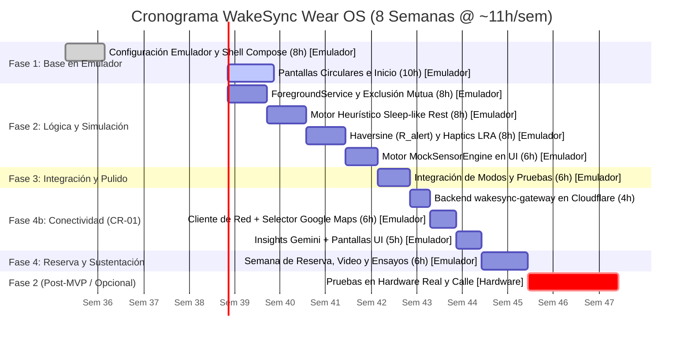

# WakeSync: Especificación Maestra del Sistema para Smartwatch Wear OS

> **Aplicación Wearable Autónoma para Estimación de Reposo y Proximidad en Tránsito**  
> *Entorno de Ejecución:* **Smartwatch Autónomo Wear OS (Android Wear OS 3+ / 4, API 30+)**  
> *Entorno de Desarrollo y Evaluación del MVP:* **Emulador Wear OS en Android Studio (100% Funcional sin Reloj Físico)**  
> *Conectividad:* **App 100% independiente del smartphone** (sin app compañera, sin Wearable Data Layer API). Usa la red propia del reloj (WiFi/LTE; en el emulador, la red de la máquina anfitriona) para comunicarse únicamente con el backend propio `wakesync-gateway`  
> *Servicios Externos (vía backend):* Google Maps Platform (Places API, Geocoding API, Maps Static API) y Google Gemini API  
> *Curso / Institución:* Diseño de Sistemas / Ingeniería de Software — Universidad Cooperativa de Colombia (UCC)  
> *Equipo de Ingeniería:* Proyecto WakeSync  
> *Estándar:* IEEE 830-1998 (SRS) / Guías de Calidad para Wear OS de Google / ISO/IEC 25010  
> *Idioma:* Español (Documentación técnica; identificadores, clases y contratos de código en inglés estándar)  

---

## Control de Cambios del Documento

| Versión | Fecha | Cambio | Secciones afectadas |
| :--- | :--- | :--- | :--- |
| 1.0 | 2026-09 (Fases 1–4) | Línea base del SRS: dos modos, estimador heurístico, geocerca dinámica, hápticos y UI circular. | Todas |
| **1.1** | **2026-09-22** | **CR-01 — Cambio de alcance posterior a la Fase 4:** (1) se elimina la selección entre 3 destinos predefinidos ("Campus UCC", "Estación Metro", "Casa") y se reemplaza por **selección libre de destino mediante Google Maps** (búsqueda por voz/teclado y selección sobre mapa) desde el propio reloj; (2) el **Motor de Insights por IA pasa de opcional (Fase 2) a obligatorio en el MVP**, usando Google Gemini; (3) se introduce el **backend sin estado `wakesync-gateway`** (Cloudflare Workers, plan gratuito) como único punto de salida a internet, que custodia todas las claves de API; (4) se elimina toda dependencia o integración con smartphone; (5) se acepta explícitamente un mayor consumo de batería a cambio de esta funcionalidad; (6) se alinean con el código real los parámetros de la ruta simulada ($2000 \rightarrow 400\text{ m}$ en $60\text{ s}$) y de la siesta simulada ($75 \rightarrow 58\text{ BPM}$). | Encabezado, 1, 2, 3, 5, 6, 7, 8.1, 8.4, 8.5, 8.7, 8.8, 8.9, 8.10 (nuevo), 8.11 (nuevo), 8.12, 9, 10, 11, 12, Apéndices A, C, D y F (nuevo) |

---

## Tabla de Contenidos
1. [Resumen Ejecutivo y Paradigma Wearable](#1-resumen-ejecutivo-y-paradigma-wearable)
2. [Visión del Producto y Definición del Alcance del MVP](#2-visión-del-producto-y-definición-del-alcance-del-mvp)
3. [Experiencia de Usuario y Diseño de Interfaz (UI/UX)](#3-experiencia-de-usuario-y-diseño-de-interfaz-uiux)
4. [Arquitectura de IA Heurística: Sleep-like Rest Estimator](#4-arquitectura-de-ia-heurística-sleep-like-rest-estimator)
5. [Arquitectura del Sistema y Stack Tecnológico para Wear OS](#5-arquitectura-del-sistema-y-stack-tecnológico-para-wear-os)
6. [Estrategia de Simulación y Pruebas en Emulador](#6-estrategia-de-simulación-y-pruebas-en-emulador)
7. [Parámetros Normativos del MVP](#7-parámetros-normativos-del-mvp)
8. [Desglose Modular y Requisitos del Sistema (SRS)](#8-desglose-modular-y-requisitos-del-sistema-srs)
   - [8.1 Módulo 1: Infraestructura Base y Servicio Central (`com.wakesync.core`)](#81-módulo-1-infraestructura-base-y-servicio-central-comwakesynccore)
   - [8.2 Módulo 2: Adquisición de Sensores y Simulación (`com.wakesync.sensors`)](#82-módulo-2-adquisición-de-sensores-y-simulación-comwakesyncsensors)
   - [8.3 Módulo 3: Motor de IA Heurística de Reposo (`com.wakesync.ai`)](#83-módulo-3-motor-de-ia-heurística-de-reposo-comwakesyncai)
   - [8.4 Módulo 4: Modo Siesta / MicroNap (`com.wakesync.sleep`)](#84-módulo-4-modo-siesta--micronap-comwakesyncsleep)
   - [8.5 Módulo 5: Modo Transporte / TransitNudge (`com.wakesync.transit`)](#85-módulo-5-modo-transporte--transitnudge-comwakesynctransit)
   - [8.6 Módulo 6: Actuador Háptico Progresivo (`com.wakesync.alerts`)](#86-módulo-6-actuador-háptico-progresivo-comwakesyncalerts)
   - [8.7 Módulo 7: UI Circular en Compose (`com.wakesync.ui`)](#87-módulo-7-ui-circular-en-compose-comwakesyncui)
   - [8.8 Módulo 8: Motor de Simulación Determinista (`com.wakesync.sensors.mock`)](#88-módulo-8-motor-de-simulación-determinista-comwakesyncsensorsmock)
   - [8.9 Módulo 9: Motor de Insights por IA (`com.wakesync.insights`)](#89-módulo-9-motor-de-insights-por-ia-comwakesyncinsights)
   - [8.10 Módulo 10: Selector de Destino con Google Maps (`com.wakesync.places`)](#810-módulo-10-selector-de-destino-con-google-maps-comwakesyncplaces)
   - [8.11 Módulo 11: Cliente de Red y Backend Gateway (`com.wakesync.network` + `backend/`)](#811-módulo-11-cliente-de-red-y-backend-gateway-comwakesyncnetwork--backend)
   - [8.12 Matriz de Trazabilidad de Requisitos (SRS Traceability Matrix)](#812-matriz-de-trazabilidad-de-requisitos-srs-traceability-matrix)
9. [Criterios de Aceptación Verificables](#9-criterios-de-aceptación-verificables)
10. [Cronograma de Desarrollo](#10-cronograma-de-desarrollo)
11. [Registro de Riesgos y Mitigaciones](#11-registro-de-riesgos-y-mitigaciones)
12. [Alineación con la Rúbrica de Evaluación Académica (UCC)](#12-alineación-con-la-rúbrica-de-evaluación-académica-ucc)
---
- [Apéndice A: Formulaciones Matemáticas](#apéndice-a-formulaciones-matemáticas)
- [Apéndice B: Implementación Kotlin del Estimador de Reposo](#apéndice-b-implementación-kotlin-del-estimador-de-reposo)
- [Apéndice C: Lista Completa de Dependencias (`build.gradle.kts`)](#apéndice-c-lista-completa-de-dependencias-buildgradlekts)
- [Apéndice D: Scripts de Automatización ADB](#apéndice-d-scripts-de-automatización-adb)
- [Apéndice E: Especificaciones de Formas de Onda Háptica (LRA)](#apéndice-e-especificaciones-de-formas-de-onda-háptica-lra)
- [Apéndice F: Contrato de API del Backend `wakesync-gateway`](#apéndice-f-contrato-de-api-del-backend-wakesync-gateway)

---

## 1. Resumen Ejecutivo y Paradigma Wearable

### 1.1 Naturaleza Unificada de WakeSync
**WakeSync es una única aplicación nativa y autónoma para smartwatches Wear OS.** No está compuesta por aplicaciones separadas ni por subsistemas independientes aislados; es una solución de software cohesiva instalada en el reloj que ofrece **dos modos de operación mutuamente excluyentes**, compartiendo la misma infraestructura técnica de servicios en primer plano, sensores, motor heurístico de IA y actuadores hápticos:

* **Regla de Exclusión Mutua:** **Solo puede existir una sesión activa a la vez.** El usuario opera en el **Modo Siesta** o en el **Modo Transporte**, garantizando un uso predecible de recursos y eliminando conflictos de concurrencia en la interfaz y en los actuadores hápticos.

1. **Modo Siesta (MicroNap):** Resuelve el problema del descanso diurno no reparador. Un temporizador fijo convencional (p. ej. de 20 minutos) suena antes de tiempo si el usuario tarda 15 minutos en relajarse, o suena tarde tras caer en sueño profundo, causando letargo e inercia del sueño. WakeSync muestrea la frecuencia cardíaca (PPG) y la quietud motora (acelerómetro), calculando un score mediante el **`Sleep-like Rest Estimator`**. Cuando el usuario alcanza un estado de reposo profundo continuo, se inicia una cuenta regresiva estricta de 15 minutos para despertarlo con vibraciones suaves y progresivas.
   - *Variante con Destino:* El Modo Siesta permite opcionalmente fijar un destino geográfico (GPS). Si el usuario viaja mientras descansa, **la proximidad al destino ($d \le R_{\text{alert}}$ dinámico, con piso de $250\text{ m}$) tiene prioridad absoluta sobre el temporizador de 15 minutos**, despertando al usuario para que no pase de largo su parada.
2. **Modo Transporte (TransitNudge):** Previene que el pasajero pase de largo su destino en transporte público mientras lee, trabaja o escucha música con auriculares. **El usuario elige libremente cualquier destino desde el propio reloj mediante Google Maps** (búsqueda por voz o teclado, o selección de un punto sobre el mapa). Luego monitorea la distancia en línea recta al destino mediante coordenadas satelitales (GPS) y la fórmula esférica de Haversine.
   - *Conectividad solo al elegir destino:* La búsqueda y el mapa requieren internet (vía el backend `wakesync-gateway`); **una vez fijado el destino, el seguimiento GPS, el cálculo de $R_{\text{alert}}$ y la alerta háptica funcionan sin conexión**, porque se ejecutan localmente en el reloj.
   - *Comportamiento sin Temporizador:* Este modo no utiliza temporizador de siesta; monitorea continuamente la posición y dispara alertas hápticas al ingresar al radio de alerta dinámico **$R_{\text{alert}} = \max(250\text{ m},\, v \cdot T_{\text{reaccion}} + \frac{v^2}{2 \cdot |a_{\text{frenado}}|})$** (con piso de $250\text{ m}$ y modulación por reposo). Opcionalmente, si el estimador de reposo detecta que el usuario está en `DEEP_REST`, modula la intensidad a `URGENT` y amplía el radio de alerta con $T_{\text{reaccion}} = 90\text{ s}$ para un despertar gradual y seguro.

```
+─────────────────────────────────────────────────────────────────────────────+
|                     WAKESYNC: UNA SOLA APLICACIÓN WEAR OS                   |
+─────────────────────────────────────────────────────────────────────────────+
                                       │
     [REGLA DE EXCLUSIÓN MUTUA: EXACTAMENTE 1 SESIÓN ACTIVA A LA VEZ]
                                       │
           +───────────────────────────┴───────────────────────────+
           │                                                       │
           ▼                                                       ▼
  [MODO SIESTA (MicroNap)]                                [MODO TRANSPORTE (TransitNudge)]
  • Estimación de Reposo Profundo                         • Proximidad Geográfica (GPS Haversine)
  • Temporizador de Siesta (15 min)                       • Geocerca Dinámica R_alert (Piso: 250 m)
  • Calibración Basal de 20 s                             • Sin Temporizador de Siesta
  • Opción: Con o Sin Destino (Google Maps)               • Destino libre elegido en Google Maps
  • Prioridad: Alerta GPS interrumpe Siesta               • Modulación según Reposo (AWAKE vs DEEP_REST)
                                                          • Cancelación manual inmediata
           │                                                       │
           +───────────────────────────┬───────────────────────────+
                                       │
                                       ▼
             [INFRAESTRUCTURA COMPARTIDA DE LA APP WAKESYNC]
             • Servicio en Primer Plano: `WakeSyncForegroundService`
             • Capa de Sensores: Health Services PPG + Acelerómetro + Fused Location GPS
             • Motor de Demostración: `MockSensorEngine` (100% funcional en Emulador)
             • Motor de IA Heurística: `Sleep-like Rest Estimator` (local, sin red)
             • Actuador Háptico: Formas de onda `VibrationEffect` (3 niveles)
             • UI Circular en Compose: Jetpack Compose for Wear OS + Horologist
             • Selector de Destino: `com.wakesync.places` (Google Maps vía backend)
             • Insights por IA (obligatorio): `com.wakesync.insights` (Gemini vía backend)
             • Cliente de Red Único: `com.wakesync.network` (HTTPS → wakesync-gateway)
                                       │
                                       ▼  HTTPS (WiFi/LTE del reloj — sin smartphone)
             [BACKEND SIN ESTADO `wakesync-gateway` — Cloudflare Workers (gratis)]
             • Custodia las claves de Google Maps Platform y Gemini
             • Places API · Geocoding API · Maps Static API · Gemini API
```

> **Aviso de Dispositivo de Bienestar (No Médico):** WakeSync es una herramienta de bienestar personal y productividad para movilidad urbana; no es un dispositivo médico. No diagnostica trastornos del sueño ni realiza estadificación clínica del sueño. Los estados de reposo son estimaciones heurísticas calculadas exclusivamente para gestionar alertas y temporizadores.

### 1.2 Viabilidad del MVP sin Hardware Físico
Para asegurar la terminación exitosa del proyecto en menos de 3 meses mientras se gestionan 4 proyectos en simultáneo, el MVP asume formalmente:
1. **Desarrollo y Verificación 100% en Emulador:** Toda la lógica, interfaz, flujos y alertas se verifican mediante el **Emulador Wear OS en Android Studio**.
2. **Simulación Determinista como Vía Primaria:** El motor `MockSensorEngine` integrado en la app es la vía oficial y principal para evaluar y calificar el sistema en el aula de clases, eliminando cualquier riesgo por falta de hardware.
3. **Postergación a Fase 2:** La adquisición de PPG continuo en la calle, el GPS en vehículos en movimiento real, la vibración háptica física medible en la piel y las pruebas de consumo de batería real se documentan como características de **Fase 2 / Opcional**.
4. **Conectividad en el Emulador:** El emulador Wear OS accede a internet a través de la máquina anfitriona, por lo que el selector de destino (Google Maps) y los Insights por IA son 100% demostrables en emulador, sin reloj físico ni smartphone. El único requisito externo es que el backend `wakesync-gateway` esté desplegado y que el computador de la demostración tenga internet.

### 1.3 Independencia Total del Smartphone
WakeSync es una aplicación **Wear OS independiente (*standalone*)**:
* No existe app compañera para teléfono, ni uso de Wearable Data Layer API, ni emparejamiento requerido por la app.
* Toda la interacción (elegir destino, iniciar/detener sesiones, leer el insight de IA, descartar alertas) ocurre en el reloj.
* El acceso a internet se hace mediante la red que el sistema operativo del reloj tenga disponible (WiFi o LTE). La app no contiene ningún código que dependa de un teléfono.
* **Decisión de diseño aceptada:** el uso de red (búsqueda, mapa e insights) incrementa el consumo de batería respecto a una app 100% local; se acepta explícitamente este costo a cambio de la selección libre de destino y de la IA generativa.

---

## 2. Visión del Producto y Definición del Alcance del MVP

### 2.1 Alcance del MVP Académico (Semanas 1–6)

**Función de Siesta (Modo MicroNap):**
- Inicio de sesión con 1 toque desde la pantalla principal.
- Calibración basal de reposo fija durante **$20\text{ segundos}$** con barra circular de progreso.
- Inferencia periódica cada **$10\text{ segundos}$** sobre ventana de análisis de **$20\text{ segundos}$**.
- Transición a `DEEP_REST` tras **2 evaluaciones consecutivas** con score $\ge 0.60$.
- Inicio automático de la cuenta regresiva fija de **$15\text{ minutos}$**.
- Soporte opcional de destino (elegido libremente con el mismo selector de Google Maps del Modo Transporte): si se configura y la distancia es $\le R_{\text{alert}}$ dinámico, se dispara la alerta de llegada interrumpiendo la siesta.
- Tiempo límite de seguridad de **$25\text{ minutos}$**: finaliza la sesión si no se detecta reposo.
- Alerta háptica progresiva al completar la siesta o por proximidad.
- Registro local de la sesión (duración, hora de inicio, latencia de reposo, estado final).

**Función de Transporte (Modo TransitNudge):**
- **Selección libre de destino con Google Maps desde el reloj**: búsqueda por voz o teclado (Places Autocomplete) con lista de resultados, o selección de un punto sobre un mapa de Google (arrastrar para desplazar, corona para zoom, pin central). Sin destinos predefinidos.
- Cálculo continuo de distancia geodésica en línea recta mediante la fórmula de Haversine.
- Disparo de alerta de llegada al ingresar al radio dinámico normativo **$R_{\text{alert}} = \max(250\text{ m},\, v \cdot T_{\text{reaccion}} + \frac{v^2}{2 \cdot |a_{\text{frenado}}|})$** (con piso de $250\text{ m}$ y modulación según velocidad y reposo).
- Despliegue en pantalla de distancia restante en metros y velocidad estimada (suavizada por EMA, $\alpha = 0.3$).
- Modulación por reposo: si el estimador reporta `DEEP_REST`, la alerta escala a `URGENT` y el tiempo de reacción se amplía a $T_{\text{reaccion}} = 90\text{ s}$ para un despertar seguro.
- Botón de cancelación inmediata `[Detener]` visible en todo momento.

**Infraestructura e Integración:**
- Lógica de exclusión mutua: impedir iniciar un modo si el otro está activo.
- Motor heurístico `Sleep-like Rest Estimator` ejecutado en corrutina secundaria (`Dispatchers.Default`) en $< 10\text{ ms}$.
- `WakeSyncForegroundService` persistente con notificación en curso para mantener la ejecución en segundo plano con pantalla apagada en el emulador.
- `MockSensorEngine` integrado con botones en pantalla: `[Simular Siesta]` y `[Simular Ruta]` (la ruta simulada se genera hacia el destino elegido en Google Maps).
- Backend sin estado `wakesync-gateway` desplegado en Cloudflare Workers (plan gratuito), único punto de salida a internet de la app y custodio de todas las claves de API.
- Cliente de red único `BackendClient` (`com.wakesync.network`) con timeouts, token de aplicación y errores tipados.

**Insights por IA (Obligatorio en el MVP):**
- Al finalizar cualquier sesión (`NAP` o `TRANSIT`), la pantalla de resumen solicita automáticamente un insight en lenguaje natural a Google Gemini (vía `wakesync-gateway`), usando solo los 4 campos agregados del historial.
- Texto de máximo 140 caracteres, con degradación segura sin conexión y botón `[Reintentar]`.

**Interfaz de Usuario y Ergonomía Circular:**
- Desarrollada en **Jetpack Compose for Wear OS** (Material 3 circular).
- Pantallas: Inicio (selector de modos), Siesta, Transporte, Configuración, **Buscar Destino** (voz/teclado + resultados), **Mapa de Destino**, **Confirmar Destino** y **Resumen Post-Sesión con Insight**.
- Desplazamiento por corona física rotatoria (*Rotary Input*) mediante librería **Horologist**.
- Áreas táctiles circulares $\ge 48\text{dp} \times 48\text{dp}$.

### 2.2 Fase 2 (Características Opcionales / Post-MVP)
*(Nota de alcance: La geocerca dinámica cinemática $R_{\text{alert}}$ con modulación por reposo fue promovida de Fase 2 a requisito mandatorio del MVP en Fase 3, encontrándose 100% implementada y verificada).*
- Monitoreo PPG continuo con sensores ópticos reales en sujetos en movimiento en la calle.
- Pruebas de geolocalización GPS real en vehículos de transporte público en movimiento.
- Mediciones empíricas de consumo de batería (mAh) en hardware físico de reloj, incluyendo el costo del uso de red (WiFi/LTE).
- Modo Ambiente (*Always-On Display*) optimizado a bajo nivel.
- Destinos recientes o favoritos guardados localmente (no incluidos en el MVP por decisión de alcance CR-01).
- Distancia vial y tiempo estimado de llegada mediante Google Routes API (el MVP mantiene la distancia en línea recta Haversine como criterio normativo de alerta).

### 2.3 Fuera del Alcance (Out of Scope)
- Diagnóstico médico o polisomnografía clínica.
- **Cualquier integración con smartphone**: app compañera, Wearable Data Layer API, notificador espejo o selección de destino en el teléfono.
- Backend con estado: bases de datos remotas, cuentas de usuario, microservicios o sincronización en la nube del historial de sesiones (el historial es 100% local; el backend `wakesync-gateway` es un *proxy* sin estado).
- Autenticación de usuarios, inicios de sesión o redes sociales.
- Navegación giro a giro (*turn-by-turn*) o trazado de rutas en el mapa.
- Integración con APIs de operadores de tránsito en tiempo real (GTFS-RT cerrado).
- Soporte multilingüe (documentación e interfaz en español/inglés técnico unificado).

---

## 3. Experiencia de Usuario y Diseño de Interfaz (UI/UX)

### 3.1 Pantallas y Estados Visuales
WakeSync adapta toda su interfaz a pantallas circulares de $454 \times 454\text{ px}$, garantizando legibilidad en menos de 3 segundos (*glanceability*):

| Pantalla / Estado | Acento de Color | Elementos Visuales Principales | Retroalimentación Háptica |
| :--- | :--- | :--- | :--- |
| **Inicio (Idle)** | Blanco / Carbón | 2 tarjetas grandes: `[ Siesta ]` y `[ Transporte ]` | Ninguna |
| **Calibrando Basal** | Cian (`#00E5FF`) | Anillo de progreso rotatorio (20 s), valor FC base | Pulsación corta al finalizar |
| **Siesta: Monitoreando** | Ámbar (`#FFD600`) | Score de reposo, estado actual, FC en vivo | Ninguna (silencio para dormir) |
| **Siesta: Reposo Confirmado**| Índigo (`#7C4DFF`) | Cuenta regresiva circular (15 min), pantalla tenue | Doble pulso corto de confirmación |
| **Buscar Destino** | Verde (`#00E676`) | Botón `[Buscar]` (voz/teclado vía `RemoteInput`), botón `[Elegir en mapa]`, lista de hasta 5 resultados (nombre + dirección) | Ninguna |
| **Mapa de Destino** | Verde (`#00E676`) | Imagen de Google Maps a pantalla completa, pin fijo al centro, botón `[Fijar destino]` | Tick corto al cambiar de nivel de zoom con la corona |
| **Confirmar Destino** | Verde (`#00E676`) | Nombre y dirección del lugar, distancia en línea recta desde la posición actual, botón `[Iniciar]` | Ninguna |
| **Transporte: En Ruta** | Verde (`#00E676`) | Nombre del destino, distancia restante al destino (m), velocidad | Micro-vibración cada 500 m recorridos |
| **Alerta Activa (Llegada/Fin)**| Coral (`#FF1744`) | Pantalla parpadeante, botón masivo de descarte | Patrón LRA de 3 niveles en crescendo |
| **Resumen Post-Sesión + Insight** | Blanco / Carbón | Duración, resultado, tarjeta con el insight de IA (≤140 caracteres) o indicador de carga; botón `[Reintentar]` si falla | Ninguna |
| **Sensor No Disponible** | Naranja (`#FF9100`)| Ícono de advertencia, estado no bloqueante | Ninguna |
| **Sin Conexión** | Naranja (`#FF9100`)| Ícono de nube tachada y mensaje breve, estado no bloqueante (solo en búsqueda/mapa/insight) | Ninguna |

### 3.2 Reglas Ergonómicas para Wear OS
* **Inicio Rápido:** El Modo Siesta se inicia en $\le 2\text{ toques}$ desde el encendido. El Modo Transporte requiere además elegir el destino (búsqueda o mapa); desde la pantalla de resultados o del mapa, el inicio de la sesión toma $\le 2\text{ toques}$ adicionales (`[Fijar destino]`/resultado → `[Iniciar]`).
* **Entrada de Texto en el Reloj:** La búsqueda de destino usa `RemoteInput` de Wear OS, que ofrece dictado por voz y teclado en pantalla sin depender de un teléfono.
* **Control de Corona (Rotary Input):** Permite desplazarse verticalmente y ajustar opciones sin cubrir la pequeña pantalla con los dedos.
* **Áreas de Contacto:** Todo botón interactivo respeta el estándar $\ge 48\text{dp} \times 48\text{dp}$.
* **Descarte de Alarma:** Botón central grande para silenciar la vibración con un solo toque ciego sobre la muñeca.

---

## 4. Arquitectura de IA Heurística: Sleep-like Rest Estimator

### 4.1 Naturaleza del Modelo
El **`Sleep-like Rest Estimator`** es un **modelo heurístico determinista basado en reglas fisiológicas**, diseñado específicamente para ejecutarse en dispositivos de muy bajo consumo. **No es una red neuronal pesada ni un modelo de caja negra entrenado**, lo que garantiza ejecución instantánea ($< 10\text{ ms}$), cero consumo apreciable de batería y total interpretabilidad para la defensa académica.

```
┌─────────────────────────────────────────────────────────────────────────────┐
│                 MOTOR HEURÍSTICO: SLEEP-LIKE REST ESTIMATOR                 │
├─────────────────────────────────────────────────────────────────────────────┤
│                                                                             │
│  [PPG Sensor / HealthServices] ──► HR_actual                                │
│  [Acelerómetro Triaxial (IMU)] ──► Motion_actual (SVM en m/s^2)             │
│                                           │                                 │
│                                           ▼                                 │
│                   [Ventana de Análisis Fija: 20 segundos]                   │
│                                           │                                 │
│                   ┌───────────────────────┴───────────────────────┐         │
│                   ▼                                               ▼         │
│        [¿Datos válidos de HR y Movimiento?]                     [NO]        │
│                   │                                               │         │
│                  [SÍ]                                             ▼         │
│                   │                                   [SENSOR_NO_DISPONIBLE]│
│                   ▼                                                         │
│   Delta_HR = max(0, (HR_base - HR_actual) / HR_base)                        │
│   Quietud  = 1.0 - min(1.0, Motion_actual / MotionMaxRef)                   │
│   (con MotionMaxRef = 2.5 m/s^2 fijo)                                       │
│                   │                                                         │
│                   ▼                                                         │
│      score_reposo = (0.5 * Delta_HR) + (0.5 * Quietud)                      │
│                   │                                                         │
│        +──────────┴──────────+──────────+                                   │
│        ▼                     ▼          ▼                                   │
│  score >= 0.60         0.30 <= score   score < 0.30                         │
│  (2 evaluaciones       < 0.60           │                                   │
│   consecutivas)              │          ▼                                   │
│        │                     ▼     [AWAKE]                                  │
│        ▼             [LIGHT_REST]                                           │
│  [DEEP_REST]                                                                │
│  (Inicia 15 min siesta                                                      │
│   o alerta GPS de llegada)                                                  │
└─────────────────────────────────────────────────────────────────────────────┘
```

### 4.2 Formulación Matemática del Score de Reposo

Cada **$10\text{ segundos}$**, el estimador calcula la media sobre la ventana deslizante reciente de **$20\text{ segundos}$**:

1. **Deceleración Cardíaca Relativa ($\Delta HR_{\text{rel}}$):**
   $$\Delta HR_{\text{rel}} = \max\left(0.0, \; \frac{HR_{\text{base}} - HR_{\text{actual}}}{HR_{\text{base}}}\right)$$
   *Si $HR_{\text{actual}} \ge HR_{\text{base}}$, el término toma el valor $0.0$.*

2. **Quietud Motora Normalizada ($\text{Quietud}$):**
   A partir de la aceleración dinámica media $\text{Motion}_{\text{actual}}$ (calculada como la magnitud del vector de señal $\text{SVM}$ restando $1.0g$ de gravedad) y la constante normativa fija $\text{MotionMaxRef} = 2.5\text{ m/s}^2$:
   $$\text{Quietud} = 1.0 - \min\left(1.0, \; \frac{\text{Motion}_{\text{actual}}}{\text{MotionMaxRef}}\right)$$
   *Nótese que la línea base de movimiento se elimina de la fórmula para evitar inestabilidad si el usuario se movió durante la calibración.*

3. **Score Ponderado de Reposo:**
   $$\text{score\_reposo} = (0.5 \cdot \Delta HR_{\text{rel}}) + (0.5 \cdot \text{Quietud})$$
   El score resultante es un valor acotado en el intervalo $[0.0, \; 1.0]$.

### 4.3 Estados de Reposo y Reglas de Transición
* **`DEEP_REST`:** $\text{score\_reposo} \ge 0.60$ durante **2 evaluaciones consecutivas** (requiere al menos 20 segundos sostenidos de relajación y quietud). Representa una pauta fisiológica de descanso efectivo.
* **`LIGHT_REST`:** $0.30 \le \text{score\_reposo} < 0.60$. Usuario inmóvil con pulso cercano al basal; estado de relajación previa.
* **`AWAKE`:** $\text{score\_reposo} < 0.30$. Presencia de movimiento activo o ausencia de deceleración cardíaca.
* **`SENSOR_NO_DISPONIBLE`:** Se emite si faltan lecturas de frecuencia cardíaca durante más de 15 segundos o si el sensor reporta fuera de contacto con el cuerpo.

---

## 5. Arquitectura del Sistema y Stack Tecnológico para Wear OS

```
┌─────────────────────────────────────────────────────────────────────────────┐
│                 CAPA DE PRESENTACIÓN (UI CIRCULAR WEAR OS)                  │
│  • Jetpack Compose for Wear OS (Material 3 circular)                        │
│  • Navegación: Inicio, Siesta, Transporte, Selector de Destino, Resumen     │
│  • Horologist Library (Rotary Input para corona giratoria y zoom del mapa)  │
└──────────────────────────────────────┬──────────────────────────────────────┘
                                       │
                                       ▼
┌─────────────────────────────────────────────────────────────────────────────┐
│                 CAPA DE DOMINIO Y GESTIÓN EN SEGUNDO PLANO                  │
│  • WakeSyncForegroundService (Servicio Sticky con notificación en curso)    │
│  • SessionManager (Garante de Exclusión Mutua: 1 sesión activa a la vez)    │
│  • RestEstimatorEngine (Cálculo heurístico en hilo de fondo a 0.1 Hz)       │
│  • GeofenceTracker (Haversine y geocerca dinámica R_alert >= 250 m)         │
│  • HapticVibrationController (Patrones VibrationEffect en 3 niveles)        │
└──────────────────────────────────────┬──────────────────────────────────────┘
                                       │
                                       ▼
┌─────────────────────────────────────────────────────────────────────────────┐
│                 CAPA DE SENSORES Y SIMULACIÓN DETERMINISTA                  │
│  • Health Services API (MeasureClient para PPG de frecuencia cardíaca)      │
│  • SensorManager Android (Acelerómetro TYPE_ACCELEROMETER para SVM)         │
│  • Google FusedLocationProviderClient (GPS con intervalos adaptativos)      │
│  • MockSensorEngine (Generador sintético determinista para evaluación)      │
│  • Almacenamiento Local (DataStore para historial de sesiones)              │
└──────────────────────────────────────┬──────────────────────────────────────┘
                                       │
                                       ▼
┌─────────────────────────────────────────────────────────────────────────────┐
│                 CAPA DE CONECTIVIDAD (SOLO SELECTOR E INSIGHTS)             │
│  • DestinationSearchRepository (com.wakesync.places)                        │
│  • InsightRepository (com.wakesync.insights)                                │
│  • BackendClient (com.wakesync.network): HTTPS, token de app, timeouts      │
└──────────────────────────────────────┬──────────────────────────────────────┘
                                       │ HTTPS (red propia del reloj)
                                       ▼
┌─────────────────────────────────────────────────────────────────────────────┐
│          BACKEND SIN ESTADO `wakesync-gateway` (Cloudflare Workers)         │
│  • /v1/places/*  → Google Places API (New) + Geocoding API                  │
│  • /v1/maps/static → Google Maps Static API (imagen PNG 454x454)            │
│  • /v1/insights  → Google Gemini API                                        │
│  • Secretos: GOOGLE_MAPS_API_KEY, GEMINI_API_KEY, APP_TOKEN                 │
└─────────────────────────────────────────────────────────────────────────────┘
```

### 5.1 Gestión de Sesión y Exclusión Mutua
El componente `SessionManager` asegura que solo exista un modo activo en ejecución. Si el usuario intenta iniciar el Modo Transporte mientras el Modo Siesta está corriendo, la interfaz muestra un cuadro de diálogo solicitando confirmar si desea finalizar la sesión de siesta en curso.

### 5.2 Ciclo de Vida y Resiliencia
* `WakeSyncForegroundService` se ejecuta con bandera `START_STICKY`, publicando una notificación persistente no descartable que garantiza que el emulador o el reloj no cierren la aplicación al atenuar la pantalla.
* Para proteger la batería, el `PARTIAL_WAKE_LOCK` cuenta con una liberación de seguridad automática a los **$40\text{ minutos}$** (tope absoluto de sesión por `absoluteCapJob` en `NapManager`).

### 5.3 Módulos de Conectividad y Fronteras
* **Frontera Estricta de Módulos:** `com.wakesync.places` (selector de destino) y `com.wakesync.insights` (IA generativa) son componentes periféricos que importan exclusivamente de `com.wakesync.core` y de `com.wakesync.network`. No importan clases de `com.wakesync.sleep`, `com.wakesync.transit`, `com.wakesync.sensors`, `com.wakesync.ai` ni `com.wakesync.alerts`.
* **Contratos en `core`:** La UI no conoce estos módulos directamente. `core` define los contratos `DestinationSearchContract` e `InsightContract` (mismo patrón que `AlertControllerContract` y `SimulationControllerContract`), y `WakeSyncApplication` registra sus implementaciones al arrancar. El destino elegido llega a `sleep`/`transit` como un `GeoPoint` de `core`; los modos nunca dependen de Google Maps.
* **Único Punto de Salida a Internet:** Toda solicitud HTTPS de la app pasa por `BackendClient` (`com.wakesync.network`) hacia `wakesync-gateway`. Ningún otro módulo abre conexiones de red, y la app nunca llama directamente a servidores de Google.
* **Independencia de Conectividad vs. GPS Satelital:** La red solo se usa para (a) elegir destino y (b) generar el insight post-sesión. El receptor GPS opera por radiofrecuencia satelital y no requiere datos móviles, WiFi ni internet; por lo tanto, **una sesión ya iniciada nunca depende de la red** para calcular distancias (RF-TRAN-02) ni para disparar alertas de proximidad (RF-TRAN-03).
* **Insights sobre Historial Persistido:** `com.wakesync.insights` opera exclusivamente sobre el `SessionRecord` ya persistido tras finalizar una sesión, sin interceptar flujos activos en segundo plano.

### 5.4 Backend Gateway `wakesync-gateway`
* **Qué es:** Un *proxy* HTTPS sin estado (sin base de datos, sin cuentas de usuario), escrito en TypeScript y desplegado como Cloudflare Worker en el plan gratuito (100 000 solicitudes/día, sin arranque en frío, sin tarjeta de crédito). Vive en la carpeta `backend/` del repositorio.
* **Por qué existe:** Custodiar las claves de Google Maps Platform y de Gemini fuera del APK (una clave dentro del APK es extraíble), centralizar límites de uso y dar a la app un único contrato de API estable (Apéndice F).
* **Qué no hace:** No guarda historial, no registra coordenadas ni cuerpos de solicitud, no identifica usuarios y no participa en el seguimiento GPS de una sesión activa.
* **Protección de costos:** Google Maps Platform exige una cuenta de facturación activa en Google Cloud (con tarjeta) aunque el uso quede dentro de la cuota gratuita mensual. Se configuran **topes de cuota diarios por API** y una **alerta de presupuesto** en Google Cloud, además del límite por IP del propio backend.

---

## 6. Estrategia de Simulación y Pruebas en Emulador

Para asegurar que el proyecto sea evaluable sin un reloj físico, WakeSync adopta una arquitectura de pruebas basada en el emulador de Android Studio:

```
┌─────────────────────────────────────────────────────────────────────────────┐
│                     CONFIGURACIÓN DEL EMULADOR WEAR OS                      │
│  • Imagen de Sistema: Google Wear OS 4 (v33 o v34) Round (454x454 px)       │
│  • Panel Extended Controls (Sensores Virtuales):                            │
│    - Heart Rate Slider: Variar pulso manualmente (p. ej. 75 -> 55 BPM)      │
│    - Accelerometer 3D: Rotar la muñeca para probar quietud vs movimiento    │
│    - Location Tab: Inyectar coordenadas estáticas o reproducir track GPX    │
└──────────────────────────────────────┬──────────────────────────────────────┘
                                       │
                                       ▼
┌─────────────────────────────────────────────────────────────────────────────┐
│                 MOCKS APPLICATION ENGINE (VÍA PRIMARIA EN AULA)             │
│  • Pantalla Modo Siesta: Botón [Simular Siesta]                             │
│    Inyecta FC decreciente (75 -> 58 BPM) y SVM decreciente (1.8 -> 0.04     │
│    m/s^2). Confirma DEEP_REST y arranca la cuenta de 15 minutos en vivo.    │
│  • Pantalla Modo Transporte: Botón [Simular Ruta]                           │
│    Requiere un destino ya elegido en Google Maps. Interpola coordenadas     │
│    hacia ESE destino (2000 m -> 400 m en 60 s, aprox. 26.7 m/s).            │
│    Al ingresar al radio R_alert (>= 250 m), dispara la vibración de llegada.│
│  • Al finalizar cada sesión: Resumen + Insight de Gemini (vía backend).     │
│  • Demostración completa realizable en menos de 4 minutos de reloj.         │
└──────────────────────────────────────┬──────────────────────────────────────┘
                                       │
                                       ▼
┌─────────────────────────────────────────────────────────────────────────────┐
│                 CONECTIVIDAD DEL EMULADOR (SELECTOR E INSIGHTS)             │
│  • El emulador usa la conexión a internet del computador anfitrión.         │
│  • La búsqueda por voz puede no estar disponible en el emulador: se usa el  │
│    teclado de RemoteInput o la selección sobre el mapa.                     │
│  • Si la red falla, las sesiones ya iniciadas continúan sin cambios.        │
└──────────────────────────────────────┬──────────────────────────────────────┘
                                       │
                                       ▼
┌─────────────────────────────────────────────────────────────────────────────┐
│                       AUTOMATIZACIÓN POR COMANDOS ADB                       │
│  • Inyección por terminal para pruebas unitarias de regresión (Apéndice D)  │
└─────────────────────────────────────────────────────────────────────────────┘
```

---

## 7. Parámetros Normativos del MVP

Para eliminar contradicciones y asegurar la terminación en tiempo, todos los módulos de WakeSync deben utilizar estrictamente los valores de esta **Tabla Normativa Única**:

| Parámetro del Sistema | Identificador en Código | Valor Normativo del MVP | Justificación Técnica |
| :--- | :--- | :---: | :--- |
| **Tiempo de Calibración Basal** | `CALIBRATION_DURATION_SEC` | **$20\text{ s}$** | Permite registrar $HR_{\text{base}}$ sin hacer esperar al usuario ni al evaluador. |
| **Ventana de Análisis de Reposo**| `ANALYSIS_WINDOW_SEC` | **$20\text{ s}$** | Intervalo suficiente para filtrar fluctuaciones cardíacas transitorias. |
| **Intervalo entre Evaluaciones** | `EVALUATION_INTERVAL_SEC` | **$10\text{ s}$** | Balance óptimo entre reactividad y ahorro de cómputo en segundo plano. |
| **Umbral de Reposo Profundo** | `REST_DEEP_THRESHOLD` | **$0.60$** | Exige relajación cardíaca y quietud muscular simultáneas. |
| **Evaluaciones Consecutivas** | `REQUIRED_CONSECUTIVE_EVALS`| **$2$** | Previene falsos positivos por una lectura aislada ($20\text{ s}$ sostenidos). |
| **Rango de Reposo Ligero** | `REST_LIGHT_MIN_THRESHOLD` | **$0.30\text{ a }0.59$** | Usuario quieto pero aún no en pauta de siesta profunda. |
| **Referencia Máxima de Movimiento**| `MOTION_MAX_REF` | **$2.5\text{ m/s}^2$** | Aceleración media típica en vigilia por encima de $1.0g$. |
| **Duración de Siesta Estándar** | `NAP_DURATION_MIN` | **$15\text{ min}$** | Tiempo de descanso ideal para evitar inercia del sueño. |
| **Radio de Alerta Dinámico** | `DYNAMIC_ALERT_RADIUS` | **$R_{\text{alert}} = \max(250\text{ m},\, v \cdot T_{\text{reaccion}} + \frac{v^2}{2 \cdot |a_{\text{frenado}}|})$** | Fórmula cuadrática con $T_{\text{reaccion}} = 60\text{ s}$ ($90\text{ s}$ ante `DEEP_REST`), $a_{\text{frenado}} = 1.1\text{ m/s}^2$ y piso de $250\text{ m}$. |
| **Piso Mínimo de Radio de Alerta** | `GEOFENCE_MIN_RADIUS_M` | **$250\text{ m}$** | Distancia mínima de seguridad para avisar al usuario incluso a baja velocidad o detenido (reemplaza umbral fijo preliminar de 500 m). |
| **Tiempo de Reacción (Vigilia)** | `REACTION_TIME_AWAKE_SEC` | **$60\text{ s}$** | Ventana para alertar al usuario antes de la parada en vigilia/reposo ligero (`AWAKE`/`LIGHT_REST`). |
| **Tiempo de Reacción (Reposo Profundo)** | `REACTION_TIME_DEEP_REST_SEC` | **$90\text{ s}$** | Margen adicional de anticipación para compensar inercia del sueño ante `DEEP_REST`. |
| **Desaceleración de Frenado** | `BRAKING_DECELERATION_MPS2` | **$1.1\text{ m/s}^2$** | Tasa estándar de frenado de servicio en transporte público para modelar parada segura. |
| **Límite Superior de Velocidad** | `MAX_SPEED_CLAMP_MPS` | **$35.0\text{ m/s}$** | Límite cinemático (~126 km/h) para acotar ruido o saltos de señal GPS. |
| **Factor de Suavizado de Velocidad** | `SPEED_EMA_ALPHA` | **$0.3$** | Factor de filtro exponencial EMA para atenuar jitter GPS en cálculo de velocidad. |
| **Distancia Inicial de Ruta Simulada** | `ROUTE_START_DISTANCE_METERS` | **$2000\text{ m}$** | Punto de partida de la aproximación demostrativa, generado al norte del destino elegido. |
| **Distancia Final de Ruta Simulada** | `ROUTE_TARGET_DISTANCE_METERS` | **$400\text{ m}$** | Punto de espera final; queda dentro de $R_{\text{alert}}$ para cualquier velocidad. |
| **Duración de Ruta Simulada** | `ROUTE_DURATION_SECONDS` | **$60\text{ s}$** | Tiempo total de la aproximación demostrativa en el aula ($\approx 26.7\text{ m/s}$, emisión GPS a 1 Hz). |
| **Frecuencia de Acelerómetro** | `ACCEL_SAMPLE_RATE_HZ` | **$20\text{ Hz}$** | Suficiente para medir quietud sin saturar el procesador. |
| **Latencia Máxima de Despacho Háptico** | `TARGET_DISPATCH_LATENCY_MS` | **$< 20\text{ ms}$** | Meta estricta de `haptic-waveform-spec` para respuesta somatosensorial inmediata con pre-cacheo ansioso. |
| **Tiempo Límite de Red para Insights** | `INSIGHTS_API_TIMEOUT_SEC` | **$10\text{ s}$** | Cubre el salto por el backend más la generación del LLM sin bloquear la UI (antes 5 s con llamada directa). |
| **Longitud Máxima de Texto Insight** | `INSIGHTS_MAX_CHARS` | **$140\text{ caracteres}$** | Ergonomía de lectura en pantalla circular Wear OS. |
| **Tiempo Límite de Red para Destinos** | `PLACES_API_TIMEOUT_SEC` | **$5\text{ s}$** | Búsqueda, detalle, geocodificación inversa e imagen de mapa. |
| **Longitud Mínima de Búsqueda** | `PLACES_MIN_QUERY_CHARS` | **$3\text{ caracteres}$** | Evita solicitudes inútiles (y costo) con textos muy cortos. |
| **Resultados Máximos de Búsqueda** | `PLACES_MAX_RESULTS` | **$5$** | Cantidad legible en una `ScalingLazyColumn` circular. |
| **Zoom Inicial / Mínimo / Máximo del Mapa** | `MAP_DEFAULT_ZOOM` / `MAP_MIN_ZOOM` / `MAP_MAX_ZOOM` | **$16$ / $10$ / $19$** | Nivel de calle por defecto; rango ajustable con la corona. |
| **Tamaño de Imagen de Mapa** | `MAP_IMAGE_SIZE_PX` | **$454\text{ px}$** | `size=227x227&scale=2` en Maps Static API = pantalla completa del reloj. |
| **Espera tras Desplazar el Mapa** | `MAP_PAN_DEBOUNCE_MS` | **$400\text{ ms}$** | Pide una sola imagen nueva al soltar el dedo o detener la corona. |
| **Precisión de Sesgo de Ubicación** | `LOCATION_BIAS_DECIMALS` | **$2$ decimales** | La posición del usuario se redondea (~1.1 km) antes de enviarse para priorizar resultados cercanos. |
| **Límite de Solicitudes del Backend** | `BACKEND_RATE_LIMIT_PER_MIN` | **$60$ / min por IP** | Protege la cuota gratuita de Google Maps Platform y Gemini. |

---

## 8. Desglose Modular y Requisitos del Sistema (SRS)

### 8.1 Módulo 1: Infraestructura Base y Servicio Central (`com.wakesync.core`)
* **RF-CORE-01 (Servicio en Primer Plano):** La app ejecutará un `ForegroundService` persistente de Android con los tipos `health` y `location`, con una notificación permanente que muestre el estado de la sesión activa.
* **RF-CORE-02 (Exclusión Mutua de Sesión):** El sistema mantendrá como máximo **una sola sesión activa a la vez**. Si se solicita iniciar un modo mientras otro está corriendo, la app exigirá confirmación explícita para detener la sesión previa.
* **RF-CORE-03 (Gestión Segura de WakeLock):** La app adquirirá un `PARTIAL_WAKE_LOCK` al iniciar una sesión y lo liberará inmediatamente al finalizar o al alcanzar el tiempo límite de $40\text{ minutos}$ (tope absoluto de sesión por `absoluteCapJob` en `NapManager` para prevenir drenaje innecesario de batería).
* **RF-CORE-04 (Permisos en Tiempo de Ejecución):** La app verificará y solicitará los permisos de Wear OS: `BODY_SENSORS`, `ACCESS_FINE_LOCATION`, `POST_NOTIFICATIONS` y `WAKE_LOCK`. Además declarará en el manifiesto los permisos normales (concedidos al instalar) `INTERNET` y `ACCESS_NETWORK_STATE`, requeridos por los módulos de conectividad.
* **RF-CORE-05 (Flujo Reactivo de Estado):** La capa de servicio expondrá un `StateFlow<WakeSyncState>` inmutable hacia la interfaz de usuario. El estado de las sesiones incluirá el destino confirmado (`GeoPoint` con nombre) cuando exista.
* **RF-CORE-06 (Aplicación Independiente / Standalone):** El manifiesto declarará `<meta-data android:name="com.google.android.wearable.standalone" android:value="true" />`. La app no incluirá dependencias de Wearable Data Layer API ni lógica que requiera un smartphone.
* **RF-CORE-07 (Contratos de Conectividad):** `core` definirá los contratos `DestinationSearchContract` (búsqueda, detalle, mapa y geocodificación inversa, con su `StateFlow<DestinationPickerState>`) e `InsightContract` (solicitud de insight y `StateFlow<InsightState>`), junto con sus proveedores de registro. `WakeSyncApplication.onCreate()` registrará las implementaciones de `com.wakesync.places` y `com.wakesync.insights`; la UI solo usará estos contratos.
* **RNF-CORE-01 (No Bloqueo de UI):** Ninguna operación del servicio, cálculo de IA o acceso a sensores bloqueará el hilo principal de la interfaz de usuario.
* **RNF-CORE-02 (Resiliencia ante Cierre):** El servicio configurará `START_STICKY` para recuperarse automáticamente si el sistema operativo reclama memoria.

### 8.2 Módulo 2: Adquisición de Sensores y Simulación (`com.wakesync.sensors`)
* **RF-SENS-01 (Muestreo de Frecuencia Cardíaca):** La app consultará el sensor PPG a través de Health Services a una frecuencia de $\ge 0.5\text{ Hz}$.
* **RF-SENS-02 (Muestreo de Acelerómetro):** La app muestreará el acelerómetro triaxial a $20\text{ Hz}$ y calculará la magnitud del vector de señal dinámica ($\text{SVM}$).
* **RF-SENS-03 (Intervalos Adaptativos de GPS):** La app consultará la posición satelital mediante `FusedLocationProviderClient` ajustando el intervalo de actualización según la distancia en línea recta al destino:
  - Distancia $> 2\text{ km}$: intervalo de **$10\text{ segundos}$**.
  - $1\text{ km} < \text{Distancia} \le 2\text{ km}$: intervalo de **$5\text{ segundos}$**.
  - Distancia $\le 1\text{ km}$: intervalo de **$3\text{ segundos}$**.
* **RF-SENS-04 (Manejo de Sensores Ausentes):** Si el sensor de pulso no arroja lecturas válidas o el reloj pierde contacto con la muñeca por más de 15 segundos, la app no se cerrará; transicionará el estimador a `SENSOR_NO_DISPONIBLE` y notificará en pantalla.
* **RF-SENS-05 (Manejo de Baja Precisión GPS):** Si la precisión reportada por el proveedor de ubicación es $> 100\text{ metros}$, la app marcará la ubicación como aproximada y mantendrá el último cálculo válido.
* **RF-SENS-06 (Conmutador de Simulación):** La app permitirá alternar entre los sensores del sistema y el componente `MockSensorEngine` sin reiniciar la aplicación.

### 8.3 Módulo 3: Motor de IA Heurística de Reposo (`com.wakesync.ai`)
* **RF-AI-01 (Ciclo de Inferencia):** El motor evaluará el score de reposo cada **$10\text{ segundos}$** sobre los últimos **$20\text{ segundos}$** de datos.
* **RF-AI-02 (Cálculo del Score):** El score de reposo se calculará mediante:
  $$\text{score\_reposo} = 0.5 \cdot \max\left(0, \frac{HR_{\text{base}} - HR_{\text{actual}}}{HR_{\text{base}}}\right) + 0.5 \cdot \left(1.0 - \min\left(1.0, \frac{\text{Motion}_{\text{actual}}}{2.5}\right)\right)$$
* **RF-AI-03 (Clasificación de Estados):** El estimador emitirá exactamente uno de los cuatro estados técnicos normalizados: `AWAKE`, `LIGHT_REST`, `DEEP_REST` o `SENSOR_NO_DISPONIBLE`.
* **RF-AI-04 (Confirmación por Persistencia):** La transición a `DEEP_REST` requerirá **2 evaluaciones consecutivas con score $\ge 0.60$**.
* **RNF-AI-01 (Tiempo de Cómputo):** El cálculo del score de reposo completará su ciclo en menos de **$10\text{ ms}$** por evaluación en el emulador.

### 8.4 Módulo 4: Modo Siesta / MicroNap (`com.wakesync.sleep`)
* **RF-NAP-01 (Calibración Inicial):** Al iniciar el Modo Siesta, la app ejecutará una calibración de **$20\text{ segundos}$** para fijar el $HR_{\text{base}}$ (con fallback defensivo a 70 BPM en ausencia de lecturas).
* **RF-NAP-02 (Disparo del Temporizador y Pre-alerta):** La cuenta regresiva de **$15\text{ minutos}$** comenzará de forma automática inmediatamente después de confirmarse el estado `DEEP_REST`, disparando una pre-alerta `AlertLevel.SOFT`.
* **RF-NAP-03 (Opción de Destino GPS):** El usuario podrá opcionalmente activar un destino geográfico para la siesta, elegido libremente con el Selector de Destino de Google Maps (Módulo 10, RF-PLC-01 a RF-PLC-04). `NapManager` recibe el destino como `GeoPoint` de `core`, sin depender de `com.wakesync.places`.
* **RF-NAP-04 (Prioridad de Proximidad sobre Siesta):** Si el Modo Siesta tiene un destino activo y la distancia en línea recta al destino se reduce a $\le R_{\text{alert}}$ dinámico (con piso de $250\text{ m}$ y $T_{\text{reaccion}} = 90\text{ s}$ ante `DEEP_REST`), **la alerta de llegada se disparará inmediatamente interrumpiendo el temporizador de 15 minutos** con resultado `INTERRUPTED_BY_ARRIVAL`.
* **RF-NAP-05 (Tiempo Límite de Sesión):** Si transcurren **$25\text{ minutos}$** de monitoreo activo sin alcanzar `DEEP_REST`, la app finalizará la sesión con una alerta suave `AlertLevel.SOFT` y resultado `TIMED_OUT`.
* **RF-NAP-06 (Alerta por Expiración):** Al completarse los 15 minutos de siesta, la app activará la alerta `AlertLevel.URGENT` hasta que el usuario la descarte explícitamente.

### 8.5 Módulo 5: Modo Transporte / TransitNudge (`com.wakesync.transit`)
* **RF-TRAN-01 (Selección Libre de Destino vía Google Maps):** Antes de iniciar el Modo Transporte, el usuario elegirá libremente cualquier destino mediante el Selector de Destino (Módulo 10): búsqueda por voz/teclado o selección de un punto sobre el mapa. La sesión solo puede iniciarse con un destino confirmado (RF-PLC-04). **Se eliminan los 3 destinos predefinidos** ("Campus UCC", "Estación Metro", "Casa") y el objeto `TransitDestinations`; `TransitManager` recibe el destino como `GeoPoint` de `core`, sin depender de `com.wakesync.places`.
* **RF-TRAN-02 (Distancia en Línea Recta Haversine):** La app calculará en cada actualización GPS la distancia geodésica esférica en línea recta hacia el destino seleccionado (aclarando en la interfaz que no corresponde a distancia vial por calles).
* **RF-TRAN-03 (Disparo de Alerta a $R_{\text{alert}}$ dinámico):** La app activará la alerta háptica de llegada en cuanto la distancia calculada sea $\le R_{\text{alert}} = \max(250\text{ m},\, v \cdot T_{\text{reaccion}} + \frac{v^2}{2 \cdot |a_{\text{frenado}}|})$ con piso de $250\text{ m}$ y modulación por reposo ($T_{\text{reaccion}} = 90\text{ s}$ ante `DEEP_REST`).
* **RF-TRAN-04 (Ausencia de Temporizador de Siesta):** El Modo Transporte no ejecutará ninguna cuenta regresiva de siesta; su ciclo de vida finaliza al llegar al destino o al ser cancelado por el usuario.
* **RF-TRAN-05 (Modulación por Reposo):** Si el estimador reporta `DEEP_REST` durante el viaje, el radio de alerta se amplía ($T_{\text{reaccion}} = 90\text{ s}$) y la alerta escala a `AlertLevel.URGENT` con espera de descarte real del usuario.
* **RF-TRAN-06 (Cancelación Manual):** El usuario podrá detener el seguimiento en cualquier instante mediante el botón `[Detener]`.

### 8.6 Módulo 6: Actuador Háptico Progresivo (`com.wakesync.alerts`)
* **RF-ALRT-01 (Patrones Hápticos en Tres Niveles y Fallback para Emulador):** La clase `HapticVibrationController` implementará la interfaz `AlertControllerContract` para sintetizar alertas hápticas progresivas según las especificaciones normativas de `haptic-waveform-spec` mediante `VibrationEffect.createWaveform()` con soporte para actuadores LRA (*Linear Resonant Actuator*):
  - **Nivel 1 (`AlertLevel.SOFT`):** Pre-aviso o confirmación de reposo (`DEEP_REST`), patrón tipo latido cardíaco (`timings = [0, 150, 600, 150, 600]`, `amplitudes = [0, 60, 0, 90, 0]`, `repeat = -1`, ejecución única no repetitiva).
  - **Nivel 2 (`AlertLevel.MODERATE`):** Llegada al umbral de geocerca en modo transporte, patrón rítmico ascendente (`timings = [0, 300, 300, 300, 300, 400]`, `amplitudes = [0, 140, 0, 180, 0, 220]`, `repeat = -1`, ejecución única no repetitiva).
  - **Nivel 3 (`AlertLevel.URGENT`):** Conclusión de siesta de $15\text{ min}$ o alerta crítica de proximidad, doble pulso repetitivo de máxima intensidad (`timings = [0, 200, 100, 200, 500]`, `amplitudes = [0, 255, 0, 255, 0]`, `repeat = 0`, bucle continuo hasta descarte manual explícito).
  - **Resolución Dual de API y Fallback de Emulador:** El controlador resolverá el servicio del sistema soportando arquitectura dual: API 31+ (`VibratorManager`) y API 30 (`Vibrator`). En caso de que el entorno no soporte control de amplitud (`vibrator.hasAmplitudeControl() == false`, condición habitual en emuladores Wear OS), el controlador conmuta a un fallback funcional a nivel binario mediante `VibrationEffect.createWaveform(timings, repeat)` preservando la cadencia rítmica y comportamiento de repetición, debidamente anotado con `// PHASE2_HARDWARE_REQUIRED: Physical LRA motor amplitude control`.
  - **Permisos y Ensamblado de Aplicación:** Requiere el permiso normal `android.permission.VIBRATE` en `AndroidManifest.xml` y su inicialización/registro global durante el ciclo de vida en `WakeSyncApplication.onCreate()`, vinculando la instancia en `AlertControllerProvider` y `SessionManager`.
* **RF-ALRT-02 (Descarte y Control Reactivo de Alerta):** El controlador expondrá el estado de alerta activa mediante `activeAlertLevel: StateFlow<AlertLevel>` y la operación de cancelación inmediata `cancelAlert()`, implementando el contrato desacoplado `AlertControllerContract` y reflejándose en el modelo de estado central `WakeSyncState`:
  - La invocación de `cancelAlert()` (o `triggerAlert(AlertLevel.NONE)`) detendrá de inmediato cualquier tren de pulsos activo mediante `vibrator.cancel()` y transicionará el flujo de estado a `AlertLevel.NONE`.
  - La pantalla de alerta activa de la interfaz Wear OS presentará un botón circular de descarte con área táctil interactiva $\ge 48\text{dp} \times 48\text{dp}$ para silenciar la vibración con un solo toque (componente UI construido por `wear-ui-architect` en Fase 4 dentro de `com.wakesync.ui`).
* **RNF-ALRT-01 (Latencia de Despacho Háptico Sub-20ms):** El comando de vibración se enviará al subsistema de hardware del sistema operativo en menos de **$20\text{ ms}$** tras cumplirse la condición de disparo (meta estricta de `haptic-waveform-spec`, ajustada respecto al umbral preliminar de $100\text{ ms}$). Para garantizar despacho sub-milisegundo sin pausas por recolección de basura (*zero-allocation dispatch*), el controlador pre-cachea ansiosamente todas las formas de onda `VibrationEffect` durante su inicialización (`init`), logrando tiempos de despacho medidos inferiores a $1\text{ ms}$.

### 8.7 Módulo 7: UI Circular en Compose (`com.wakesync.ui`)
* **RF-UI-01 (Interfaz Circular):** La UI estará construida con componentes circulares de Jetpack Compose for Wear OS sin recortes de texto.
* **RF-UI-02 (Navegación por Corona):** La app integrará la librería Horologist para permitir desplazamiento de listas y pantallas con la corona rotatoria.
* **RF-UI-03 (Visibilidad de Estado):** La interfaz mostrará en tiempo real el modo activo, el estado del reposo, el nombre del destino y la distancia restante.
* **RF-UI-04 (Pantallas del Selector de Destino):** La UI incluirá las pantallas Buscar Destino (botón `[Buscar]` que abre `RemoteInput` con voz y teclado, botón `[Elegir en mapa]` y lista de hasta 5 resultados en `ScalingLazyColumn`), Mapa de Destino (imagen a pantalla completa con pin central, arrastre para desplazar, corona para zoom vía Horologist, botón `[Fijar destino]`) y Confirmar Destino (nombre, dirección, distancia en línea recta y botón `[Iniciar]`). Estas pantallas se alimentan exclusivamente de `DestinationSearchContract` (RF-CORE-07).
* **RF-UI-05 (Resumen Post-Sesión con Insight):** Al finalizar una sesión (tras descartar la alerta o detenerla), la UI mostrará una pantalla de resumen con duración, resultado y la tarjeta del insight de IA (estados: cargando, texto, sin conexión con `[Reintentar]`), alimentada por `InsightContract`.
* **RNF-UI-01 (Glanceability):** Toda información crítica podrá interpretarse en menos de 3 segundos de lectura visual.

### 8.8 Módulo 8: Motor de Simulación Determinista (`com.wakesync.sensors.mock`)
* **RF-SIM-01 (Simulación de Siesta):** El botón `[Simular Siesta]` inyectará una traza fisiológica sintética (FC $75 \rightarrow 58\text{ BPM}$, SVM $1.8 \rightarrow 0.04\text{ m/s}^2$) que llevará al estimador a `DEEP_REST`, disparando el temporizador de 15 minutos.
* **RF-SIM-02 (Simulación de Ruta):** El botón `[Simular Ruta]` interpolará la posición GPS desde $2000\text{ m}$ hasta $400\text{ m}$ del destino **elegido por el usuario en el Selector de Destino** a lo largo de **$60\text{ segundos}$** (emisión a 1 Hz, $\approx 26.7\text{ m/s}$), manteniéndose luego a $400\text{ m}$ e ingresando al radio de alerta dinámico $R_{\text{alert}} \ge 250\text{ m}$ para activar la alerta. El motor no tendrá un destino por defecto: si no hay destino confirmado, el botón permanece deshabilitado.
* **RF-SIM-03 (Independencia de Sensores):** El motor de simulación funcionará al 100% en el emulador de Android Studio sin necesidad de hardware real. La simulación en sí no usa red; solo la elección previa del destino la requiere.

### 8.9 Módulo 9: Motor de Insights por IA (`com.wakesync.insights`)

Este módulo es **obligatorio en el MVP** (CR-01) y cumple el requisito de integrar un modelo de Inteligencia Artificial generativa externo: da al usuario una retroalimentación breve en lenguaje natural tras cada descanso o trayecto. El proveedor es **Google Gemini** (tier gratuito), invocado **siempre a través del backend `wakesync-gateway`** (Módulo 11), nunca de forma directa desde el reloj.

> **Distinción importante:** el `Sleep-like Rest Estimator` (Módulo 3) sigue siendo un modelo heurístico determinista que corre **localmente** y sin red. Gemini solo interviene después de terminada la sesión, sobre datos agregados, y nunca toma decisiones de alerta.

* **RF-INS-01 (Generación de Insight Post-Sesión):** Al finalizar cualquier sesión (`NAP` o `TRANSIT`) y mostrarse la pantalla de resumen (RF-UI-05), la app solicitará **automáticamente una única vez** un insight mediante `POST /v1/insights` del backend. Enviará exclusivamente los atributos agregados persistidos según `local-storage-spec` (`sessionType`, `durationSeconds`, `restLatencySeconds`, `outcome`) y mostrará una tarjeta con texto breve (máximo 140 caracteres, `INSIGHTS_MAX_CHARS`).
* **RF-INS-02 (Degradación sin Conectividad):** Si el reloj no tiene conexión, el backend responde con error o la solicitud excede $10\text{ segundos}$ (`INSIGHTS_API_TIMEOUT_SEC`), la tarjeta mostrará *"Resumen no disponible sin conexión"* y un botón `[Reintentar]`. La falla no bloqueará el hilo principal, no hará reintentos automáticos en bucle y no condicionará el guardado del historial ni el funcionamiento de los modos.
* **RF-INS-03 (Persistencia del Insight):** El texto obtenido se guardará en el campo opcional `insightText` del `SessionRecord` correspondiente, para mostrarlo en el historial sin volver a llamar a la API. Desde el detalle del historial, un registro sin insight podrá solicitarlo con `[Generar Insight]`.
* **RF-INS-04 (Contenido del Insight):** El prompt de sistema vive en el backend (no en la app) y exige: español, tono de bienestar no clínico, sin diagnósticos médicos, máximo 140 caracteres. El backend recorta la respuesta si excede el límite, y la app vuelve a validar la longitud.
* **RNF-INS-01 (Privacidad Estricta del Payload):** El cuerpo enviado nunca incluirá series temporales biomédicas crudas (PPG o SVM), frecuencia cardíaca, score de reposo, identificadores de hardware, nombres de usuario, nombre del destino ni coordenadas GPS; se limita de forma estricta a los 4 campos agregados.
* **RNF-INS-02 (Gestión Segura de Credenciales):** La clave de Gemini (`GEMINI_API_KEY`) existe **solo** como secreto del backend (`wrangler secret put`). Nunca estará en el código fuente, en el repositorio, en `local.properties` ni en el APK.

### 8.10 Módulo 10: Selector de Destino con Google Maps (`com.wakesync.places`)

Implementa `DestinationSearchContract` (RF-CORE-07). Permite elegir **cualquier destino** desde el reloj, consumiendo Google Maps Platform **a través del backend** (Places API (New), Geocoding API y Maps Static API). No hay destinos predefinidos, recientes ni favoritos en el MVP.

* **RF-PLC-01 (Búsqueda por Voz o Teclado):** El botón `[Buscar]` abrirá la entrada de texto de Wear OS (`RemoteInput` con `RemoteInputIntentHelper`, que ofrece dictado por voz y teclado). Con al menos 3 caracteres (`PLACES_MIN_QUERY_CHARS`), la app llamará a `POST /v1/places/autocomplete` y mostrará hasta 5 resultados (`PLACES_MAX_RESULTS`) con nombre principal y texto secundario (dirección). Para priorizar lugares cercanos, enviará la posición actual **redondeada a 2 decimales** (`LOCATION_BIAS_DECIMALS`), si está disponible.
* **RF-PLC-02 (Resolución de Coordenadas del Resultado):** Al tocar un resultado, la app llamará a `GET /v1/places/{placeId}` para obtener latitud, longitud, nombre y dirección formateada. La búsqueda y el detalle compartirán un `sessionToken` (UUID generado en el reloj) para que Google los facture como una sola sesión de autocompletado.
* **RF-PLC-03 (Selección sobre el Mapa):** El botón `[Elegir en mapa]` mostrará una imagen de Google Maps de $454 \times 454\text{ px}$ (`GET /v1/maps/static`), centrada en la posición actual (o en el último resultado consultado) con zoom $16$ (`MAP_DEFAULT_ZOOM`) y un **pin fijo en el centro de la pantalla**:
  - **Arrastrar** desplaza el mapa: el nuevo centro se calcula en el reloj con la proyección Web Mercator (Apéndice A.7).
  - **Tocar** un punto recentra el mapa en ese punto (misma proyección).
  - **Girar la corona** cambia el zoom entre $10$ y $19$ (`MAP_MIN_ZOOM`/`MAP_MAX_ZOOM`).
  - Tras $400\text{ ms}$ sin movimiento (`MAP_PAN_DEBOUNCE_MS`) se pide una sola imagen nueva; mientras llega, la imagen anterior se muestra desplazada.
  - `[Fijar destino]` toma el centro como destino y llama a `GET /v1/geocode/reverse` para obtener un nombre legible; si falla, usa *"Punto en el mapa (lat, lng)"* con 4 decimales.
* **RF-PLC-04 (Confirmación de Destino):** Antes de iniciar una sesión, la app mostrará nombre, dirección y distancia en línea recta desde la posición actual (Haversine local) y el botón `[Iniciar]`. Solo un destino confirmado se entrega a `SessionManager` como `GeoPoint` (latitud, longitud, nombre).
* **RF-PLC-05 (Degradación sin Conectividad):** Si no hay red o una solicitud excede $5\text{ s}$ (`PLACES_API_TIMEOUT_SEC`), la pantalla mostrará el estado *"Sin conexión: no es posible buscar destinos"* (acento naranja, no bloqueante) con `[Reintentar]`. Las sesiones ya iniciadas no se ven afectadas.
* **RF-PLC-06 (Sin Red Durante la Sesión):** Una vez iniciada la sesión, el módulo no hará solicitudes de red en segundo plano. El destino vive en el estado de la sesión y no se guarda en ningún historial de destinos.
* **RNF-PLC-01 (Latencia Percibida):** Con red disponible en el emulador, los resultados de búsqueda deberán aparecer en $\le 2\text{ s}$ y cada imagen de mapa en $\le 2\text{ s}$ (sin contar el tiempo de dictado o escritura).
* **RNF-PLC-02 (Privacidad de Ubicación):** La posición actual del usuario nunca se enviará con más de 2 decimales. Las coordenadas exactas enviadas corresponden solo al punto que el usuario eligió como destino o al centro del mapa que él mismo está explorando.
* **RNF-PLC-03 (Atribución):** La imagen del mapa conservará el logotipo y la atribución de Google que incluye Maps Static API, sin recortarlos (condición de los términos de servicio de Google Maps Platform).

### 8.11 Módulo 11: Cliente de Red y Backend Gateway (`com.wakesync.network` + `backend/`)

**Cliente en el reloj (`com.wakesync.network`):**
* **RF-NET-01 (Cliente HTTP Único):** `BackendClient` será el único componente de la app que abre conexiones de red. Usará OkHttp sobre HTTPS, serialización JSON con `kotlinx.serialization`, URL base `BuildConfig.BACKEND_BASE_URL` y la cabecera `X-WakeSync-App-Token` con `BuildConfig.BACKEND_APP_TOKEN` (ambos inyectados desde `local.properties`, nunca versionados).
* **RF-NET-02 (Red del Sistema, sin Smartphone):** El cliente usará la red por defecto del sistema (WiFi/LTE del reloj; en el emulador, la del anfitrión). Antes de cada solicitud verificará con `ConnectivityManager` que exista una red con capacidad `NET_CAPABILITY_VALIDATED`; si no existe, devolverá `NetworkUnavailable` sin intentar la conexión.
* **RF-NET-03 (Resultados Tipados):** Toda llamada devolverá una `sealed class ApiResult<T>`: `Success`, `NetworkUnavailable`, `Timeout`, `HttpError(code)`, `ParseError`. Ninguna excepción de red se propagará a la UI; todas se registran con el tag de Logcat `BackendClient`, sin cuerpos de solicitud ni coordenadas.
* **RF-NET-04 (Ejecución Fuera del Hilo Principal):** Todas las llamadas son funciones `suspend` ejecutadas en `Dispatchers.IO`.

**Backend (`backend/`, Cloudflare Worker `wakesync-gateway`):**
* **RF-BE-01 (Endpoints):** El backend expondrá exactamente los endpoints del Apéndice F: `GET /v1/health`, `POST /v1/places/autocomplete`, `GET /v1/places/{placeId}`, `GET /v1/geocode/reverse`, `GET /v1/maps/static` y `POST /v1/insights`.
* **RF-BE-02 (Custodia de Secretos):** `GOOGLE_MAPS_API_KEY`, `GEMINI_API_KEY` y `APP_TOKEN` se guardarán como secretos de Cloudflare (`wrangler secret put`). La clave de Google se restringirá en Google Cloud Console **por API** (solo Places API (New), Geocoding API y Maps Static API).
* **RF-BE-03 (Validación de Token de App):** Toda solicitud sin la cabecera `X-WakeSync-App-Token` correcta recibirá `401`. *Limitación reconocida:* este token vive en el APK y es extraíble; su propósito es filtrar tráfico casual, no autenticar usuarios. La protección real de costos la dan RF-BE-04 y los topes de cuota de Google Cloud.
* **RF-BE-04 (Límite de Uso):** Máximo 60 solicitudes por minuto por IP (`BACKEND_RATE_LIMIT_PER_MIN`); al excederlo responderá `429`. En Google Cloud se configurarán topes de cuota diarios por API y una alerta de presupuesto.
* **RF-BE-05 (Validación de Entradas):** El backend validará tipos y rangos (latitud $[-90, 90]$, longitud $[-180, 180]$, zoom $[10, 19]$, texto de búsqueda de 3 a 100 caracteres, `outcome`/`sessionType` dentro de sus enumeraciones) y responderá `400` ante entradas inválidas, sin reenviarlas a Google.
* **RF-BE-06 (Idioma y Región):** Las llamadas a Google usarán `languageCode=es` y `regionCode=co` (búsqueda) y `language=es` (geocodificación).
* **RNF-BE-01 (Despliegue Gratuito):** El backend se desplegará con `wrangler deploy` en el plan gratuito de Cloudflare Workers, con URL del tipo `https://wakesync-gateway.<subdominio>.workers.dev`. No requiere tarjeta de crédito en Cloudflare.
* **RNF-BE-02 (Sin Estado y Sin Registro de Datos Personales):** El backend no tendrá base de datos ni almacenamiento persistente, no registrará cuerpos de solicitud, textos de búsqueda ni coordenadas, y solo registrará método, ruta, código de estado y latencia.
* **RNF-BE-03 (Sobrecosto de Latencia):** El salto por el backend deberá añadir menos de $300\text{ ms}$ a la latencia de la API de Google correspondiente.

### 8.12 Matriz de Trazabilidad de Requisitos (SRS Traceability Matrix)

Esta matriz vincula cada requisito funcional y no funcional con su módulo responsable, fase del proyecto y estado real de implementación según el estándar IEEE 830:

| ID Requisito | Nombre / Descripción Resumida | Módulo | Fase | Estado Actual | Notas Técnicas / Evidencia |
| :--- | :--- | :---: | :---: | :---: | :--- |
| **RF-CORE-01** | Servicio en Primer Plano (`health` / `location`) | `com.wakesync.core` | Fase 1 | **Verificado en emulador** | `WakeSyncForegroundService` persistente con notificación en curso. |
| **RF-CORE-02** | Exclusión Mutua de Sesión (1 activa a la vez) | `com.wakesync.core` | Fase 1 | **Verificado en emulador** | `SessionManager` gestiona conflictos y diálogo de confirmación. |
| **RF-CORE-03** | Gestión Segura de WakeLock (timeout 40 min) | `com.wakesync.core` | Fase 1 | **Verificado en emulador** | `WakeLockManager` con liberación automática defensiva (tope de 40 min alineado con `absoluteCapJob`). |
| **RF-CORE-04** | Permisos en Tiempo de Ejecución Wear OS | `com.wakesync.core` | Fase 1 | **Verificado en emulador** | `PermissionManager` para `BODY_SENSORS`, ubicación y notificaciones. **Ajuste pendiente (CR-01):** declarar `INTERNET` y `ACCESS_NETWORK_STATE` en el manifiesto. |
| **RF-CORE-05** | Flujo Reactivo de Estado Inmutable | `com.wakesync.core` | Fase 1 | **Verificado en emulador** | `StateFlow<WakeSyncState>` como única fuente de verdad. |
| **RF-CORE-06** | Aplicación Independiente (Standalone, sin smartphone) | `com.wakesync.core` | Fase 4b | **Pendiente (CR-01)** | `meta-data` `com.google.android.wearable.standalone=true`; sin Data Layer API. |
| **RF-CORE-07** | Contratos de Conectividad (`DestinationSearchContract`, `InsightContract`) | `com.wakesync.core` | Fase 4b | **Pendiente (CR-01)** | Registro en `WakeSyncApplication.onCreate()`, mismo patrón que `AlertControllerContract`. |
| **RNF-CORE-01**| Operación No Bloqueante en Hilo Principal | `com.wakesync.core` | Fase 1 | **Verificado en emulador** | Corrutinas Kotlin en `Dispatchers.Default` e `IO`. |
| **RNF-CORE-02**| Resiliencia ante Muerte del Proceso | `com.wakesync.core` | Fase 1 | **Verificado en emulador** | Servicio iniciado con bandera `START_STICKY`. |
| **RF-SENS-01** | Muestreo de Frecuencia Cardíaca ($\ge 0.5\text{ Hz}$) | `com.wakesync.sensors` | Fase 2a | **Implementado** | Health Services API vía `RealSensorSource`. |
| **RF-SENS-02** | Muestreo de IMU Triaxial a $20\text{ Hz}$ (SVM) | `com.wakesync.sensors` | Fase 2a | **Implementado** | Magnitud del vector dinámico menos gravedad. |
| **RF-SENS-03** | Intervalos Adaptativos de Ubicación GPS | `com.wakesync.sensors` | Fase 2a | **Implementado** | Muestreo adaptativo (10s >2km, 5s 1–2km, 3s $\le$1km). |
| **RF-SENS-04** | Detección de Desconexión / Sensor Ausente | `com.wakesync.sensors` | Fase 2a | **Implementado** | Transición a `SENSOR_NO_DISPONIBLE` tras 15s de timeout. |
| **RF-SENS-05** | Filtrado de Baja Precisión GPS ($>100\text{ m}$) | `com.wakesync.sensors` | Fase 2a | **Implementado** | Mantiene última lectura válida con bandera de advertencia. |
| **RF-SENS-06** | Conmutador Caliente Real vs Simulado | `com.wakesync.sensors` | Fase 2a | **Verificado en emulador** | `SensorRepository` alterna entre `MockSensorEngine` y hardware sin reinicio. |
| **RF-AI-01**   | Ciclo de Inferencia Periódico (10 s / 20 s) | `com.wakesync.ai` | Fase 2a | **Verificado en emulador** | Evaluación cada 10 s sobre ventana móvil de 20 s. |
| **RF-AI-02**   | Ponderación Bimodal del Score de Reposo | `com.wakesync.ai` | Fase 2a | **Verificado en emulador** | Fórmula 50% deceleración cardíaca + 50% quietud motora. |
| **RF-AI-03**   | Clasificación de 4 Estados de Reposo | `com.wakesync.ai` | Fase 2a | **Verificado en emulador** | Emisión exacta de `AWAKE`, `LIGHT_REST`, `DEEP_REST`, `SENSOR_NO_DISPONIBLE`. |
| **RF-AI-04**   | Confirmación por Persistencia (2x $\ge 0.60$) | `com.wakesync.ai` | Fase 2a | **Verificado en emulador** | Requiere 2 ciclos continuos para validar descanso efectivo. |
| **RNF-AI-01**  | Inferencia Ultra-Rápida ($< 10\text{ ms}$) | `com.wakesync.ai` | Fase 2a | **Verificado en emulador** | Algoritmo determinista sin red neuronal ($< 1\text{ ms}$ en tests unitarios). |
| **RF-NAP-01**  | Calibración Basal Fija ($20\text{ s}$) | `com.wakesync.sleep` | Fase 3 | **Implementado y Verificado en Tests Unitarios** | Calibración de 20s con fallback a 70 BPM (19/19 tests pasando). |
| **RF-NAP-02**  | Disparo Automático del Temporizador (15 min) | `com.wakesync.sleep` | Fase 3 | **Implementado y Verificado en Tests Unitarios** | Arranca al confirmarse `DEEP_REST` y emite pre-alerta `SOFT` (19/19 tests pasando). |
| **RF-NAP-03**  | Soporte Opcional de Destino Satelital | `com.wakesync.sleep` | Fase 3 | **Implementado y Verificado en Tests Unitarios** | Monitoreo GPS simultáneo en siesta (19/19 tests pasando). El destino llegará desde el Selector de Destino (CR-01) sin cambios en `NapManager`. |
| **RF-NAP-04**  | Prioridad Absoluta de Geocerca sobre Siesta | `com.wakesync.sleep` | Fase 3 | **Implementado y Verificado en Tests Unitarios** | Ingreso a $R_{\text{alert}}$ cancela siesta e interrumpe con `URGENT` (19/19 tests pasando). |
| **RF-NAP-05**  | Timeout de Inactividad sin Reposo ($25\text{ min}$) | `com.wakesync.sleep` | Fase 3 | **Implementado y Verificado en Tests Unitarios** | 25 min netos de monitoreo; concluye con `SOFT` y `TIMED_OUT` (19/19 tests pasando). |
| **RF-NAP-06**  | Alerta Progresiva por Expiración de Siesta | `com.wakesync.sleep` | Fase 3 | **Implementado y Verificado en Tests Unitarios** | Dispara `AlertLevel.URGENT` al finalizar los 15 minutos (19/19 tests pasando). |
| **RF-TRAN-01** | Selección Libre de Destino vía Google Maps | `com.wakesync.transit` / `com.wakesync.places` | Fase 4b | **Reabierto — Pendiente (CR-01)** | Reemplaza la versión de Fase 3 con 3 destinos fijos. Eliminar `TransitDestinations` y los strings de destinos predefinidos; `TransitManager` recibe el `GeoPoint` confirmado. |
| **RF-TRAN-02** | Geodesia Esférica Haversine en Línea Recta | `com.wakesync.transit` | Fase 3 | **Implementado y Verificado en Tests Unitarios** | Radio terrestre 6,371,000 m (`GeofenceCalculator`, 19/19 tests pasando). |
| **RF-TRAN-03** | Radio de Alerta Dinámico $R_{\text{alert}}$ | `com.wakesync.transit` | Fase 3 | **Implementado y Verificado en Tests Unitarios** | Fórmula dinámica cinemática con piso de 250 m y EMA ($\alpha = 0.3$, 19/19 tests pasando). |
| **RF-TRAN-04** | Ausencia de Cuenta Regresiva de Siesta | `com.wakesync.transit` | Fase 3 | **Implementado y Verificado en Tests Unitarios** | Modo exclusivamente de proximidad geográfica (19/19 tests pasando). |
| **RF-TRAN-05** | Modulación de Alerta Reforzada por Reposo | `com.wakesync.transit` | Fase 3 | **Implementado y Verificado en Tests Unitarios** | `MODERATE` en reposo normal vs `URGENT` y $T=90\text{ s}$ en `DEEP_REST` (19/19 tests pasando). |
| **RF-TRAN-06** | Cancelación Inmediata con Botón `[Detener]` | `com.wakesync.transit` | Fase 3 | **Implementado y Verificado en Tests Unitarios** | `stopSession()` detiene monitoreo y cancela alertas activas (19/19 tests pasando). |
| **RF-ALRT-01** | Patrones Hápticos LRA en 3 Niveles y Fallback | `com.wakesync.alerts` | Fase 2b | **Verificado en emulador** | `HapticVibrationController` implementa `SOFT`, `MODERATE`, `URGENT`, dual API 30/31+, y fallback de amplitud `// PHASE2_HARDWARE_REQUIRED`. |
| **RF-ALRT-02** | Descarte Reactivo y Cancelación de Alerta | `com.wakesync.alerts` / `com.wakesync.ui` | Fase 2b / Fase 4 | **Implementado** | `cancelAlert()` y `activeAlertLevel: StateFlow` en `AlertControllerContract`; botón circular de descarte $\ge 48\text{dp}$ en `ActiveAlertOverlay` (Fase 4). |
| **RNF-ALRT-01**| Latencia de Despacho Háptico Sub-20ms | `com.wakesync.alerts` | Fase 2b | **Verificado en emulador** | Meta de latencia $< 20\text{ ms}$ (`haptic-waveform-spec`) lograda mediante pre-cacheo ansioso de formas de onda en inicialización. |
| **RF-UI-01**   | Interfaz Circular Adaptada a Wear OS | `com.wakesync.ui` | Fase 4 | **Implementado (Fase 4)** | Componentes Jetpack Compose for Wear OS Material 3 (`HomeScreen`, `NapScreen`, `TransitScreen`, `SettingsScreen`). |
| **RF-UI-02**   | Soporte para Corona Rotatoria (Rotary Input) | `com.wakesync.ui` | Fase 4 | **Implementado (Fase 4)** | Integración de librería Horologist. |
| **RF-UI-03**   | Glanceability y Visibilidad de Estado ($< 3\text{ s}$) | `com.wakesync.ui` | Fase 4 / Fase 4b | **Implementado (Fase 4) / Ajuste pendiente (CR-01)** | Falta mostrar el nombre del destino elegido en Google Maps. |
| **RF-UI-04**   | Pantallas del Selector de Destino (Buscar, Mapa, Confirmar) | `com.wakesync.ui` | Fase 4b | **Pendiente (CR-01)** | Reemplaza `DestinationPickerDialog` de 3 destinos en `HomeScreen`. |
| **RF-UI-05**   | Resumen Post-Sesión con Insight de IA | `com.wakesync.ui` | Fase 4b | **Pendiente (CR-01)** | Consume `InsightContract`. |
| **RNF-UI-01**  | Legibilidad Ergonómica en Pantalla 454x454 | `com.wakesync.ui` | Fase 4 | **Implementado (Fase 4)** | Targets táctiles $\ge 48\text{dp}$ sin recortes de texto. |
| **RF-SIM-01**  | Simulación Sintética de Reposo para Siesta | `com.wakesync.sensors.mock` | Fase 2a | **Verificado en emulador** | `MockSensorEngine.startNapSimulation()`: FC 75→58 BPM, SVM 1.8→0.04 m/s². |
| **RF-SIM-02**  | Simulación Sintética de Ruta GPS (2000→400 m en 60 s) | `com.wakesync.sensors.mock` | Fase 2a / Fase 4b | **Implementado / Ajuste pendiente (CR-01)** | `MockSensorEngine.startRouteSimulation()` ya interpola 2000→400 m en 60 s (`MockSensorEngineTest`). Pendiente: eliminar el destino por defecto "Campus UCC" y exigir el destino elegido. |
| **RF-SIM-03**  | Independencia Absoluta de Hardware Físico | `com.wakesync.sensors.mock` | Fase 2a | **Verificado en emulador** | Evaluación 100% autónoma en emulador de Android Studio. |
| **RF-INS-01**  | Insight Post-Sesión Automático (Gemini vía backend) | `com.wakesync.insights` | Fase 4b | **Pendiente (Obligatorio, CR-01)** | `POST /v1/insights` con los 4 agregados de `local-storage-spec`. |
| **RF-INS-02**  | Degradación sin Conectividad (Timeout 10 s) + `[Reintentar]` | `com.wakesync.insights` | Fase 4b | **Pendiente (Obligatorio, CR-01)** | Sin bloqueo de UI ni reintentos automáticos en bucle. |
| **RF-INS-03**  | Persistencia del Insight en `SessionRecord.insightText` | `com.wakesync.insights` / `com.wakesync.core` | Fase 4b | **Pendiente (Obligatorio, CR-01)** | Evita llamadas repetidas desde el historial. |
| **RF-INS-04**  | Contenido del Insight (español, no clínico, ≤140) | `backend/` | Fase 4b | **Pendiente (Obligatorio, CR-01)** | Prompt de sistema en el backend + recorte. |
| **RNF-INS-01** | Privacidad de Payload (Cero Series Crudas / GPS) | `com.wakesync.insights` | Fase 4b | **Pendiente (Obligatorio, CR-01)** | Payload limitado estrictamente a los 4 campos agregados. |
| **RNF-INS-02** | Clave de Gemini solo como Secreto del Backend | `backend/` | Fase 4b | **Pendiente (Obligatorio, CR-01)** | `wrangler secret put GEMINI_API_KEY`; nunca en el APK. |
| **RF-PLC-01**  | Búsqueda de Destino por Voz o Teclado (`RemoteInput`) | `com.wakesync.places` | Fase 4b | **Pendiente (CR-01)** | `POST /v1/places/autocomplete`, máx. 5 resultados. |
| **RF-PLC-02**  | Resolución de Coordenadas del Resultado | `com.wakesync.places` | Fase 4b | **Pendiente (CR-01)** | `GET /v1/places/{placeId}` con `sessionToken`. |
| **RF-PLC-03**  | Selección sobre el Mapa (pin central, arrastre, corona) | `com.wakesync.places` / `com.wakesync.ui` | Fase 4b | **Pendiente (CR-01)** | `GET /v1/maps/static` + Web Mercator (Apéndice A.7). |
| **RF-PLC-04**  | Confirmación de Destino antes de Iniciar | `com.wakesync.places` / `com.wakesync.ui` | Fase 4b | **Pendiente (CR-01)** | Entrega un `GeoPoint` a `SessionManager`. |
| **RF-PLC-05**  | Degradación sin Conectividad (Timeout 5 s) | `com.wakesync.places` | Fase 4b | **Pendiente (CR-01)** | Estado naranja no bloqueante con `[Reintentar]`. |
| **RF-PLC-06**  | Sin Red Durante la Sesión Activa | `com.wakesync.places` | Fase 4b | **Pendiente (CR-01)** | Destino solo en el estado de la sesión. |
| **RNF-PLC-01** | Latencia Percibida ($\le 2\text{ s}$) | `com.wakesync.places` | Fase 4b | **Pendiente (CR-01)** | Medido en emulador con red. |
| **RNF-PLC-02** | Privacidad de Ubicación (2 decimales) | `com.wakesync.places` | Fase 4b | **Pendiente (CR-01)** | Sesgo de búsqueda con posición redondeada. |
| **RNF-PLC-03** | Atribución de Google en el Mapa | `com.wakesync.ui` | Fase 4b | **Pendiente (CR-01)** | Logotipo de Google visible, sin recortes. |
| **RF-NET-01**  | Cliente HTTP Único `BackendClient` | `com.wakesync.network` | Fase 4b | **Pendiente (CR-01)** | OkHttp + `kotlinx.serialization`, cabecera `X-WakeSync-App-Token`. |
| **RF-NET-02**  | Red del Sistema, sin Smartphone | `com.wakesync.network` | Fase 4b | **Pendiente (CR-01)** | Verificación `NET_CAPABILITY_VALIDATED`. |
| **RF-NET-03**  | Resultados Tipados `ApiResult<T>` | `com.wakesync.network` | Fase 4b | **Pendiente (CR-01)** | Tag de Logcat `BackendClient`. |
| **RF-NET-04**  | Ejecución en `Dispatchers.IO` | `com.wakesync.network` | Fase 4b | **Pendiente (CR-01)** | Funciones `suspend`. |
| **RF-BE-01**   | Endpoints del Contrato (Apéndice F) | `backend/` | Fase 4b | **Pendiente (CR-01)** | Cloudflare Worker `wakesync-gateway`. |
| **RF-BE-02**   | Custodia de Secretos | `backend/` | Fase 4b | **Pendiente (CR-01)** | Clave de Google restringida por API. |
| **RF-BE-03**   | Validación de Token de App (`401`) | `backend/` | Fase 4b | **Pendiente (CR-01)** | Filtro de tráfico casual. |
| **RF-BE-04**   | Límite de Uso (60/min por IP, `429`) | `backend/` | Fase 4b | **Pendiente (CR-01)** | Más topes de cuota y alerta de presupuesto en Google Cloud. |
| **RF-BE-05**   | Validación de Entradas (`400`) | `backend/` | Fase 4b | **Pendiente (CR-01)** | Rangos de lat/lng/zoom y enumeraciones. |
| **RF-BE-06**   | Idioma `es` / Región `co` | `backend/` | Fase 4b | **Pendiente (CR-01)** | Parámetros hacia Google. |
| **RNF-BE-01**  | Despliegue Gratuito (Cloudflare Workers) | `backend/` | Fase 4b | **Pendiente (CR-01)** | `wrangler deploy`. |
| **RNF-BE-02**  | Sin Estado y Sin Registro de Datos Personales | `backend/` | Fase 4b | **Pendiente (CR-01)** | Solo método, ruta, estado y latencia. |
| **RNF-BE-03**  | Sobrecosto de Latencia $< 300\text{ ms}$ | `backend/` | Fase 4b | **Pendiente (CR-01)** | Medido desde el emulador. |

---

## 9. Criterios de Aceptación Verificables (Evaluación en Emulador)

Todos los criterios siguientes son **100% verificables en el Emulador de Wear OS en Android Studio**:

### 9.1 Modo Siesta (MicroNap)
- [ ] Iniciar sesión de siesta con un solo toque desde la pantalla principal.
- [ ] La calibración basal dura exactamente 20 segundos y muestra barra de progreso circular.
- [ ] Tras presionar `[Simular Siesta]`, el estado transiciona a `DEEP_REST` tras 2 evaluaciones consecutivas (en $\le 30\text{ s}$).
- [ ] Al confirmarse `DEEP_REST`, el temporizador de 15 minutos comienza su cuenta regresiva automáticamente.
- [x] Si se configura un destino y se inyectan coordenadas a $\le R_{\text{alert}}$ dinámico (calculado según velocidad estimada con piso de $250\text{ m}$ y $T_{\text{reaccion}} = 90\text{ s}$ ante `DEEP_REST`), la alerta de llegada se dispara de inmediato interrumpiendo el temporizador (verificado en pruebas unitarias).
- [ ] La alerta se puede silenciar con un solo toque en el botón central de descarte.
- [x] Si pasan 25 minutos sin reposo, la app termina la sesión automáticamente con una notificación (verificado en pruebas unitarias).

### 9.2 Modo Transporte (TransitNudge)
- [ ] Solo se puede iniciar si no hay una siesta activa (o se confirma cancelar la siesta previa).
- [ ] La app permite elegir **cualquier** destino desde el reloj, ya sea buscándolo por texto o eligiéndolo sobre el mapa de Google, y no existe ninguna lista de destinos predefinidos.
- [ ] La sesión no puede iniciarse sin un destino confirmado en la pantalla Confirmar Destino.
- [ ] La distancia restante hacia el destino y su nombre se muestran en tiempo real.
- [ ] Al presionar `[Simular Ruta]`, la distancia hacia el destino elegido decrece continuamente de 2000 m a 400 m durante 60 segundos.
- [ ] Con el destino ya fijado, desactivar la red del emulador no interrumpe el seguimiento ni la alerta de llegada.
- [x] Al ingresar al radio dinámico $R_{\text{alert}} = \max(250\text{ m},\, v \cdot T_{\text{reaccion}} + \frac{v^2}{2 \cdot |a_{\text{frenado}}|})$ evaluado según la velocidad estimada suavizada por EMA ($v$) con piso de $250\text{ m}$, la alerta háptica y visual se activa instantáneamente (verificado en pruebas unitarias).
- [x] Presionar `[Detener]` cancela la sesión y regresa a la pantalla de inicio de inmediato (verificado en pruebas unitarias).

### 9.3 Motor de IA Heurística
- [x] El score de reposo se recalcula cada 10 segundos en un hilo secundario sin congelar la UI.
- [x] El cálculo matemático se completa en menos de 10 ms por ciclo.
- [ ] Es posible verificar los cuatro estados en la interfaz (`AWAKE`, `LIGHT_REST`, `DEEP_REST`, `SENSOR_NO_DISPONIBLE`).
- [ ] Si faltan datos de pulso, el estado pasa a `SENSOR_NO_DISPONIBLE` sin generar cierres forzados (crashes).

### 9.4 Resiliencia y Privacidad
- [ ] La app no se detiene si se desactiva el sensor de frecuencia cardíaca en el panel de sensores virtuales.
- [ ] Todos los datos de sesión se almacenan exclusivamente en almacenamiento interno local, sin depender de internet para su registro ni recuperación. La red se usa solo en el Selector de Destino y en los Insights por IA, ambos degradan de forma segura sin conexión, y ninguno condiciona una sesión ya iniciada.
- [ ] La app ofrece un botón en configuración para limpiar el historial de sesiones registradas.
- [ ] No se imprimen datos biomédicos personales en los registros generales de Logcat.
- [ ] La app funciona sin ningún smartphone emparejado: el manifiesto declara `com.google.android.wearable.standalone=true` y no existe código de Wearable Data Layer API.
- [ ] Ninguna clave de API (Google Maps, Gemini) aparece en el repositorio ni en el APK decompilado.

### 9.5 Verificación de la Demostración en Aula
- [ ] La demostración completa de ambos modos, incluyendo la búsqueda de destino y un insight de IA, puede realizarse de principio a fin en **menos de 4 minutos**.

### 9.6 Actuador Háptico y Gestión de Alertas (`com.wakesync.alerts`)
- [x] El controlador `HapticVibrationController` sintetiza 3 niveles progresivos diferenciados (`SOFT`, `MODERATE`, `URGENT`) con timings, amplitudes y patrones de repetición exactos según `haptic-waveform-spec` (RF-ALRT-01).
- [x] El controlador conmuta a fallback funcional binario (`VibrationEffect.createWaveform(timings, repeat)`) cuando se ejecuta en emuladores o dispositivos sin control de amplitud LRA (`// PHASE2_HARDWARE_REQUIRED`) (RF-ALRT-01).
- [x] La latencia de despacho del comando háptico es menor a $20\text{ ms}$ (con despacho medido en $< 1\text{ ms}$) gracias al pre-cacheo ansioso de formas de onda en inicialización (RNF-ALRT-01).
- [x] La invocación de `cancelAlert()` o `triggerAlert(AlertLevel.NONE)` cancela inmediatamente cualquier vibración activa en el motor (`vibrator.cancel()`) y actualiza el flujo a `AlertLevel.NONE` (RF-ALRT-02).
- [x] El estado del actuador se expone reactivamente mediante `activeAlertLevel: StateFlow<AlertLevel>` vía `AlertControllerContract` y se propaga en `WakeSyncState` (RF-ALRT-02).
- [ ] La interfaz de usuario Wear OS despliega un botón circular de descarte con área interactiva $\ge 48\text{dp} \times 48\text{dp}$ que silencia la alerta con un solo toque (RF-ALRT-02, asignado a `wear-ui-architect` para Fase 4 en `com.wakesync.ui`).

### 9.7 Motor de Insights por IA (`com.wakesync.insights`) — Obligatorio
- [ ] Al finalizar una sesión, la pantalla de resumen solicita automáticamente el insight y muestra un texto en español de $\le 140$ caracteres generado por Gemini.
- [ ] La solicitud enviada a `POST /v1/insights` contiene únicamente los 4 campos agregados (`sessionType`, `durationSeconds`, `restLatencySeconds`, `outcome`).
- [ ] Al deshabilitar internet en el emulador, la tarjeta muestra *"Resumen no disponible sin conexión"* en $\le 10\text{ s}$ con botón `[Reintentar]`, sin congelar la UI ni producir cierres inesperados.
- [ ] El insight obtenido se muestra desde el historial sin volver a llamar al backend.
- [ ] La clave de Gemini existe solo como secreto del backend.

### 9.8 Selector de Destino con Google Maps (`com.wakesync.places`)
- [ ] `[Buscar]` abre la entrada de voz/teclado de Wear OS; al escribir "Universidad Cooperativa" aparecen hasta 5 resultados con nombre y dirección.
- [ ] Al tocar un resultado se muestra la pantalla Confirmar Destino con nombre, dirección y distancia en línea recta.
- [ ] `[Elegir en mapa]` muestra un mapa de Google a pantalla completa con pin central; arrastrar desplaza el mapa, girar la corona cambia el zoom (10–19) y `[Fijar destino]` confirma el punto central con un nombre legible.
- [ ] El logotipo y la atribución de Google permanecen visibles en el mapa.
- [ ] Sin red, la búsqueda y el mapa muestran el estado naranja *"Sin conexión"* sin bloquear la app.

### 9.9 Backend `wakesync-gateway`
- [ ] `GET /v1/health` responde `200` desde la URL pública `*.workers.dev`.
- [ ] Una solicitud sin `X-WakeSync-App-Token` válido recibe `401`; más de 60 solicitudes/min desde una IP reciben `429`; entradas fuera de rango reciben `400`.
- [ ] Los registros del Worker (`wrangler tail`) no muestran textos de búsqueda, coordenadas ni cuerpos de solicitud.
- [ ] La clave de Google Maps está restringida por API en Google Cloud Console y existen topes de cuota diarios y una alerta de presupuesto.

---

## 10. Cronograma de Desarrollo

**Duración Total:** 8 semanas  
**Dedicación Estimada:** ~10–11 horas por semana (~50–55 horas totales)  
**Entorno de Trabajo:** 100% Emulador Android Studio  



### Clasificación Explícita de Tareas por Entorno:
* **Tareas del MVP (Semanas 1 a 8 - Completables 100% en Emulador):**
  - Configuración del proyecto Wear OS 4 (API 33/34) en Android Studio.
  - Vistas circulares en Compose y navegación con Horologist.
  - Implementación del `ForegroundService` y la exclusión mutua de modos.
  - Implementación del estimador heurístico `RestEstimatorEngine` y fórmula Haversine.
  - Creación del `MockSensorEngine` y botones de simulación.
  - **(Fase 4b, CR-01)** Despliegue del backend `wakesync-gateway`, cliente de red, Selector de Destino con Google Maps e Insights por IA con Gemini (el emulador usa el internet del anfitrión).
  - Ensayos de presentación y grabación de video de respaldo en alta resolución.
* **Tareas Pospuestas a Fase 2 (Requieren Hardware Real):**
  - Pruebas de adquisición de pulso óptico con reloj físico en la piel.
  - Validación de geocercas en autobús o metro real en movimiento.
  - Medición física del consumo energético de la batería del reloj (incluido el uso de WiFi/LTE).
  - Pruebas de conectividad LTE/WiFi propia en un reloj físico sin teléfono emparejado.

---

## 11. Registro de Riesgos y Mitigaciones

| Riesgo | Severidad | Probabilidad | Impacto | Mitigación |
| :--- | :---: | :---: | :--- | :--- |
| **Inestabilidad de sensores virtuales en el emulador** | **ALTA** | Media | Fallo al inyectar valores manuales durante la sustentación. | **Mitigación Principal:** Utilizar el botón integrado `[Simular Siesta]`, que inyecta los datos internamente en memoria sin depender de la ventana del emulador. |
| **El jurado pregunta por la ausencia de un reloj físico** | **MEDIA** | Alta | Dudas sobre la validez del proyecto como solución wearable. | **Mitigación:** Explicar que el desarrollo sigue el estándar oficial de Google de desarrollo sobre *Virtual Wearable Devices*, demostrando que la APK resultante es directamente instalable en un reloj comercial. |
| **Lentitud o congelamiento de Android Studio durante la demo** | **ALTA** | Media | Interrupción de la presentación académica. | **Mitigación:** Grabar un video en alta definición (Full HD) de 2 minutos demostrando el recorrido completo 24 horas antes de la entrega. |
| **Sobrecarga por los otros 3 proyectos académicos** | **CRÍTICA** | Alta | Retrasos en la entrega o código incompleto. | **Mitigación:** Congelar el alcance estrictamente en los parámetros normativos de la Sección 7. Dejar la Semana 8 libre de nuevas características. |
| **Pérdida de señal GPS simulada** | **BAJA** | Baja | Bloqueo de la pantalla de transporte. | **Mitigación:** El botón `[Simular Ruta]` interpola las coordenadas matemáticamente de forma determinista, inmune a cortes de conexión. |
| **Sin internet en el aula durante la demo** | **ALTA** | Media | No se puede buscar destino ni generar el insight. | **Mitigación:** Compartir datos del celular al computador anfitrión (el reloj sigue sin depender del teléfono); elegir el destino y verificar el insight antes de la presentación; video de respaldo que incluya búsqueda, mapa e insight. |
| **Facturación obligatoria de Google Maps Platform** | **MEDIA** | Alta | Sin cuenta de facturación activa, Places, Geocoding y Maps Static no responden. | **Mitigación:** Activar facturación con tarjeta en Google Cloud (el uso académico cabe en la cuota gratuita mensual); definir topes de cuota diarios por API y una alerta de presupuesto. |
| **Abuso o fuga del token de app** | **MEDIA** | Baja | Consumo de cuota de Google/Gemini por terceros. | **Mitigación:** Límite de 60 solicitudes/min por IP, topes diarios en Google Cloud y rotación del `APP_TOKEN` con `wrangler secret put`. Ninguna clave de Google o Gemini está en el APK. |
| **Límites del tier gratuito de Gemini** | **BAJA** | Media | Respuestas `429` del proveedor de IA. | **Mitigación:** Un único insight por sesión, sin reintentos automáticos; la UI muestra `[Reintentar]`. El modelo es configurable en el backend (`GEMINI_MODEL`) sin recompilar la app. |
| **Dictado por voz no disponible en el emulador** | **BAJA** | Alta | No se puede buscar por voz en clase. | **Mitigación:** `RemoteInput` ofrece también teclado; alternativa adicional: `[Elegir en mapa]`. |

---

## 12. Alineación con la Rúbrica de Evaluación Académica (UCC)

```
+─────────────────────────────────────────────────────────────────────────────+
|                    BALANCE DE EVALUACIÓN: DISEÑO Y RIGOR                    |
+──────────────────────────────────────┬──────────────────────────────────────+
                                       │
           +───────────────────────────┴───────────────────────────+
           │                                                       │
           ▼                                                       ▼
    [50% DISEÑO Y ERGONOMÍA]                                [50% RIGOR TÉCNICO]
• Estándar Google Wear OS Material 3                   • Estimador heurístico determinista
• Control por Corona Física (Horologist)               • Servicio en primer plano y WakeLock
• Comprensión visual inmediata (<= 3 s)                • Exclusión mutua de sesiones
• Targets táctiles circulares >= 48dp                  • Geocerca dinámica R_alert (>= 250 m)
• Paleta de contraste para descanso                    • 100% reproducible en emulador
• Destino libre con Google Maps en el reloj            • IA generativa (Gemini) vía backend propio
• App independiente, sin smartphone                    • Claves de API fuera del APK
```

### Guion de Sustentación ante el Evaluador (4 Minutos)
1. **Minuto 0–1 (Introducción y Concepto Unificado):**
   - Proyectar el emulador de Wear OS.
   - Explicar: *"WakeSync es una sola aplicación independiente para smartwatch Wear OS, sin teléfono, con dos modos de operación: Modo Siesta y Modo Transporte. Comparten una misma infraestructura de servicio y estimación de reposo con exclusión mutua de sesión, y usan Google Maps y Gemini a través de nuestro propio backend."*
2. **Minuto 1–2 (Demostración de la Función de Siesta):**
   - Tocar `[ Siesta ]`. Mostrar la calibración de 20 segundos.
   - Presionar `[ Simular Siesta ]`. Mostrar cómo el score de reposo supera $0.60$, transiciona a `DEEP_REST` y arranca automáticamente la cuenta de 15 minutos en pantalla.
   - Detener la siesta y mostrar el resumen con el insight de Gemini.
3. **Minuto 2–3.5 (Demostración de la Función de Transporte):**
   - Salir al inicio y seleccionar `[ Transporte ]` (mostrando el cambio de modo).
   - Tocar `[Buscar]`, escribir el destino (p. ej. "Universidad Cooperativa") y elegir un resultado; alternativamente, mostrar `[Elegir en mapa]` moviendo el mapa y cambiando el zoom con la corona.
   - Confirmar con `[Iniciar]`. Tocar `[ Simular Ruta ]`. Observar el progreso continuo y cómo, al ingresar al radio dinámico $R_{\text{alert}}$ (con piso de $250\text{ metros}$), la pantalla y el emulador disparan la alerta de llegada. Descartar la alerta con un toque.
4. **Minuto 3.5–4 (Cierre):**
   - Mostrar el resumen post-sesión con el insight de IA y explicar que la alerta de llegada funciona aunque se pierda la conexión.

---

# Apéndices Técnicos

---

## Apéndice A: Formulaciones Matemáticas

### A.1 Magnitud del Vector de Señal de Aceleración (SVM)
Aísla el movimiento dinámico del brazo del componente de aceleración gravitacional estática ($1.0g = 9.81\text{ m/s}^2$):

$$\text{SVM}_k = \sqrt{a_{x,k}^2 + a_{y,k}^2 + a_{z,k}^2} - 1.0g$$

Sobre una ventana de análisis fija de $N = 400$ muestras ($20\text{ segundos}$ a $20\text{ Hz}$):

$$\text{Motion}_{\text{actual}} = \frac{1}{N} \sum_{i=1}^{N} |\text{SVM}_i|$$

### A.2 Deceleración Cardíaca Relativa
$$\Delta HR_{\text{rel}} = \max\left(0.0, \; \frac{HR_{\text{base}} - HR_{\text{actual}}}{HR_{\text{base}}}\right)$$

### A.3 Quietud Motora Normalizada
Utilizando la constante normativa fija $\text{MotionMaxRef} = 2.5\text{ m/s}^2$:
$$\text{Quietud} = 1.0 - \min\left(1.0, \; \frac{\text{Motion}_{\text{actual}}}{2.5}\right)$$

### A.4 Puntuación del Estimador de Reposo
$$\text{score\_reposo} = (0.5 \cdot \Delta HR_{\text{rel}}) + (0.5 \cdot \text{Quietud})$$

### A.5 Distancia Geodésica en Línea Recta por Fórmula de Haversine
Calcula la distancia esférica en línea recta sobre el geoide terrestre entre la posición actual $(\phi_1, \lambda_1)$ y el destino $(\phi_2, \lambda_2)$ en radianes (no calcula distancia vial):

$$\Delta\phi = \phi_2 - \phi_1, \quad \Delta\lambda = \lambda_2 - \lambda_1$$
$$a = \sin^2\left(\frac{\Delta\phi}{2}\right) + \cos(\phi_1)\cos(\phi_2)\sin^2\left(\frac{\Delta\lambda}{2}\right)$$
$$c = 2 \cdot \arctan2\left(\sqrt{a}, \sqrt{1-a}\right)$$
$$d = R_{\text{tierra}} \cdot c \quad (R_{\text{tierra}} \approx 6,371,000\text{ metros})$$

### A.6 Radio de Alerta Dinámico y Modelo de Frenado Cinemático
Para anticipar la alerta según la velocidad real del vehículo y el estado fisiológico del usuario:

$$R_{\text{alert}} = \max\left(250\text{ m},\, v \cdot T_{\text{reaccion}} + \frac{v^2}{2 \cdot |a_{\text{frenado}}|}\right)$$

Donde:
- $v$: Velocidad estimada del vehículo mediante filtro exponencial (EMA, $\alpha = 0.3$) acotada en $[0.0, 35.0]\text{ m/s}$.
- $T_{\text{reaccion}}$: Tiempo de reacción del usuario ($60\text{ s}$ en vigilia/reposo ligero `AWAKE`/`LIGHT_REST`, o $90\text{ s}$ ante reposo profundo `DEEP_REST`).
- $a_{\text{frenado}}$: Desaceleración estándar de frenado vehicular ($1.1\text{ m/s}^2$).
- Piso mínimo de seguridad: $250\text{ metros}$.

Condición normativa de llegada:
$$\text{Disparo de Alerta} \iff d \le R_{\text{alert}}$$

### A.7 Proyección Web Mercator para el Mapa del Selector de Destino
El mapa del reloj es una imagen estática de Maps Static API centrada en $(\phi_c, \lambda_c)$ con zoom $z$. Para desplazarlo (arrastre) o recentrarlo (toque) sin pedir coordenadas al servidor, el reloj convierte entre grados y "píxeles de mundo" con la proyección Web Mercator de Google.

Tamaño del mundo en píxeles lógicos al zoom $z$:
$$W = 256 \cdot 2^{z}$$

De grados a píxeles de mundo:
$$x = W \cdot \frac{\lambda + 180}{360}, \qquad y = W \cdot \left(\frac{1}{2} - \frac{\ln\left(\tan\left(\frac{\pi}{4} + \frac{\phi}{2}\right)\right)}{2\pi}\right)$$

La imagen se pide con `size=(S/2)x(S/2)&scale=2`, donde $S$ es el lado de la pantalla en píxeles físicos ($S = 454$ en el emulador de referencia). Así, **1 píxel lógico = 2 píxeles de pantalla**:
- **Arrastre** de $(\Delta x_s, \Delta y_s)$ píxeles de pantalla: $x' = x_c - \frac{\Delta x_s}{2}, \quad y' = y_c - \frac{\Delta y_s}{2}$
- **Toque** en $(s_x, s_y)$: $x' = x_c + \frac{s_x - S/2}{2}, \quad y' = y_c + \frac{s_y - S/2}{2}$

De píxeles de mundo a grados (nuevo centro):
$$\lambda' = \frac{360 \cdot x'}{W} - 180, \qquad \phi' = \arctan\left(\sinh\left(\pi \cdot \left(1 - \frac{2 y'}{W}\right)\right)\right)$$

$\phi'$ se acota a $[-85.0511°, 85.0511°]$ (límite de la proyección) y $\lambda'$ se normaliza a $[-180°, 180°)$.

---

## Apéndice B: Implementación Kotlin del Estimador de Reposo

```kotlin
package com.wakesync.ai

/**
 * Estados técnicos del estimador de reposo.
 * Representan pautas fisiológicas de descanso, no diagnóstico clínico de sueño.
 * Migración completada a identificadores estándar en inglés.
 */
enum class RestState {
    AWAKE,
    LIGHT_REST,
    DEEP_REST,
    SENSOR_NO_DISPONIBLE
}

data class RestEvaluationResult(
    val score: Float,
    val state: RestState,
    val consecutiveDeepRestCount: Int,
    val isDataValid: Boolean
)

/**
 * Motor heurístico determinista para estimar reposo compatible con siesta.
 * Parámetros normativos fijos:
 * - Ventana de análisis: 20 s
 * - Umbral reposo profundo: 0.60
 * - Evaluaciones consecutivas requeridas: 2
 * - MotionMaxRef fijo: 2.5 m/s^2 (no depende de línea base de movimiento)
 */
class RestEstimatorEngine(
    private val weightHeartRate: Float = 0.5f,
    private val weightMotion: Float = 0.5f,
    private val motionMaxRef: Float = 2.5f // m/s^2 fija
) {
    private var baselineHeartRate: Float = 75f
    private var deepRestCounter: Int = 0

    fun setBaseline(baselineHr: Float) {
        // Valida que la frecuencia cardíaca basal sea fisiológicamente razonable
        this.baselineHeartRate = if (baselineHr in 40f..120f) baselineHr else 75f
        this.deepRestCounter = 0
    }

    /**
     * Evalúa el estado de reposo a partir de los datos recientes.
     * Invocado periódicamente cada 10 segundos.
     */
    fun evaluateRest(currentHr: Float, currentMotionSvm: Float): RestEvaluationResult {
        // 1. Manejo explícito de datos ausentes o inválidos
        if (currentHr <= 0f || currentMotionSvm < 0f) {
            deepRestCounter = 0
            return RestEvaluationResult(
                score = 0f,
                state = RestState.SENSOR_NO_DISPONIBLE,
                consecutiveDeepRestCount = 0,
                isDataValid = false
            )
        }

        // 2. Deceleración cardíaca relativa (acotada entre 0 y 1)
        val deltaHr = (baselineHeartRate - currentHr) / baselineHeartRate
        val normalizedHrFactor = deltaHr.coerceIn(0f, 1f)

        // 3. Quietud motora normalizada frente al umbral fijo de 2.5 m/s^2
        val motionClamped = currentMotionSvm.coerceIn(0f, motionMaxRef)
        val normalizedMotionFactor = 1.0f - (motionClamped / motionMaxRef)

        // 4. Cálculo del score ponderado (rango 0.0 a 1.0)
        val score = (weightHeartRate * normalizedHrFactor) + (weightMotion * normalizedMotionFactor)

        // 5. Clasificación según parámetros normativos
        val state = when {
            score >= 0.60f -> {
                deepRestCounter++
                // Requiere 2 evaluaciones consecutivas (mínimo 20 s continuos)
                if (deepRestCounter >= 2) RestState.DEEP_REST else RestState.LIGHT_REST
            }
            score >= 0.30f -> {
                deepRestCounter = 0
                RestState.LIGHT_REST
            }
            else -> {
                deepRestCounter = 0
                RestState.AWAKE
            }
        }

        return RestEvaluationResult(
            score = score,
            state = state,
            consecutiveDeepRestCount = deepRestCounter,
            isDataValid = true
        )
    }
}
```

---

## Apéndice C: Lista Completa de Dependencias (`build.gradle.kts`)

```kotlin
plugins {
    id("com.android.application")
    id("org.jetbrains.kotlin.android")
}

android {
    namespace = "com.wakesync"
    compileSdk = 34

    defaultConfig {
        applicationId = "com.wakesync"
        minSdk = 30 // Wear OS 3.0+
        targetSdk = 34
        versionCode = 1
        versionName = "1.0.0"
    }

    buildFeatures {
        compose = true
    }

    composeOptions {
        kotlinCompilerExtensionVersion = "1.5.8"
    }
}

dependencies {
    // Interfaz de Usuario Wear OS con Compose Material 3
    implementation("androidx.wear.compose:compose-material3:1.0.0-alpha20")
    implementation("androidx.wear.compose:compose-foundation:1.3.1")
    implementation("androidx.wear.compose:compose-navigation:1.3.1")

    // Horologist para soporte de Corona Giratoria (Rotary Input)
    implementation("com.google.android.horologist:horologist-composables:0.6.9")
    implementation("com.google.android.horologist:horologist-compose-layout:0.6.9")

    // Sensores de Salud y Geoposicionamiento de Wear OS
    implementation("androidx.health:health-services-client:1.1.0-alpha03")
    implementation("com.google.android.gms:play-services-location:21.2.0")

    // Persistencia Local de Historial
    implementation("androidx.datastore:datastore-preferences:1.0.0")

    // Arquitectura, Ciclo de Vida y Corrutinas
    implementation("androidx.lifecycle:lifecycle-service:2.7.0")
    implementation("org.jetbrains.kotlinx:kotlinx-coroutines-android:1.8.0")
}
```

### C.1 Cambios Propuestos por CR-01 (pendientes de aprobación — aún NO aplicados)
Según los guardrails del proyecto, este *diff* debe mostrarse y aprobarse antes de modificar `build.gradle.kts`. No incluye SDK de Google Maps ni de Gemini en la app: todo pasa por el backend.

```diff
 // build.gradle.kts (raíz)
 plugins {
     id("com.android.application") version "8.2.2" apply false
     id("org.jetbrains.kotlin.android") version "1.9.22" apply false
+    id("org.jetbrains.kotlin.plugin.serialization") version "1.9.22" apply false
 }

 // app/build.gradle.kts
 plugins {
     id("com.android.application")
     id("org.jetbrains.kotlin.android")
+    id("org.jetbrains.kotlin.plugin.serialization")
 }

 android {
     defaultConfig {
+        // Leídos de local.properties (no versionado)
+        buildConfigField("String", "BACKEND_BASE_URL", "\"${localProp("wakesync.backendBaseUrl")}\"")
+        buildConfigField("String", "BACKEND_APP_TOKEN", "\"${localProp("wakesync.backendAppToken")}\"")
     }
     buildFeatures {
         compose = true
+        buildConfig = true // AGP 8 lo desactiva por defecto
     }
 }

 dependencies {
+    // Cliente HTTP y JSON (com.wakesync.network)
+    implementation("com.squareup.okhttp3:okhttp:4.12.0")
+    implementation("org.jetbrains.kotlinx:kotlinx-serialization-json:1.6.3")
+
+    // Entrada de texto por voz/teclado en Wear OS (RemoteInput)
+    implementation("androidx.wear:wear-input:1.1.0")
+
+    // Pruebas del cliente de red
+    testImplementation("com.squareup.okhttp3:mockwebserver:4.12.0")
 }
```

Entradas nuevas en `local.properties` (ya ignorado por Git):
```properties
wakesync.backendBaseUrl=https://wakesync-gateway.<subdominio>.workers.dev
wakesync.backendAppToken=<token-aleatorio-de-32-bytes>
```

Cambios en `AndroidManifest.xml`:
```xml
<uses-permission android:name="android.permission.INTERNET" />
<uses-permission android:name="android.permission.ACCESS_NETWORK_STATE" />
<!-- dentro de <application> -->
<meta-data android:name="com.google.android.wearable.standalone" android:value="true" />
```

---

## Apéndice D: Scripts de Automatización ADB

Comandos para inyección de parámetros en el emulador de Android Studio:

```bash
# 1. Inyectar una posición GPS (longitud latitud altitud) — ejemplo en Medellín.
#    Sirve como "posición actual" para el sesgo de búsqueda y el centro inicial del mapa.
adb emu geo fix -75.5684 6.2518 1500

# 2. Inyectar pulso cardíaco simulado de reposo (56 BPM)
adb emu sensor set heart-rate 56

# 3. Inyectar quietud en acelerómetro (1.0g vertical puro)
adb emu sensor set acceleration 0 9.81 0

# 4. Filtrar registros de ejecución de WakeSync
adb logcat -s WakeSyncService RestEstimatorEngine GeofenceTracker BackendClient

# 5. Simular pérdida de red en el emulador (verifica RF-PLC-05, RF-INS-02 y que la sesión activa continúe)
adb shell svc wifi disable
adb shell svc data disable
# ...y restaurarla
adb shell svc wifi enable
adb shell svc data enable
```

---

## Apéndice E: Especificaciones de Formas de Onda Háptica (LRA)

```kotlin
// Nivel 1 (Suave): Pre-aviso o confirmación de reposo
val timingsLevel1 = longArrayOf(0, 150, 600, 150, 600)
val amplitudesLevel1 = intArrayOf(0, 60, 0, 90, 0)
val effectLevel1 = VibrationEffect.createWaveform(timingsLevel1, amplitudesLevel1, -1)

// Nivel 2 (Moderado): Llegada al radio dinámico R_alert (>= 250 m)
val timingsLevel2 = longArrayOf(0, 300, 300, 300, 300, 400)
val amplitudesLevel2 = intArrayOf(0, 140, 0, 180, 0, 220)
val effectLevel2 = VibrationEffect.createWaveform(timingsLevel2, amplitudesLevel2, -1)

// Nivel 3 (Urgente): Conclusión de siesta de 15 min / Sin descarte
val timingsLevel3 = longArrayOf(0, 200, 100, 200, 500)
val amplitudesLevel3 = intArrayOf(0, 255, 0, 255, 0)
val effectLevel3 = VibrationEffect.createWaveform(timingsLevel3, amplitudesLevel3, 0) // Repetir hasta descarte
```

---

## Apéndice F: Contrato de API del Backend `wakesync-gateway`

### F.1 Ubicación, Plataforma y Configuración
* **Código:** carpeta `backend/` del repositorio (TypeScript, Cloudflare Workers).
* **Plataforma:** Cloudflare Workers, plan gratuito (100 000 solicitudes/día, sin tarjeta, sin arranque en frío). URL pública: `https://wakesync-gateway.<subdominio>.workers.dev`.
* **Estructura sugerida:**
  ```
  backend/
  ├── wrangler.toml          ← nombre del Worker, variables no secretas, límite de uso
  ├── package.json
  ├── src/index.ts           ← enrutador + validación de token + límite de uso
  ├── src/places.ts          ← autocompletado, detalle y geocodificación inversa
  ├── src/maps.ts            ← proxy de Maps Static API
  ├── src/insights.ts        ← prompt de sistema + llamada a Gemini
  └── test/                  ← pruebas con Vitest (@cloudflare/vitest-pool-workers)
  ```
* **Secretos** (`wrangler secret put <NOMBRE>`, nunca en el repositorio): `GOOGLE_MAPS_API_KEY`, `GEMINI_API_KEY`, `APP_TOKEN`.
* **Variables no secretas** (`wrangler.toml`): `GEMINI_MODEL` (modelo Flash del tier gratuito, p. ej. `gemini-2.5-flash`; se puede cambiar sin recompilar la app).
* **Límite de uso:** 60 solicitudes/min por IP mediante el *binding* de Rate Limiting de Workers (`[[ratelimits]]` en `wrangler.toml`). Si no estuviera disponible en la cuenta, se usa un contador en memoria por instancia como respaldo.
* **Despliegue:** `npm install` → `npx wrangler login` → `npx wrangler secret put ...` (x3) → `npx wrangler deploy`.

### F.2 Reglas Comunes
* Todas las rutas, excepto `/v1/health`, exigen la cabecera `X-WakeSync-App-Token`.
* Respuestas de error con cuerpo `{"error": "<codigo>", "message": "<texto breve>"}`:

| Código HTTP | `error` | Cuándo |
| :---: | :--- | :--- |
| 400 | `invalid_request` | Parámetros ausentes o fuera de rango (RF-BE-05). |
| 401 | `unauthorized` | Token de app ausente o incorrecto. |
| 429 | `rate_limited` | Más de 60 solicitudes/min por IP, o `429` del proveedor. |
| 502 | `upstream_error` | Google o Gemini respondieron con error. |
| 504 | `upstream_timeout` | Google o Gemini no respondieron a tiempo. |

* Los registros solo contienen método, ruta, código y latencia (RNF-BE-02).

### F.3 Endpoints

**`GET /v1/health`** → `200 {"status": "ok"}`

**`POST /v1/places/autocomplete`** — búsqueda de destino (RF-PLC-01)
```json
// Solicitud
{ "query": "universidad cooperativa", "sessionToken": "3f0c...-uuid", "bias": { "lat": 6.25, "lng": -75.57 } }
// Respuesta 200 (máximo 5 elementos)
{ "predictions": [
    { "placeId": "ChIJ...", "primaryText": "Universidad Cooperativa de Colombia", "secondaryText": "Envigado, Antioquia" }
] }
```
Llamada a Google: `POST https://places.googleapis.com/v1/places:autocomplete` con `X-Goog-Api-Key`, cuerpo `{input, sessionToken, languageCode:"es", regionCode:"co", locationBias:{circle:{center:{latitude, longitude}, radius:20000}}}` (`locationBias` solo si llega `bias`). Se mapea `suggestions[].placePrediction` → `placeId`, `structuredFormat.mainText.text`, `structuredFormat.secondaryText.text`.

**`GET /v1/places/{placeId}?sessionToken=...`** — coordenadas del resultado (RF-PLC-02)
```json
{ "placeId": "ChIJ...", "name": "Universidad Cooperativa de Colombia", "address": "Cra. ..., Envigado", "lat": 6.1720, "lng": -75.5890 }
```
Llamada a Google: `GET https://places.googleapis.com/v1/places/{placeId}?languageCode=es&sessionToken=...` con `X-Goog-FieldMask: id,displayName,formattedAddress,location`.

**`GET /v1/geocode/reverse?lat=6.2518&lng=-75.5684`** — nombre legible de un punto del mapa (RF-PLC-03)
```json
{ "name": "Calle 50 #45-20", "address": "Calle 50 #45-20, La Candelaria, Medellín, Antioquia" }
```
Llamada a Google: `GET https://maps.googleapis.com/maps/api/geocode/json?latlng={lat},{lng}&language=es&key=...` (primer resultado).

**`GET /v1/maps/static?lat=6.2518&lng=-75.5684&zoom=16&size=227`** — imagen del mapa (RF-PLC-03)
* Respuesta: `200` con `Content-Type: image/png` (bytes de la imagen, sin JSON).
* Llamada a Google: `GET https://maps.googleapis.com/maps/api/staticmap?center={lat},{lng}&zoom={zoom}&size={size}x{size}&scale=2&maptype=roadmap&language=es&key=...`
* Sin marcadores: el pin central lo dibuja la app. `size` acotado a $[100, 320]$.

**`POST /v1/insights`** — insight post-sesión (RF-INS-01, RF-INS-04)
```json
// Solicitud (exactamente estos 4 campos)
{ "sessionType": "NAP", "durationSeconds": 1320, "restLatencySeconds": 240, "outcome": "COMPLETED" }
// Respuesta 200
{ "insight": "Tardaste 4 min en relajarte y completaste tu siesta. ¡Buen descanso para seguir tu tarde!" }
```
Llamada a Gemini: `POST https://generativelanguage.googleapis.com/v1beta/models/{GEMINI_MODEL}:generateContent` con cabecera `x-goog-api-key`, `systemInstruction` (prompt de abajo), los 4 campos como contenido del usuario y `generationConfig: {maxOutputTokens: 100, temperature: 0.7}`. El backend recorta a 140 caracteres.

Prompt de sistema (vive solo en el backend):
> Eres el asistente de bienestar de WakeSync, una app de smartwatch. Recibes el resumen agregado de una sesión de siesta (NAP) o de viaje en transporte (TRANSIT). Responde en español con una sola frase amable y práctica de máximo 140 caracteres. No des diagnósticos médicos ni menciones trastornos del sueño. No uses emojis ni formato markdown.
